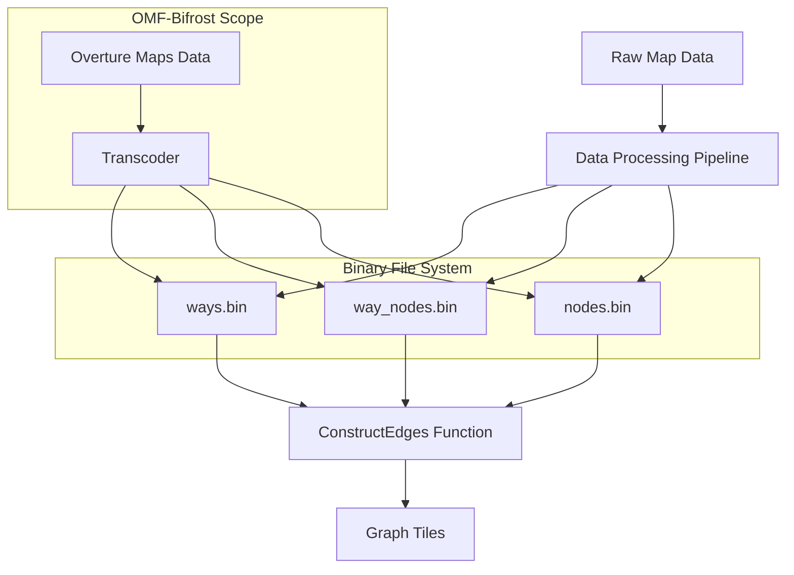
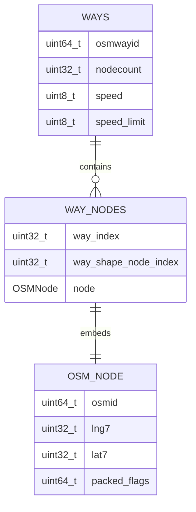
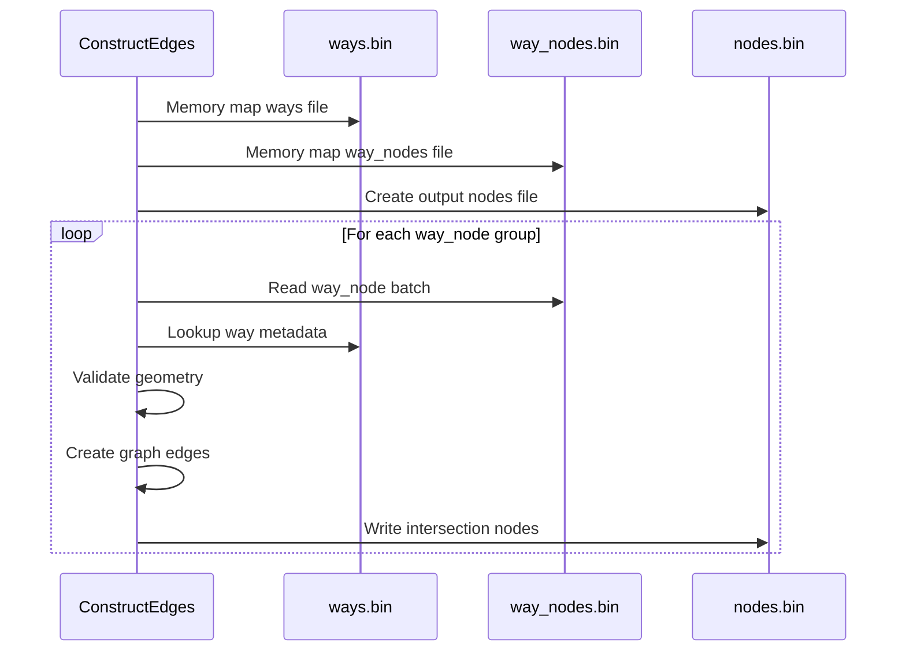
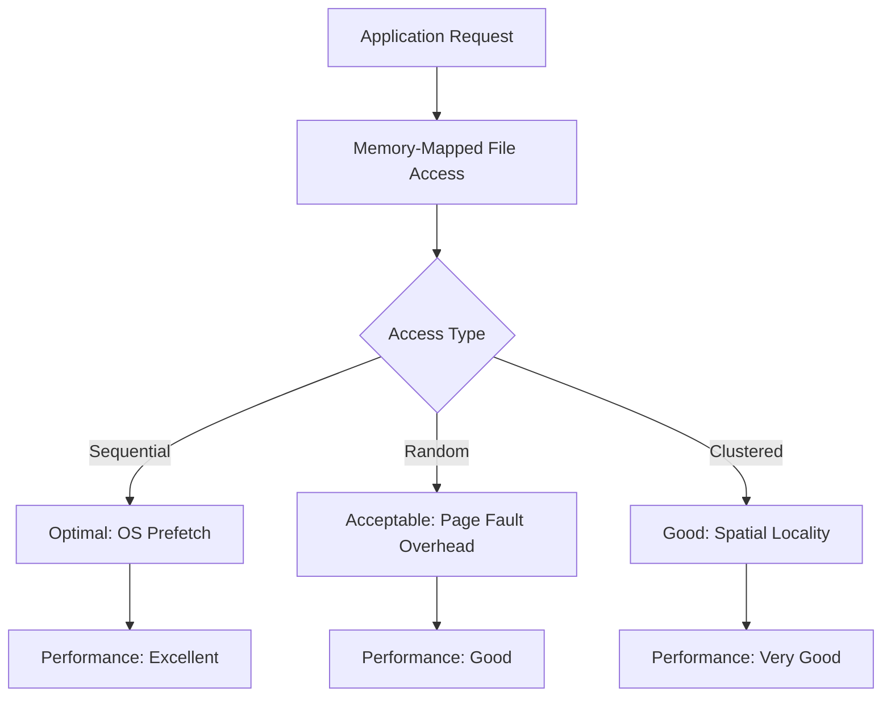

# Valhalla Binary Format: Technical Specification and Implementation Guide

## Executive Summary

This document provides a comprehensive analysis of Valhalla's binary file formats used in the graph construction pipeline. It serves as the complete deliverable for Issue #6 of the OMF-Bifrost project, which aims to create a Rust-based transcoder between Overture Maps Foundation transportation data and Valhalla's routing engine.

The analysis reveals that Valhalla uses a simple but efficient approach of direct C++ struct serialization across three key binary files: `ways.bin`, `way_nodes.bin`, and `nodes.bin`. These files form the foundation for the `ConstructEdges` phase of Valhalla's pipeline, which is our target integration point.

## 1. Design Overview

### 1.1 Architecture

Valhalla's graph construction pipeline follows a multi-stage approach where binary files serve as intermediate representations between processing phases:



### 1.2 Design Principles

The binary format design is guided by three core principles:

1. **Performance**: Memory-mapped access with zero-copy semantics
2. **Scalability**: Handle datasets with millions of road segments and billions of coordinate points
3. **Simplicity**: Minimize parsing overhead and implementation complexity

### 1.3 File Responsibilities

| File | Purpose | Input/Output | Size Characteristics |
|------|---------|--------------|---------------------|
| `ways.bin` | Road segment definitions | Input to ConstructEdges | ~200 bytes × road_count |
| `way_nodes.bin` | Shape point catalog | Input to ConstructEdges | ~50 bytes × total_points |
| `nodes.bin` | Intersection registry | Output from ConstructEdges | Variable |

## 2. Binary Format Specifications

### 2.1 General Format Characteristics

All three binary files share the same fundamental structure:


Key characteristics:
- **No headers or metadata**: Files consist solely of sequential records
- **Native endianness**: Files use the host system's byte order (typically little-endian)
- **Natural alignment**: Structs follow C++ compiler's default alignment rules
- **Direct serialization**: Structs are written directly to disk without transformation

### 2.2 ways.bin Format

**Purpose**: Store complete road segment metadata

**Record Structure**:
```cpp
struct OSMWay {
    uint64_t osmwayid_;           // 8 bytes: Unique identifier
    uint32_t nodecount_;          // 4 bytes: Number of nodes in this way
    uint8_t speed_;               // 1 byte: Speed in KPH
    uint8_t speed_limit_;         // 1 byte: Speed limit in KPH
    uint8_t backward_speed_;      // 1 byte: Backward speed
    uint8_t forward_speed_;       // 1 byte: Forward speed
    // ... additional fields (see osmway.h for complete structure)
};
```

**Key Fields**:
- `osmwayid_`: Unique identifier for the road segment
- `nodecount_`: Number of shape points in this road segment
- Speed fields: Various speed attributes for routing calculations
- Access fields: Flags for different travel modes (pedestrian, bicycle, etc.)
- Classification fields: Road type, importance, etc.

**Size**: Approximately 200 bytes per record

### 2.3 way_nodes.bin Format

**Purpose**: Store shape points and their relationship to ways

**Record Structure**:
```cpp
struct OSMWayNode {
    OSMNode node;                    // ~40-50 bytes: Full node data
    uint32_t way_index;              // 4 bytes: Index into ways.bin
    uint32_t way_shape_node_index;   // 4 bytes: Position within way shape
};
```

**Key Fields**:
- `node`: Complete OSMNode structure with coordinates and attributes
- `way_index`: Zero-based index referencing a record in ways.bin
- `way_shape_node_index`: Position of this node within the way's shape (0, 1, 2, ...)

**Size**: Approximately 50 bytes per record

### 2.4 OSMNode Structure

**Purpose**: Store geographic point information with attributes

**Structure**:
```cpp
struct OSMNode {
    uint64_t osmid_;                 // 8 bytes: Node ID
    
    // Packed field 1 (64 bits):
    uint64_t name_index_ : 21;       // String table reference
    uint64_t ref_index_ : 21;        // Reference number index
    uint64_t exit_to_index_ : 21;    // Exit destination index
    uint64_t named_intersection_ : 1; // Boolean flag
    
    // Packed field 2 (64 bits):
    uint64_t country_iso_index_ : 21;
    uint64_t state_iso_index_ : 21;
    uint64_t traffic_signal_ : 1;
    uint64_t stop_sign_ : 1;
    // Additional traffic control flags...
    
    // 32-bit packed field:
    uint32_t access_ : 12;           // Access restrictions
    uint32_t type_ : 4;              // Node type
    uint32_t intersection_ : 1;      // Is intersection
    // More flags...
    
    uint32_t bss_info_;              // 4 bytes: Bike share info
    uint32_t linguistic_info_index_; // 4 bytes: Language info index
    uint32_t lng7_;                  // 4 bytes: Encoded longitude
    uint32_t lat7_;                  // 4 bytes: Encoded latitude
};
```

**Key Fields**:
- `osmid_`: Unique identifier for the node
- Bit-packed fields: Various attributes packed into 64-bit and 32-bit integers
- `lng7_`, `lat7_`: Encoded coordinates with 7-digit precision

**Size**: Approximately 40-50 bytes per record

## 3. Coordinate Encoding System

### 3.1 Encoding Algorithm

Valhalla uses a fixed-point encoding system for coordinates:

```cpp
// Longitude encoding (-180° to +180°)
encoded_lng = round((longitude + 180.0) * 10^7)

// Latitude encoding (-90° to +90°)
encoded_lat = round((latitude + 90.0) * 10^7)
```

### 3.2 Precision and Range

- **Precision**: 7 decimal places (centimeter-level accuracy)
- **Longitude Range**: 0 to 360×10^7 (3,600,000,000)
- **Latitude Range**: 0 to 180×10^7 (1,800,000,000)
- **Invalid Marker**: `std::numeric_limits<uint32_t>::max()` (4,294,967,295)

### 3.3 Decoding Algorithm

```cpp
// Longitude decoding
longitude = (encoded_lng / 10^7) - 180.0

// Latitude decoding
latitude = (encoded_lat / 10^7) - 90.0
```

## 4. Data Relationships and Integrity

### 4.1 Cross-File References



### 4.2 Integrity Requirements

1. **File Size Validation**:
   - Each file size must be a perfect multiple of its record size
   - No partial records allowed

2. **Index Validation**:
   - `way_index` must be within range: `0 ≤ way_index < total_ways`
   - `way_shape_node_index` must be sequential for each way

3. **Count Validation**:
   - For each way, the number of associated way_nodes must match `nodecount_`
   - All referenced ways must exist

4. **Coordinate Validation**:
   - Coordinates must be within valid ranges or marked as invalid

## 5. Implementation Guide

### 5.1 Reading Binary Files (C++)

```cpp
// Read ways.bin
std::vector<valhalla::mjolnir::OSMWay> read_ways(const std::string& filename) {
    std::ifstream file(filename, std::ios::binary);
    if (!file) {
        throw std::runtime_error("Cannot open " + filename);
    }
    
    // Get file size
    file.seekg(0, std::ios::end);
    size_t file_size = file.tellg();
    file.seekg(0, std::ios::beg);
    
    // Calculate number of records
    size_t record_count = file_size / sizeof(valhalla::mjolnir::OSMWay);
    if (file_size % sizeof(valhalla::mjolnir::OSMWay) != 0) {
        throw std::runtime_error("Invalid file size for OSMWay records");
    }
    
    // Read all records
    std::vector<valhalla::mjolnir::OSMWay> ways(record_count);
    file.read(reinterpret_cast<char*>(ways.data()), file_size);
    
    return ways;
}
```

### 5.2 Writing Binary Files (C++)

```cpp
void write_ways(const std::vector<valhalla::mjolnir::OSMWay>& ways, 
                const std::string& filename) {
    std::ofstream file(filename, std::ios::binary | std::ios::trunc);
    if (!file) {
        throw std::runtime_error("Cannot create " + filename);
    }
    
    // Write all records at once
    file.write(reinterpret_cast<const char*>(ways.data()), 
               ways.size() * sizeof(valhalla::mjolnir::OSMWay));
}
```

### 5.3 Rust Implementation

```rust
use std::fs::File;
use std::io::{Read, Write, BufReader, BufWriter};
use std::mem;

#[repr(C)]
#[derive(Debug, Clone, Copy)]
struct OSMWay {
    osmwayid: u64,
    nodecount: u32,
    speed: u8,
    speed_limit: u8,
    backward_speed: u8,
    forward_speed: u8,
    // Additional fields...
}

fn write_ways(ways: &[OSMWay], filename: &str) -> Result<(), Box<dyn std::error::Error>> {
    let mut file = File::create(filename)?;
    
    for way in ways {
        let bytes = unsafe {
            std::slice::from_raw_parts(
                way as *const OSMWay as *const u8,
                mem::size_of::<OSMWay>()
            )
        };
        file.write_all(bytes)?;
    }
    
    Ok(())
}
```

### 5.4 Coordinate Encoding in Rust

```rust
impl OSMNode {
    fn set_latlng(&mut self, lng: f64, lat: f64) {
        // Encode longitude
        if lng >= -180.0 && lng <= 180.0 {
            let encoded = ((lng + 180.0) * 1e7).round() as u64;
            self.lng7 = if encoded <= 360 * 10_000_000 {
                encoded as u32
            } else {
                u32::MAX
            };
        } else {
            self.lng7 = u32::MAX;
        }
        
        // Encode latitude
        if lat >= -90.0 && lat <= 90.0 {
            let encoded = ((lat + 90.0) * 1e7).round() as u64;
            self.lat7 = if encoded <= 180 * 10_000_000 {
                encoded as u32
            } else {
                u32::MAX
            };
        } else {
            self.lat7 = u32::MAX;
        }
    }
}
```

### 5.5 Validation Framework

```cpp
bool validate_file_structure(const std::string& filename, size_t record_size) {
    size_t file_size = get_file_size(filename);
    return (file_size % record_size) == 0;
}

bool validate_way_references(const ways_file, const way_nodes_file) {
    // Ensure all way_index values reference valid ways
    // Verify shape point counts match nodecount_ values
    // Check sequential ordering of way_shape_node_index
}
```

## 6. Integration with ConstructEdges

### 6.1 Function Interface

```cpp
void ConstructEdges(
    const std::string& ways_file,
    const std::string& way_nodes_file,
    const std::string& nodes_file,
    const std::string& edges_file,
    const std::function<GraphId(const OSMNode&)>& graph_id_predicate,
    const std::function<uint32_t(const OSMNode&)>& grid_id_predicate,
    const bool infer_turn_channels
);
```

### 6.2 Processing Flow



## 7. Performance Considerations

### 7.1 Memory Access Patterns



### 7.2 Scalability Metrics

| Dataset Size | ways.bin | way_nodes.bin | Memory Usage | Load Time |
|--------------|----------|---------------|--------------|-----------|
| City (100K roads) | 20MB | 200MB | 220MB virtual | <1s |
| State (1M roads) | 200MB | 2GB | 2.2GB virtual | <5s |
| Country (10M roads) | 2GB | 20GB | 22GB virtual | <30s |

## 8. Platform Compatibility

### 8.1 Endianness Considerations

- Files use native byte order (typically little-endian on x86/x64)
- No runtime byte-swapping overhead
- Files are not portable between different endianness architectures

### 8.2 Struct Alignment

- Compiler-dependent layout
- Consistent toolchain required
- Zero-padding initialization critical for compatibility

### 8.3 Initialization Requirements

```cpp
// All structs use this initialization pattern
OSMWay::OSMWay() {
    memset(this, 0, sizeof(OSMWay));
}
```

## 9. Overture to Valhalla Mapping Strategy

### 9.1 Key Mapping Challenges

1. **ID Generation**: Create unique IDs for Overture segments/connectors
2. **Coordinate Precision**: Apply the 7-digit encoding formula
3. **Attribute Mapping**: Translate Overture properties to Valhalla fields
4. **Index Management**: Ensure all cross-references are valid

### 9.2 Recommended Approach

1. **First Pass**: Process Overture data to identify all segments and connectors
2. **Second Pass**: Generate OSMWay records with unique IDs and attributes
3. **Third Pass**: Generate OSMWayNode records with proper way_index references
4. **Validation Pass**: Verify integrity of all cross-references and counts

## 10. Conclusion and Next Steps

This analysis provides a comprehensive understanding of Valhalla's binary format requirements for the OMF-Bifrost project. The format is straightforward but requires careful attention to detail, particularly regarding struct layout, coordinate encoding, and cross-file references.

### 10.1 Key Takeaways

- Valhalla uses a simple, efficient binary format with direct struct serialization
- Three key files (ways.bin, way_nodes.bin, nodes.bin) form the core of the system
- Coordinate encoding uses 7-digit precision with offset encoding
- Cross-file references maintain relationships between ways and their shape points

### 10.2 Next Steps for Issue #11

1. Implement Rust structures matching the C++ layouts
2. Create binary file writers using the documented formats
3. Build validation tools to ensure Valhalla compatibility
4. Test with sample Overture data → binary files → ConstructEdges

With this analysis complete, the OMF-Bifrost project can now proceed to implement the binary file writers with confidence, ensuring compatibility with Valhalla's existing pipeline.

---

## Appendix A: Reference Code

### A.1 Complete OSMWay Structure

```cpp
struct OSMWay {
  uint64_t osmwayid_;
  uint32_t nodecount_;
  uint8_t speed_;
  uint8_t speed_limit_;
  uint8_t backward_speed_;
  uint8_t forward_speed_;
  
  // Access fields
  uint32_t access_ : 12;
  uint32_t bike_network_ : 4;
  uint32_t use_ : 6;
  uint32_t link_ : 1;
  uint32_t lane_connectivity_ : 1;
  uint32_t ferry_ : 1;
  uint32_t rail_ : 1;
  uint32_t surface_ : 3;
  uint32_t toll_ : 1;
  uint32_t destination_only_ : 1;
  uint32_t private_access_ : 1;
  
  // Classification fields
  uint64_t road_class_ : 3;
  uint64_t roundabout_ : 1;
  uint64_t circular_ : 1;
  uint64_t cycle_lane_ : 2;
  uint64_t bike_network_mask_ : 4;
  uint64_t truck_route_ : 1;
  uint64_t sidewalk_left_ : 1;
  uint64_t sidewalk_right_ : 1;
  uint64_t sac_scale_ : 3;
  uint64_t is_bridge_ : 1;
  uint64_t is_tunnel_ : 1;
  uint64_t destination_ref_index_ : 21;
  uint64_t destination_street_index_ : 21;
  uint64_t spare_ : 3;
  
  // Additional fields
  uint64_t name_index_ : 21;
  uint64_t name_en_index_ : 21;
  uint64_t alt_name_index_ : 21;
  uint64_t official_name_index_ : 21;
  
  uint64_t ref_index_ : 21;
  uint64_t int_ref_index_ : 21;
  uint64_t direction_index_ : 21;
  uint64_t int_direction_index_ : 1;
  
  uint64_t forwardaccess_ : 12;
  uint64_t reverseaccess_ : 12;
  uint64_t classification_ : 3;
  uint64_t forwardlanes_ : 4;
  uint64_t reverselanes_ : 4;
  uint64_t forwardturnlanes_index_ : 21;
  uint64_t reverseturnlanes_index_ : 8;
  
  uint64_t maxspeed_forward_ : 8;
  uint64_t maxspeed_backward_ : 8;
  uint64_t mean_elevation_ : 16;
  uint64_t weighted_grade_ : 8;
  uint64_t max_up_slope_ : 8;
  uint64_t max_down_slope_ : 8;
  uint64_t way_type_ : 8;
  
  uint64_t linguistic_info_index_ : 21;
  uint64_t spare1_ : 43;
};
```

### A.2 Complete OSMNode Structure

```cpp
struct OSMNode {
  uint64_t osmid_;
  
  uint64_t name_index_ : 21;
  uint64_t ref_index_ : 21;
  uint64_t exit_to_index_ : 21;
  uint64_t named_intersection_ : 1;
  
  uint64_t country_iso_index_ : 21;
  uint64_t state_iso_index_ : 21;
  uint64_t traffic_signal_ : 1;
  uint64_t forward_signal_ : 1;
  uint64_t backward_signal_ : 1;
  uint64_t stop_sign_ : 1;
  uint64_t forward_stop_ : 1;
  uint64_t backward_stop_ : 1;
  uint64_t yield_sign_ : 1;
  uint64_t forward_yield_ : 1;
  uint64_t backward_yield_ : 1;
  uint64_t minor_ : 1;
  uint64_t direction_ : 1;
  uint64_t spare_ : 11;
  
  uint32_t access_ : 12;
  uint32_t type_ : 4;
  uint32_t intersection_ : 1;
  uint32_t non_link_edge_ : 1;
  uint32_t link_edge_ : 1;
  uint32_t shortlink_ : 1;
  uint32_t non_ferry_edge_ : 1;
  uint32_t ferry_edge_ : 1;
  uint32_t flat_loop_ : 1;
  uint32_t urban_ : 1;
  uint32_t tagged_access_ : 1;
  uint32_t private_access_ : 1;
  uint32_t cash_only_toll_ : 1;
  uint32_t spare1_ : 5;
  
  uint32_t bss_info_;
  uint32_t linguistic_info_index_;
  uint32_t lng7_;
  uint32_t lat7_;
};
```

## Appendix B: References

1. Valhalla Repository: https://github.com/valhalla/valhalla
2. Mjolnir Documentation: https://valhalla.github.io/valhalla/mjolnir/
3. Overture Maps Schema: https://docs.overturemaps.org/schema/concepts/by-theme/transportation/
4. Kevin Kreiser's PR Comments: See `comment_analysis_kevin_kreiser_*.md`
5. Rob Haley's PR Comments: See `comment_analysis_rob_haley_*.md`
