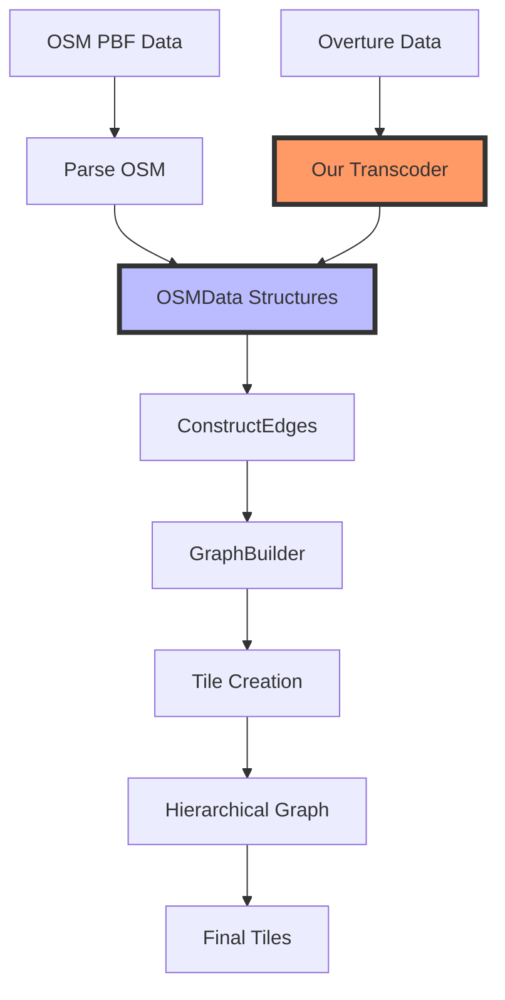

# Integration Approach: Overture to Valhalla

Based on Kevin Kreiser's comments, we can identify a clear integration strategy that avoids forking Mjolnir while still leveraging Valhalla's routing capabilities.

## Key Insight

The most important insight from the PR comments is that **we don't need to modify Valhalla's entire pipeline**. Instead, we can:

1. Identify the right integration point in Valhalla's pipeline
2. Create a transcoder that converts Overture data to Valhalla's expected format at that point
3. Let Valhalla handle the rest of the process

## Valhalla Pipeline and Integration Point

As Kevin suggested, the `ConstructEdges` phase is the ideal integration point. This means:

1. We bypass Valhalla's OSM parsing phase
2. We create our own parser for Overture data
3. We transform Overture data into the intermediate structures that `ConstructEdges` expects
4. We let Valhalla handle the rest of the pipeline

## Target Data Structures

The key structures we need to generate are:

- `OSMData`: Container for all the parsed data
- `OSMWay`: Represents a way (road segment)
- `OSMNode`: Represents a node (intersection)
- `OSMWayNode`: Represents a node that's part of a way
- `OSMRestriction`: Represents turn restrictions

These structures are relatively simple and well-documented in Valhalla's codebase.

## Administrative Boundaries

A separate but related task is handling administrative boundaries. Kevin suggests:

1. Using a tool like DuckDB to process Overture's admin boundary data
2. Converting it to a spatialite database format that Valhalla can use
3. Integrating this with the main pipeline

This approach allows us to leverage Valhalla's existing capabilities while working with Overture's unique data model.
