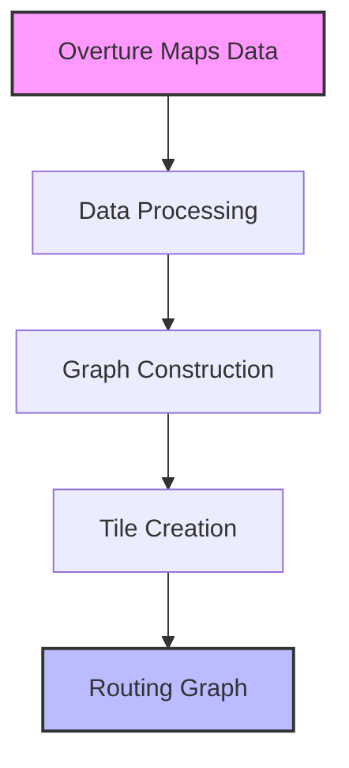

# Building Overture Graph Tiles

## Introduction

Welcome to "Building Overture Graph Tiles" - a comprehensive guide to creating efficient routing graph tiles using Overture Maps Foundation data. This book explores the journey from raw map data to a sophisticated routing graph, with a particular focus on understanding and adapting Valhalla's Mjolnir tile builder for Overture data.

### Why Graph Tiles Matter

Routing is a fundamental component of modern mapping applications. Whether you're finding your way to a new restaurant, planning a cross-country road trip, or optimizing delivery routes, efficient routing algorithms are essential. At the heart of these algorithms lies a critical data structure: the routing graph.

Graph tiles represent a sophisticated approach to managing routing data. By dividing the world into a hierarchical system of tiles, we can:

- Process and update specific geographic regions independently
- Load only the necessary data into memory during routing
- Enable efficient path finding across continental-scale networks
- Support multiple transportation modes with different routing characteristics

### The Overture Maps Foundation Challenge

The [Overture Maps Foundation](https://overturemaps.org/) provides rich, standardized geospatial data with several advantages over traditional sources:

- A normalized schema with consistent attributes
- First-class topological nodes that explicitly define network connectivity
- Comprehensive properties for accurate routing decisions
- Standard formats like GeoParquet for efficient processing

However, to use this data for routing, we need to transform it into a format that routing engines can understand. This is where graph tiles come in.

### Our Journey Through This Book

This book is organized into two main sections:

1. **Understanding Valhalla's Mjolnir**: A deep dive into how Valhalla's graph tile builder works, exploring its architecture, algorithms, and data structures. This knowledge is essential for anyone looking to adapt or extend Valhalla for use with Overture data.

2. **Building Overture Graph Tiles**: Practical guidance on creating graph tiles from Overture data, including integration approaches, attribute mapping, and optimization techniques.

### Who This Book Is For

This book is designed for:

- **Developers** working with routing engines and geospatial data
- **Data scientists** exploring transportation network analysis
- **GIS specialists** interested in advanced routing applications
- **Contributors** to the Overture Maps Foundation ecosystem

Whether you're familiar with Valhalla or completely new to routing engines, this book provides the context and details you need to understand graph tile creation and use Overture data effectively.

### Prerequisites

While we've tried to make this book accessible to a wide audience, some familiarity with the following concepts will be helpful:

- Basic graph theory and algorithms
- Geospatial data formats and concepts
- Programming experience (C++ examples are used, but concepts apply to any language)
- Understanding of transportation networks

### How to Use This Book

This book can be read sequentially or used as a reference. Each chapter builds on previous concepts but also stands on its own for those interested in specific topics.

- If you're new to routing and graph tiles, start from the beginning
- If you're familiar with routing but new to Valhalla, focus on the Mjolnir chapters
- If you're experienced with Valhalla and want to use Overture data, jump to the Overture-specific sections

Code examples and diagrams are provided throughout to illustrate key concepts, but the focus is on understanding the underlying principles rather than memorizing implementation details.

Let's begin our journey into the fascinating world of graph tiles and routing!
