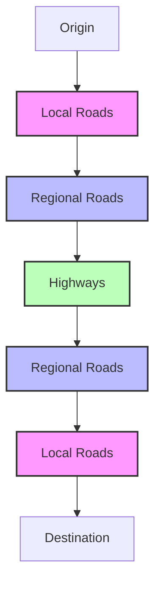
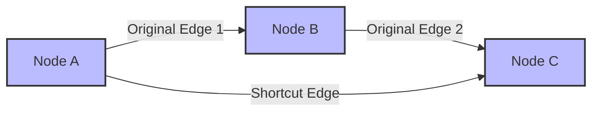
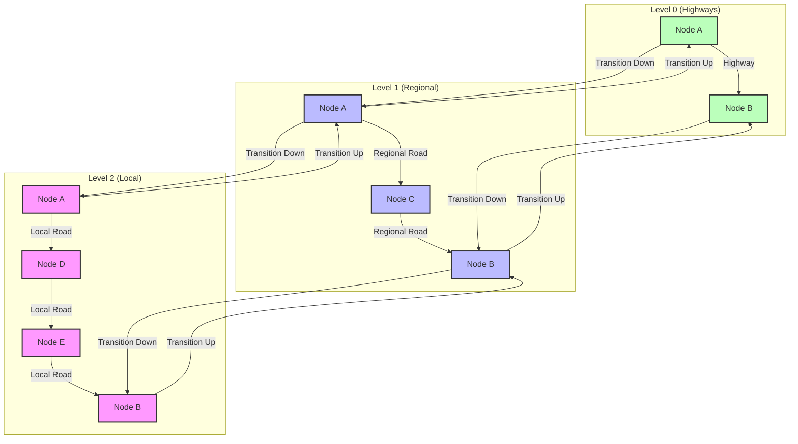

# Hierarchical Graph Building

## The Concept of Hierarchical Routing

Valhalla uses a hierarchical approach to routing, which is essential for efficient path finding across large networks. This chapter explores how Mjolnir builds this hierarchical structure.

The hierarchy consists of multiple levels, each representing different types of roads:

- **Level 0**: Major highways and arterials (lowest detail, 4-degree tiles)
- **Level 1**: Regional roads (1-degree tiles)
- **Level 2**: Local roads and paths (highest detail, 0.25-degree tiles)

This mimics how humans navigate: using local streets near origin and destination, but preferring major roads for the middle portion of longer journeys.



## The HierarchyBuilder Class

The `HierarchyBuilder` class is responsible for creating the hierarchical graph:

```cpp
// From valhalla/mjolnir/hierarchybuilder.h
class HierarchyBuilder {
public:
  static void Build(const boost::property_tree::ptree& pt);
};
```

The implementation in `src/mjolnir/hierarchybuilder.cc` orchestrates the creation of each level:

```cpp
// From src/mjolnir/hierarchybuilder.cc
void HierarchyBuilder::Build(const boost::property_tree::ptree& pt) {
  // Get the tile hierarchy
  TileHierarchy hierarchy(pt);
  
  // Build level 0 (already done in GraphBuilder)
  
  // Build level 1
  BuildLevel1(hierarchy, pt);
  
  // Build level 2
  BuildLevel2(hierarchy, pt);
  
  // Add transitions between levels
  AddTransitions(hierarchy, pt);
}
```

## Road Classification and Level Assignment

The first step in building the hierarchy is determining which roads belong to which level. This is based on the road classification:

```cpp
// From src/mjolnir/hierarchybuilder.cc
bool ShouldIncludeInLevel1(const DirectedEdge* edge) {
  // Include major roads in level 1
  RoadClass rc = edge->classification();
  return rc <= RoadClass::kTertiary;
}

bool ShouldIncludeInLevel2(const DirectedEdge* edge) {
  // Include only the most important roads in level 2
  RoadClass rc = edge->classification();
  return rc <= RoadClass::kPrimary;
}
```

The road classification is determined during the initial graph building based on OSM highway tags:

```cpp
// From src/mjolnir/osmway.cc
RoadClass OSMWay::GetRoadClass(const std::string& highway) {
  if (highway == "motorway")        return RoadClass::kMotorway;
  else if (highway == "trunk")      return RoadClass::kTrunk;
  else if (highway == "primary")    return RoadClass::kPrimary;
  else if (highway == "secondary")  return RoadClass::kSecondary;
  else if (highway == "tertiary")   return RoadClass::kTertiary;
  else if (highway == "residential") return RoadClass::kResidential;
  // ... other classifications ...
  else                              return RoadClass::kServiceOther;
}
```

The mapping between OSM highway tags and hierarchy levels is:
- Level 0: motorway, trunk, primary
- Level 1: secondary, tertiary
- Level 2: residential, unclassified, service, and other minor roads

## Building Higher Level Tiles

For each higher level (1 and 2), Mjolnir creates new tiles containing only the roads that belong to that level:

```cpp
// From src/mjolnir/hierarchybuilder.cc
void HierarchyBuilder::BuildLevel1(const TileHierarchy& hierarchy, const boost::property_tree::ptree& pt) {
  // For each level 0 tile
  for (const auto& level0_tile_id : GetTileSet(hierarchy, 0)) {
    // Get the level 0 tile
    const GraphTile* level0_tile = reader.GetGraphTile(level0_tile_id);
    
    // Create a level 1 tile builder
    GraphId level1_tile_id = hierarchy.GetLevel1TileId(level0_tile_id);
    GraphTileBuilder level1_builder(level1_tile_id, tile_dir);
    
    // For each edge in the level 0 tile
    for (uint32_t edge_idx = 0; edge_idx < level0_tile->header()->directededgecount(); edge_idx++) {
      const DirectedEdge* edge = level0_tile->directededge(edge_idx);
      
      // If the edge is important enough for level 1
      if (ShouldIncludeInLevel1(edge)) {
        // Add to level 1
        level1_builder.AddEdge(edge);
      }
    }
    
    // Create shortcuts for level 1
    CreateShortcuts(level1_builder);
    
    // Store the level 1 tile
    level1_builder.StoreTileData();
  }
}
```

The process involves:
1. Identifying which roads belong in each hierarchy level
2. Creating new tiles for each level
3. Adding only the appropriate roads to each level
4. Creating shortcuts to optimize routing

## Shortcut Creation

One of the key features of the hierarchical graph is the creation of "shortcuts" - edges that represent multiple underlying edges. This allows for faster routing on higher levels:

```cpp
// From valhalla/mjolnir/shortcutbuilder.h
class ShortcutBuilder {
public:
  static void Build(const boost::property_tree::ptree& pt);
};
```

The implementation identifies paths that can be represented as shortcuts:

```cpp
// From src/mjolnir/shortcutbuilder.cc
void ShortcutBuilder::Build(const boost::property_tree::ptree& pt) {
  // For each tile in levels 1 and 2
  for (uint8_t level = 1; level <= 2; level++) {
    for (const auto& tile_id : GetTileSet(hierarchy, level)) {
      // Get the tile
      const GraphTile* tile = reader.GetGraphTile(tile_id);
      
      // Create a tile builder
      GraphTileBuilder builder(tile_id, tile_dir);
      
      // For each node in the tile
      for (uint32_t node_idx = 0; node_idx < tile->header()->nodecount(); node_idx++) {
        const NodeInfo* node = tile->node(node_idx);
        
        // If the node has exactly 2 edges (one in, one out)
        if (node->edge_count() == 2) {
          // Get the edges
          const DirectedEdge* edge1 = tile->directededge(node->edge_index());
          const DirectedEdge* edge2 = tile->directededge(node->edge_index() + 1);
          
          // If one is incoming and one is outgoing
          if (edge1->endnode() && !edge2->endnode()) {
            // Create a shortcut that bypasses this node
            CreateShortcut(builder, edge1, edge2);
          }
        }
      }
      
      // Store the updated tile
      builder.StoreTileData();
    }
  }
}
```

Shortcuts include the combined attributes of the underlying edges:

```cpp
// From src/mjolnir/shortcutbuilder.cc
void CreateShortcut(GraphTileBuilder& builder, const DirectedEdge* edge1, const DirectedEdge* edge2) {
  // Create a new directed edge
  DirectedEdgeBuilder shortcut;
  
  // Set basic attributes
  shortcut.set_endnode(edge2->endnode());
  shortcut.set_shortcut(true);
  
  // Combine length
  shortcut.set_length(edge1->length() + edge2->length());
  
  // Use the most restrictive access
  shortcut.set_access(edge1->access() & edge2->access());
  
  // Use the worst surface type
  shortcut.set_surface(std::max(edge1->surface(), edge2->surface()));
  
  // ... set other attributes ...
  
  // Add the shortcut to the builder
  builder.AddShortcut(edge1->endnode(), edge2->endnode(), shortcut);
}
```

Shortcuts are particularly important for long-distance routing, as they allow the algorithm to skip over intermediate nodes that don't offer meaningful routing choices.



## Transition Edges

To allow routes to move between hierarchy levels, Mjolnir creates special "transition" edges:

```cpp
// From src/mjolnir/hierarchybuilder.cc
void HierarchyBuilder::AddTransitions(const TileHierarchy& hierarchy, const boost::property_tree::ptree& pt) {
  // For each level except the highest
  for (uint8_t level = 0; level < 2; level++) {
    // For each tile in this level
    for (const auto& tile_id : GetTileSet(hierarchy, level)) {
      // Get the tile
      const GraphTile* tile = reader.GetGraphTile(tile_id);
      
      // Create a tile builder
      GraphTileBuilder builder(tile_id, tile_dir);
      
      // For each node in the tile
      for (uint32_t node_idx = 0; node_idx < tile->header()->nodecount(); node_idx++) {
        const NodeInfo* node = tile->node(node_idx);
        
        // Check if this node exists in the next level up
        GraphId higher_node_id = FindNodeInHigherLevel(node, level + 1);
        if (higher_node_id.Is_Valid()) {
          // Create up transition
          DirectedEdgeBuilder up_edge;
          up_edge.set_trans_up(true);
          up_edge.set_endnode(true);
          
          // Add the transition edge
          builder.AddTransitionEdge(node_idx, higher_node_id, up_edge);
          
          // Also add down transition in the higher level
          AddDownTransition(higher_node_id, GraphId(tile_id.tileid(), level, node_idx));
        }
      }
      
      // Store the updated tile
      builder.StoreTileData();
    }
  }
}
```

Transition edges connect nodes that exist in multiple hierarchy levels, allowing the routing algorithm to move up to a higher level for long-distance travel and back down to a lower level as it approaches the destination.



## Node Expansion for Complex Intersections

Complex intersections often need special handling. The `NodeExpander` class handles this:

```cpp
// From valhalla/mjolnir/node_expander.h
class NodeExpander {
public:
  static void Expand(const boost::property_tree::ptree& pt);
};
```

The implementation identifies complex intersections and expands them into multiple nodes:

```cpp
// From src/mjolnir/node_expander.cc
void NodeExpander::Expand(const boost::property_tree::ptree& pt) {
  // For each tile
  for (const auto& tile_id : GetTileSet(hierarchy, 0)) {
    // Get the tile
    const GraphTile* tile = reader.GetGraphTile(tile_id);
    
    // Create a tile builder
    GraphTileBuilder builder(tile_id, tile_dir);
    
    // For each node in the tile
    for (uint32_t node_idx = 0; node_idx < tile->header()->nodecount(); node_idx++) {
      const NodeInfo* node = tile->node(node_idx);
      
      // If the node has many edges (complex intersection)
      if (node->edge_count() > 4) {
        // Expand the node into multiple nodes
        ExpandNode(builder, node_idx);
      }
    }
    
    // Store the updated tile
    builder.StoreTileData();
  }
}
```

Node expansion improves routing accuracy at complex intersections by creating a more detailed representation of the possible movements.

## Handling Special Cases

### Turn Channels

Turn channels (dedicated turning lanes) are identified and handled specially:

```cpp
// From src/mjolnir/graphbuilder.cc
bool IsTurnChannel(const OSMWay& way) {
  return way.has_tag("highway", "turning_loop") || 
         way.has_tag("junction", "roundabout") ||
         way.has_tag("oneway", "yes");
}
```

### Roundabouts

Roundabouts require special handling to ensure proper navigation:

```cpp
// From src/mjolnir/graphbuilder.cc
bool IsRoundabout(const OSMWay& way) {
  return way.has_tag("junction", "roundabout") ||
         way.has_tag("junction", "circular");
}
```

### Internal Edges

Internal edges (within intersections) are marked for special handling:

```cpp
// From src/mjolnir/graphbuilder.cc
bool IsInternalEdge(const OSMWay& way) {
  return way.has_tag("highway", "internal");
}
```

These special cases ensure that the routing graph accurately represents complex road features that might otherwise be difficult to navigate.

## Performance Considerations

Building a hierarchical graph for planet-scale data requires careful attention to performance:

1. **Memory Usage**: Processing one tile at a time to limit memory usage
2. **Parallelization**: Using multiple threads for independent tasks
3. **Efficient Data Structures**: Using optimized containers and algorithms

```cpp
// Example of parallel processing
void BuildHierarchyInParallel(const TileHierarchy& hierarchy, const boost::property_tree::ptree& pt) {
  // Get all level 0 tiles
  std::vector<GraphId> level0_tiles = GetTileSet(hierarchy, 0);
  
  // Process tiles in parallel
  #pragma omp parallel for
  for (size_t i = 0; i < level0_tiles.size(); i++) {
    // Process one tile
    ProcessTile(level0_tiles[i], hierarchy, pt);
  }
}
```

The hierarchical approach not only improves routing performance but also helps manage memory usage during graph construction, as each level can be processed independently.

## Validation and Quality Assurance

After building the hierarchical graph, Mjolnir validates it to ensure quality:

```cpp
// From valhalla/mjolnir/graphvalidator.h
class GraphValidator {
public:
  static void Validate(const boost::property_tree::ptree& pt);
};
```

The implementation checks for various issues:

```cpp
// From src/mjolnir/graphvalidator.cc
void GraphValidator::Validate(const boost::property_tree::ptree& pt) {
  // Check connectivity between levels
  CheckLevelConnectivity(pt);
  
  // Check for unreachable nodes
  CheckReachability(pt);
  
  // Check for invalid shortcuts
  CheckShortcuts(pt);
  
  // ... other checks ...
}
```

Validation ensures that the hierarchical graph is properly connected and that all nodes are reachable, which is essential for reliable routing.

Understanding hierarchical graph building is essential for creating an efficient routing system. The hierarchy allows Valhalla to quickly find routes across large networks by focusing on important roads for the majority of the journey.
