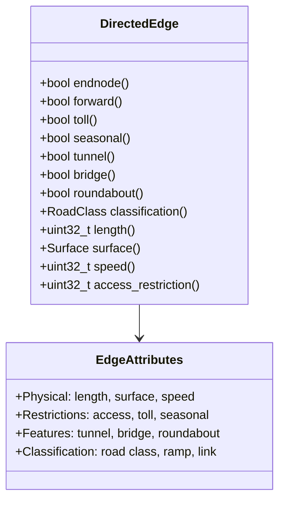
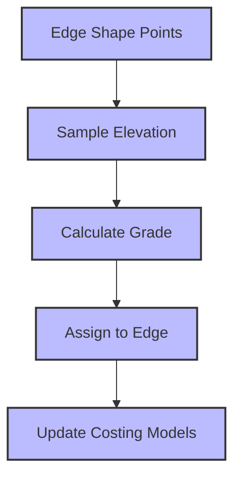
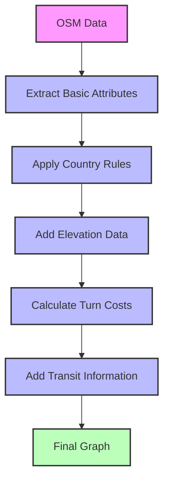

# Costing and Edge Attribution

## The Importance of Edge Attributes

In a routing graph, edges (road segments) need detailed attributes to enable accurate route calculation. These attributes determine how suitable a road is for different types of travel (car, bicycle, pedestrian) and affect the cost of traversing the edge. This chapter explores how Mjolnir assigns attributes to edges.

## Core Edge Attributes

Mjolnir extracts and assigns numerous attributes to each edge:

### Basic Attributes

```cpp
// From baldr/directededge.h
class DirectedEdge {
public:
  // Basic attributes
  bool endnode() const;
  bool forward() const;
  bool toll() const;
  bool seasonal() const;
  bool destination_only() const;
  bool tunnel() const;
  bool bridge() const;
  bool roundabout() const;
  
  // Classification
  RoadClass classification() const;
  bool is_ramp() const;
  bool link() const;
  bool internal() const;
  
  // Physical characteristics
  uint32_t length() const;
  Surface surface() const;
  uint32_t speed() const;
  bool truck_route() const;
  
  // Access restrictions
  uint32_t access_restriction() const;
  bool destination_only() const;
  bool has_exit_sign() const;
  
  // ... many more attributes ...
};
```



### Access Attributes

Access attributes determine which modes of travel can use an edge:

```cpp
// From baldr/directededge.h
class DirectedEdge {
public:
  // Access methods
  bool forwardaccess() const;
  bool reverseaccess() const;
  
  bool forwardaccess(uint32_t access) const;
  bool reverseaccess(uint32_t access) const;
  
  // Mode-specific access
  bool pedestrian_access() const;
  bool bicycle_access() const;
  bool auto_access() const;
  bool bus_access() const;
  bool truck_access() const;
  bool emergency_access() const;
  bool hov_access() const;
  bool taxi_access() const;
  bool motorcycle_access() const;
};
```

Access attributes are stored as bit fields, with each bit representing a different travel mode. This allows for efficient storage and quick access checks during routing.

## Attribute Extraction from OSM

Mjolnir extracts these attributes from OSM tags during the initial graph building:

```cpp
// From src/mjolnir/osmway.cc
void OSMWay::SetAttributes(const Tags& tags) {
  // Road class
  std::string highway = tags.find("highway")->second;
  road_class_ = GetRoadClass(highway);
  
  // Surface
  auto surface_tag = tags.find("surface");
  if (surface_tag != tags.end()) {
    surface_ = GetSurface(surface_tag->second);
  }
  
  // Speed limit
  auto maxspeed_tag = tags.find("maxspeed");
  if (maxspeed_tag != tags.end()) {
    speed_ = ParseSpeed(maxspeed_tag->second);
  } else {
    // Assign default speed based on road class
    speed_ = GetDefaultSpeed(road_class_);
  }
  
  // Access restrictions
  SetAccess(tags);
  
  // One-way
  auto oneway_tag = tags.find("oneway");
  if (oneway_tag != tags.end() && oneway_tag->second == "yes") {
    oneway_ = true;
  }
  
  // ... set other attributes ...
}
```

The attribute extraction process involves:
1. Identifying relevant OSM tags
2. Converting tag values to internal representations
3. Setting default values when tags are missing
4. Handling special cases and combinations of tags

## Speed Assignment

Speed is a critical attribute for routing. Mjolnir assigns speeds based on:

1. Explicit speed limits from OSM
2. Default speeds based on road class
3. Adjustments based on surface type, urban areas, etc.

```cpp
// From src/mjolnir/osmway.cc
uint32_t OSMWay::ParseSpeed(const std::string& maxspeed) {
  // Parse the speed string (e.g., "50 mph", "80 km/h")
  // ...
  
  // Convert to internal speed value
  return ConvertToInternalSpeed(value, units);
}

uint32_t OSMWay::GetDefaultSpeed(RoadClass road_class) {
  switch (road_class) {
    case RoadClass::kMotorway:
      return 100;  // 100 km/h
    case RoadClass::kTrunk:
      return 90;   // 90 km/h
    case RoadClass::kPrimary:
      return 70;   // 70 km/h
    // ... other road classes ...
    default:
      return 50;   // 50 km/h
  }
}
```

Speed values are stored in a compact format to save space while still providing sufficient precision for routing calculations.

## Access Restriction Assignment

Access restrictions determine which modes of travel can use an edge:

```cpp
// From src/mjolnir/osmway.cc
void OSMWay::SetAccess(const Tags& tags) {
  // Default access
  access_ = kAllAccess;
  
  // Check for access restrictions
  auto access_tag = tags.find("access");
  if (access_tag != tags.end()) {
    if (access_tag->second == "private" || access_tag->second == "no") {
      access_ = 0;
    }
  }
  
  // Mode-specific access
  auto car_tag = tags.find("motor_vehicle");
  if (car_tag != tags.end()) {
    if (car_tag->second == "no") {
      access_ &= ~kAutoAccess;
    }
  }
  
  // ... check other modes ...
}
```

Access restrictions can be complex, as they may vary by:
- Travel mode (car, bicycle, pedestrian, etc.)
- Direction (forward, reverse)
- Time of day
- Vehicle characteristics (weight, height, etc.)

## Country-Specific Rules

Different countries have different rules for roads. Mjolnir handles this using the `CountryAccess` class:

```cpp
// From valhalla/mjolnir/countryaccess.h
class CountryAccess {
public:
  static void Build(const boost::property_tree::ptree& pt);
};
```

The implementation applies country-specific rules:

```cpp
// From src/mjolnir/countryaccess.cc
void CountryAccess::Build(const boost::property_tree::ptree& pt) {
  // For each tile
  for (const auto& tile_id : GetTileSet(hierarchy, 0)) {
    // Get the tile
    const GraphTile* tile = reader.GetGraphTile(tile_id);
    
    // Create a tile builder
    GraphTileBuilder builder(tile_id, tile_dir);
    
    // For each edge in the tile
    for (uint32_t edge_idx = 0; edge_idx < tile->header()->directededgecount(); edge_idx++) {
      const DirectedEdge* edge = tile->directededge(edge_idx);
      
      // Get the country code
      uint32_t admin_index = edge->admin_index();
      const Admin* admin = tile->admin(admin_index);
      std::string country_code = admin->country_iso();
      
      // Apply country-specific rules
      if (country_code == "DE") {  // Germany
        // In Germany, all residential roads allow bicycles
        if (edge->classification() == RoadClass::kResidential) {
          DirectedEdge new_edge = *edge;
          new_edge.set_bicycle_access(true);
          builder.UpdateDirectedEdge(edge_idx, new_edge);
        }
      }
      
      // ... apply other country-specific rules ...
    }
    
    // Store the updated tile
    builder.StoreTileData();
  }
}
```

Country-specific rules include:
- Default access rules (e.g., bicycles allowed on all residential roads in Germany)
- Driving side (left or right)
- Default speed limits
- Special road types and their characteristics

## Elevation and Grade

Elevation data is important for realistic routing, especially for bicycles and pedestrians. Mjolnir adds elevation data using the `ElevationBuilder`:

```cpp
// From valhalla/mjolnir/elevationbuilder.h
class ElevationBuilder {
public:
  static void Build(const boost::property_tree::ptree& pt);
};
```

The implementation samples elevation data along each edge:

```cpp
// From src/mjolnir/elevationbuilder.cc
void ElevationBuilder::Build(const boost::property_tree::ptree& pt) {
  // Get the elevation service
  Skadi::sample elevation_service(pt);
  
  // For each tile
  for (const auto& tile_id : GetTileSet(hierarchy, 0)) {
    // Get the tile
    const GraphTile* tile = reader.GetGraphTile(tile_id);
    
    // Create a tile builder
    GraphTileBuilder builder(tile_id, tile_dir);
    
    // For each edge in the tile
    for (uint32_t edge_idx = 0; edge_idx < tile->header()->directededgecount(); edge_idx++) {
      const DirectedEdge* edge = tile->directededge(edge_idx);
      
      // Get the shape of the edge
      auto shape = tile->edgeinfo(edge->edgeinfo_offset()).shape();
      
      // Sample elevation at each point
      std::vector<float> elevations = elevation_service.get_all(shape);
      
      // Calculate the weighted grade
      float grade = CalculateWeightedGrade(shape, elevations);
      
      // Update the edge with the grade
      DirectedEdge new_edge = *edge;
      new_edge.set_weighted_grade(grade);
      builder.UpdateDirectedEdge(edge_idx, new_edge);
    }
    
    // Store the updated tile
    builder.StoreTileData();
  }
}
```

Elevation data is used to calculate:
- Road grade (slope)
- Energy consumption models for various travel modes
- Realistic travel times for bicycles and pedestrians



## Turn Cost Assignment

Turn costs are crucial for realistic routing. Mjolnir assigns turn costs based on the angle between edges:

```cpp
// From src/mjolnir/graphbuilder.cc
uint32_t CalculateTurnCost(const DirectedEdge* edge1, const DirectedEdge* edge2) {
  // Get the turn angle
  float angle = GetTurnAngle(edge1, edge2);
  
  // Assign cost based on angle
  if (angle < 10) {
    return 0;  // Straight ahead
  } else if (angle < 45) {
    return 1;  // Slight turn
  } else if (angle < 135) {
    return 2;  // Regular turn
  } else {
    return 4;  // Sharp turn or U-turn
  }
}
```

Turn costs affect route selection by penalizing routes with many turns or difficult maneuvers. This helps create more natural and drivable routes.

## Traffic Signal Information

Traffic signals affect routing costs. Mjolnir extracts this information from OSM:

```cpp
// From src/mjolnir/osmnode.cc
void OSMNode::SetTrafficSignal(const Tags& tags) {
  auto highway_tag = tags.find("highway");
  if (highway_tag != tags.end() && highway_tag->second == "traffic_signals") {
    traffic_signal_ = true;
  }
}
```

Traffic signals are stored as attributes of nodes and are used in the costing models to add delays for stopping at intersections.

## Lane Information

Lane information is important for realistic routing, especially for turn-by-turn directions:

```cpp
// From src/mjolnir/osmway.cc
void OSMWay::SetLanes(const Tags& tags) {
  // Get the number of lanes
  auto lanes_tag = tags.find("lanes");
  if (lanes_tag != tags.end()) {
    try {
      lanes_ = std::stoi(lanes_tag->second);
    } catch (...) {
      lanes_ = 1;  // Default to 1 lane
    }
  }
  
  // Get turn lane information
  auto turn_lanes_tag = tags.find("turn:lanes");
  if (turn_lanes_tag != tags.end()) {
    turn_lanes_ = turn_lanes_tag->second;
  }
}
```

Lane information is used for:
- Determining road capacity
- Generating lane guidance for turn-by-turn directions
- Calculating realistic travel times in congested areas

## Bicycle Network Information

For bicycle routing, information about bicycle networks is important:

```cpp
// From src/mjolnir/osmway.cc
void OSMWay::SetBicycleInfo(const Tags& tags) {
  // Check if this is a designated bicycle route
  auto bicycle_tag = tags.find("bicycle");
  if (bicycle_tag != tags.end() && bicycle_tag->second == "designated") {
    bike_network_ = true;
  }
  
  // Check for bicycle network tags
  auto network_tag = tags.find("network");
  if (network_tag != tags.end()) {
    if (network_tag->second == "lcn") {
      bike_network_mask_ |= kLocalBicycleNetwork;
    } else if (network_tag->second == "rcn") {
      bike_network_mask_ |= kRegionalBicycleNetwork;
    } else if (network_tag->second == "ncn") {
      bike_network_mask_ |= kNationalBicycleNetwork;
    }
  }
}
```

Bicycle network information helps create better bicycle routes by preferring designated bicycle facilities and routes.

## Transit Information

For multi-modal routing, transit information is crucial:

```cpp
// From valhalla/mjolnir/transitbuilder.h
class TransitBuilder {
public:
  static void Build(const boost::property_tree::ptree& pt);
};
```

The implementation processes transit data:

```cpp
// From src/mjolnir/transitbuilder.cc
void TransitBuilder::Build(const boost::property_tree::ptree& pt) {
  // Read transit data
  transit::Data transit_data;
  transit_data.Read(pt.get<std::string>("mjolnir.transit_dir"));
  
  // For each transit stop
  for (const auto& stop : transit_data.stops) {
    // Find the nearest node in the graph
    GraphId node_id = FindNearestNode(stop.lat, stop.lng);
    
    // Add a transit connection
    AddTransitConnection(node_id, stop);
  }
  
  // For each transit route
  for (const auto& route : transit_data.routes) {
    // Add the route to the graph
    AddTransitRoute(route);
  }
}
```

Transit information includes:
- Stop locations and attributes
- Routes and schedules
- Transfer points
- Fare information

## Putting It All Together

The complete edge attribution process involves multiple steps:

1. **Extract basic attributes** from OSM tags
2. **Apply country-specific rules**
3. **Add elevation data** if available
4. **Calculate turn costs**
5. **Add transit information** if available



This comprehensive attribution enables Valhalla to calculate realistic routes for various modes of travel. The rich set of attributes allows the routing engine to make intelligent decisions about which paths to explore and which to avoid based on the specific requirements of each travel mode.

Understanding costing and edge attribution is essential for building a graph tile builder, as it determines how the routing engine will evaluate different paths.
