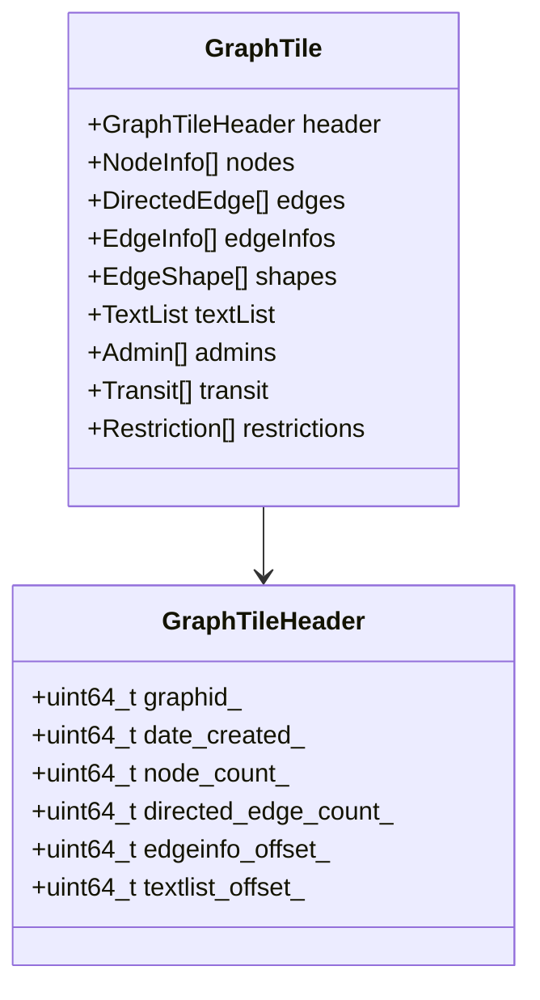
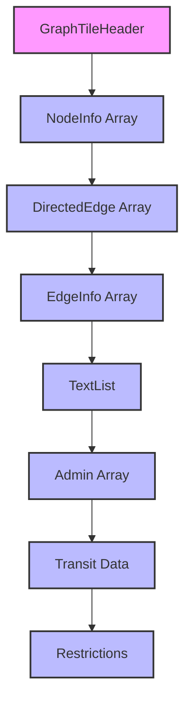

# Binary Tile Format

## Overview of the Tile Format

Valhalla's graph tiles are stored in a binary format optimized for efficient storage and quick loading. Understanding this format is crucial for building a graph tile builder. This chapter provides a detailed examination of the binary tile format.

## Tile Header

Each tile begins with a header that contains metadata about the tile:

```cpp
// From baldr/graphtileheader.h
class GraphTileHeader {
public:
  GraphTileHeader();
  
  // Set methods
  void set_graphid(const baldr::GraphId& graphid);
  void set_date_created(const uint32_t date);
  void set_node_count(const uint32_t count);
  void set_directed_edge_count(const uint32_t count);
  // ... many more setters ...
  
  // Get methods
  baldr::GraphId graphid() const;
  uint32_t date_created() const;
  uint32_t node_count() const;
  uint32_t directed_edge_count() const;
  // ... many more getters ...
  
private:
  uint64_t graphid_;                 // Graph Id (tileid and level)
  uint64_t date_created_;            // Date tile was created
  
  // Counts of objects in the tile
  uint64_t node_count_;              // Number of nodes
  uint64_t directed_edge_count_;     // Number of directed edges
  uint64_t predictedspeeds_count_;   // Number of predicted speeds elements
  
  // Offsets to the start of objects in the tile
  uint64_t complex_restriction_forward_offset_;  // Offset to complex restriction list
  uint64_t complex_restriction_reverse_offset_;  // Offset to complex restriction list
  uint64_t edgeinfo_offset_;         // Offset to edge info
  uint64_t textlist_offset_;         // Offset to text list
  
  // ... many more fields ...
};
```

The header serves several purposes:
1. **Identification**: The `graphid_` field identifies the tile within the hierarchy
2. **Metadata**: Fields like `date_created_` provide metadata about the tile
3. **Counts**: Fields like `node_count_` and `directed_edge_count_` indicate how many objects are in the tile
4. **Offsets**: Fields like `edgeinfo_offset_` indicate where different sections start within the tile

## Memory Layout

The complete memory layout of a tile follows this structure:

```
+------------------+
| GraphTileHeader  |
+------------------+
| NodeInfo[]       |
+------------------+
| DirectedEdge[]   |
+------------------+
| EdgeInfo[]       |
+------------------+
| EdgeShape[]      |
+------------------+
| TextList         |
+------------------+
| Admin[]          |
+------------------+
| Transit[]        |
+------------------+
| Restrictions[]   |
+------------------+
| ... other data   |
+------------------+
```



Each section contains a specific type of data, and the offsets in the header indicate where each section begins. This layout allows for efficient memory mapping and access to specific sections without loading the entire tile.

## Binary Serialization

The `GraphTileBuilder` class handles the serialization of tiles to binary format:

```cpp
// From mjolnir/graphtilebuilder.h
class GraphTileBuilder : public GraphTile {
public:
  GraphTileBuilder(const GraphId& graphid, const std::string& tile_dir,
                  const bool isbuild = true);
  
  // Add elements to the tile
  void AddNodeAccessRestriction(const NodeAccessRestriction& access);
  void AddNodeAdmin(const uint32_t node_index, const uint32_t admin_index);
  void AddAdmin(const std::string& country_name, const std::string& state_name, ...);
  
  // Serialize the tile to disk
  void StoreTileData();
};
```

The `StoreTileData` method writes the tile to disk:

```cpp
// From src/mjolnir/graphtilebuilder.cc
void GraphTileBuilder::StoreTileData() {
  // Make sure the directory exists
  std::string directory = tile_dir_ + filesystem::path::get_separator() +
                         GraphTile::FileSuffix(header_->graphid());
  filesystem::create_directories(directory);
  
  // Open the file
  std::string filename = directory + filesystem::path::get_separator() +
                        GraphTile::FileSuffix(header_->graphid());
  std::ofstream file(filename, std::ios::out | std::ios::binary);
  if (!file.is_open()) {
    throw std::runtime_error("Failed to open file: " + filename);
  }
  
  // Write the header
  file.write(reinterpret_cast<const char*>(header_), sizeof(GraphTileHeader));
  
  // Write the nodes
  file.write(reinterpret_cast<const char*>(nodes_.data()), nodes_.size() * sizeof(NodeInfo));
  
  // Write the directed edges
  file.write(reinterpret_cast<const char*>(directededges_.data()),
             directededges_.size() * sizeof(DirectedEdge));
  
  // ... write other sections ...
  
  // Close the file
  file.close();
}
```

The serialization process writes each section of the tile sequentially to the file, ensuring that the offsets in the header correctly point to the start of each section.

## File Naming Convention

Tile files are named according to a specific convention that encodes the tile ID and level:

```cpp
// From baldr/graphtile.cc
std::string GraphTile::FileSuffix(const GraphId& graphid) {
  // If the level is 0, the directory is the first 3 digits of the tile ID
  // If the level is 1, the directory is the first 2 digits of the tile ID
  // If the level is 2, the directory is the first digit of the tile ID
  
  std::string suffix;
  uint32_t level = graphid.level();
  uint32_t tileid = graphid.tileid();
  
  if (level == 0) {
    suffix = std::to_string(tileid / 1000000);
  } else if (level == 1) {
    suffix = std::to_string(tileid / 100000);
  } else if (level == 2) {
    suffix = std::to_string(tileid / 10000);
  }
  
  // Add the level and tile ID to the suffix
  suffix += "/" + std::to_string(level) + "/" + std::to_string(tileid);
  
  return suffix;
}
```

This naming convention allows for efficient organization of tiles on disk and quick lookup based on tile ID and level. For example, a tile with ID 756425 at level 2 would be stored at `/2/000/756/425.gph`.

## Data Compression Techniques

To minimize storage requirements, Valhalla uses several compression techniques:

### 1. Bit Packing

Multiple fields are packed into a single integer to save space:

```cpp
// From baldr/nodeinfo.h
class NodeInfo {
public:
  // Set methods
  void set_latlng(const std::pair<float, float>& ll);
  void set_access(const uint32_t access);
  void set_type(const NodeType type);
  
private:
  uint64_t field1_;      // Lat,lng packed as uint64_t
  uint32_t field2_;      // Access, intersection type, admin index
  uint32_t field3_;      // Edge index, edge count, time zone
};
```

The implementation packs multiple fields into each integer:

```cpp
// From baldr/nodeinfo.cc
void NodeInfo::set_latlng(const std::pair<float, float>& ll) {
  // Convert to fixed-point and pack into field1_
  uint32_t lat = LatLng::Float2Fixed(ll.first);
  uint32_t lng = LatLng::Float2Fixed(ll.second);
  field1_ = (static_cast<uint64_t>(lat) << 32) | static_cast<uint64_t>(lng);
}

void NodeInfo::set_access(const uint32_t access) {
  // Pack into field2_
  field2_ = (field2_ & ~kAccessMask) | (access & kAccessMask);
}

void NodeInfo::set_type(const NodeType type) {
  // Pack into field2_
  field2_ = (field2_ & ~kTypeShift) | (static_cast<uint32_t>(type) << kTypeShift);
}
```

Bit packing allows Valhalla to store more information in less space, which is crucial for keeping tile sizes manageable.

### 2. Delta Encoding

For sequences of similar values, delta encoding stores the differences between values rather than the absolute values:

```cpp
// From src/mjolnir/graphtilebuilder.cc
void GraphTileBuilder::AddEdgeShape(const std::vector<PointLL>& shape) {
  // Store the first point as an absolute value
  uint32_t lat = LatLng::Float2Fixed(shape[0].lat());
  uint32_t lng = LatLng::Float2Fixed(shape[0].lng());
  edgeshape_.push_back(lat);
  edgeshape_.push_back(lng);
  
  // Store subsequent points as deltas
  for (size_t i = 1; i < shape.size(); i++) {
    int32_t dlat = LatLng::Float2Fixed(shape[i].lat()) - lat;
    int32_t dlng = LatLng::Float2Fixed(shape[i].lng()) - lng;
    
    edgeshape_.push_back(dlat);
    edgeshape_.push_back(dlng);
    
    lat += dlat;
    lng += dlng;
  }
}
```

Delta encoding is particularly effective for shape points, as consecutive points are often close together, resulting in small delta values that can be stored using fewer bits.

### 3. Dictionary Encoding

For repeated strings like street names, dictionary encoding stores each unique string once and uses indices to reference them:

```cpp
// From src/mjolnir/graphtilebuilder.cc
uint32_t GraphTileBuilder::AddName(const std::string& name) {
  // Check if the name already exists in the text list
  auto it = text_offset_map_.find(name);
  if (it != text_offset_map_.end()) {
    return it->second;
  }
  
  // Add the name to the text list
  uint32_t offset = textlist_.size();
  textlist_.append(name);
  textlist_.push_back('\0');  // Null terminator
  
  // Add to the offset map
  text_offset_map_[name] = offset;
  
  return offset;
}
```

Dictionary encoding is highly effective for street names, as many edges share the same name. Instead of storing the full string for each edge, only an offset into the text list is stored.

## Binary Format Diagram

Here's a detailed diagram of the binary format:

```
+------------------+
| GraphTileHeader  | 64 bytes
+------------------+
| NodeInfo[]       | node_count * sizeof(NodeInfo) bytes
+------------------+
| DirectedEdge[]   | directed_edge_count * sizeof(DirectedEdge) bytes
+------------------+
| EdgeInfo[]       | Variable size
|                  | Each EdgeInfo contains:
|                  | - Way ID (8 bytes)
|                  | - Shape point count (4 bytes)
|                  | - Name offsets (4 bytes each)
|                  | - Shape points (8 bytes each)
+------------------+
| TextList         | Variable size
|                  | Null-terminated strings
+------------------+
| Admin[]          | admin_count * sizeof(Admin) bytes
|                  | Each Admin contains:
|                  | - Country code (2 bytes)
|                  | - State code (2 bytes)
|                  | - Country name offset (4 bytes)
|                  | - State name offset (4 bytes)
+------------------+
| ... other data   |
+------------------+
```



## Reading Tiles

The `GraphTile` class handles reading tiles from disk:

```cpp
// From baldr/graphtile.h
class GraphTile {
public:
  GraphTile(const GraphId& id, char* ptr, size_t size);
  
  // Header information
  const GraphTileHeader* header() const;
  
  // Access to nodes
  const NodeInfo* node(const uint32_t id) const;
  const NodeInfo* node(const GraphId& node) const;
  
  // Access to directed edges
  const DirectedEdge* directededge(const uint32_t idx) const;
  
  // Many more accessor methods...
};
```

The implementation uses pointer arithmetic to access different sections of the tile:

```cpp
// From baldr/graphtile.cc
const NodeInfo* GraphTile::node(const uint32_t id) const {
  if (id < header_->nodecount()) {
    return &nodes_[id];
  }
  throw std::runtime_error("NodeInfo index out of bounds: " + std::to_string(id));
}

const DirectedEdge* GraphTile::directededge(const uint32_t idx) const {
  if (idx < header_->directededgecount()) {
    return &directededges_[idx];
  }
  throw std::runtime_error("DirectedEdge index out of bounds: " + std::to_string(idx));
}
```

This approach allows for efficient access to tile data without requiring additional memory allocations or copies.

## Tile Cache

To efficiently manage memory usage, Valhalla uses a tile cache:

```cpp
// From baldr/graphreader.h
class GraphReader {
public:
  GraphReader(const boost::property_tree::ptree& pt);
  
  // Get a graph tile
  const GraphTile* GetGraphTile(const GraphId& graphid);
  
private:
  std::string tile_dir_;                    // Directory with tile files
  std::shared_ptr<GraphMemory> memory_;     // Memory-mapped tiles
  CacheLRU<GraphId, GraphTilePtr> cache_;   // LRU cache of tiles
};
```

The implementation uses a least-recently-used (LRU) cache to keep frequently accessed tiles in memory:

```cpp
// From baldr/graphreader.cc
const GraphTile* GraphReader::GetGraphTile(const GraphId& graphid) {
  // Check if the tile is already in the cache
  auto cached = cache_.find(graphid);
  if (cached != cache_.end()) {
    return cached->second.get();
  }
  
  // Not in cache, load it
  std::string filename = tile_dir_ + "/" + GraphTile::FileSuffix(graphid);
  
  // Memory map the file
  std::ifstream file(filename, std::ios::binary);
  if (!file.is_open()) {
    return nullptr;
  }
  
  // Get file size
  file.seekg(0, std::ios::end);
  size_t size = file.tellg();
  file.seekg(0, std::ios::beg);
  
  // Allocate memory and read the file
  char* memory = new char[size];
  file.read(memory, size);
  
  // Create the tile
  auto tile = std::make_shared<GraphTile>(graphid, memory, size);
  
  // Add to cache
  cache_[graphid] = tile;
  
  return tile.get();
}
```

The tile cache is crucial for performance, as it allows Valhalla to avoid repeatedly loading the same tiles from disk during routing operations.

## Version Compatibility

To ensure compatibility between different versions of the tile format, Valhalla includes a version number in the header:

```cpp
// From baldr/graphtileheader.h
class GraphTileHeader {
public:
  // Version
  uint32_t version() const;
  void set_version(const uint32_t version);
  
private:
  uint32_t version_;     // Version of the tile specification
};
```

When reading a tile, the version is checked to ensure compatibility:

```cpp
// From baldr/graphtile.cc
GraphTile::GraphTile(const GraphId& id, char* ptr, size_t size) {
  // Set pointers to the start of each section
  header_ = reinterpret_cast<GraphTileHeader*>(ptr);
  
  // Check version
  if (header_->version() != kCurrentVersion) {
    throw std::runtime_error("Incompatible tile version: " + std::to_string(header_->version()) +
                           " vs current version " + std::to_string(kCurrentVersion));
  }
  
  // Set pointers to other sections based on offsets in the header
  nodes_ = reinterpret_cast<NodeInfo*>(ptr + sizeof(GraphTileHeader));
  directededges_ = reinterpret_cast<DirectedEdge*>(ptr + sizeof(GraphTileHeader) +
                                                 header_->nodecount() * sizeof(NodeInfo));
  
  // ... set other pointers ...
}
```

Version checking ensures that older versions of Valhalla can detect and reject incompatible tile formats, preventing crashes or incorrect routing results.

## Tile Size Considerations

The size of tiles is an important consideration:

1. **Too Large**: Large tiles consume more memory and take longer to load
2. **Too Small**: Small tiles result in more tile boundaries and more tile lookups during routing

Valhalla uses different tile sizes for different hierarchy levels:

```cpp
// From baldr/tilehierarchy.cc
TileHierarchy::TileHierarchy(const boost::property_tree::ptree& pt) {
  // Level 0: Local roads (highest detail)
  levels_[0] = Level(pt.get<float>("mjolnir.tile_size", 500.0f),
                    pt.get<size_t>("mjolnir.max_level_0_transit_nodes", 5000));
  
  // Level 1: Regional roads
  levels_[1] = Level(levels_[0].tiles.TileSize() * 4,
                    pt.get<size_t>("mjolnir.max_level_1_transit_nodes", 10000));
  
  // Level 2: Major highways (lowest detail)
  levels_[2] = Level(levels_[1].tiles.TileSize() * 4,
                    pt.get<size_t>("mjolnir.max_level_2_transit_nodes", 5000));
}
```

This hierarchical approach allows Valhalla to balance memory usage and routing performance, using smaller tiles for detailed local routing and larger tiles for long-distance routing.

Understanding the binary tile format is essential for building a graph tile builder, as it defines how the routing graph is stored and accessed. The format is designed for efficient storage and quick loading, which are crucial for a high-performance routing engine.
