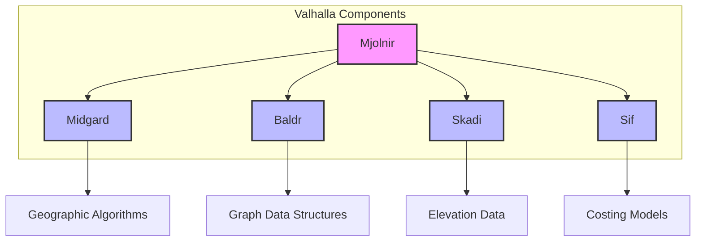
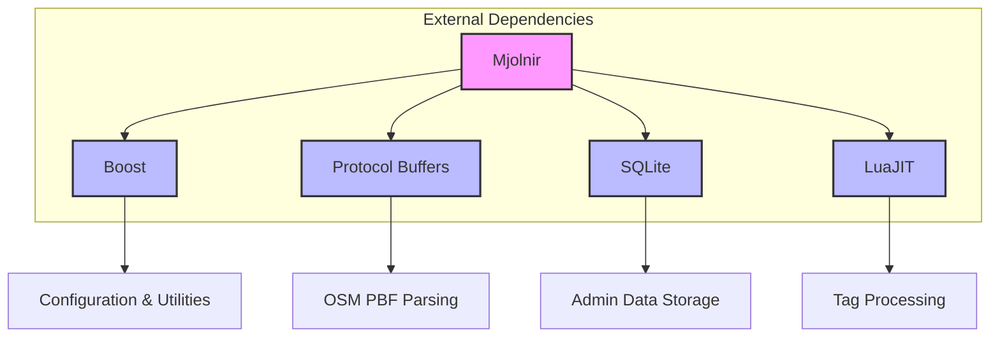
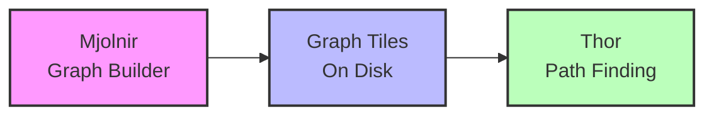
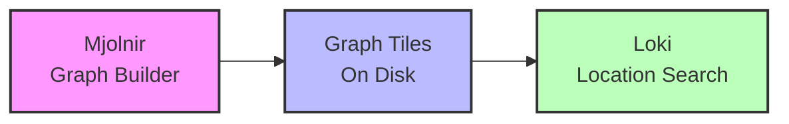
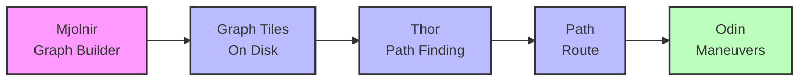
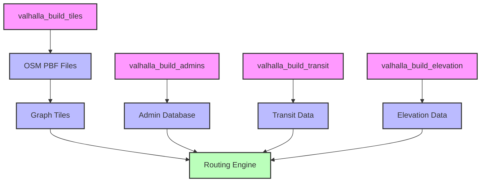

# Dependencies and Integration

## Overview of Mjolnir's Dependencies

Mjolnir relies on several other components within Valhalla and external libraries to function properly. Understanding these dependencies is crucial for building a graph tile builder. This chapter explores Mjolnir's dependencies and how they integrate with each other.

## Internal Valhalla Dependencies

Mjolnir depends on several other Valhalla components:

### 1. Midgard

Midgard provides basic geographic and geometric algorithms:

```cpp
// From valhalla/midgard/pointll.h
class PointLL {
public:
  PointLL(const float lat = 0.0f, const float lng = 0.0f);
  
  // Geographic functions
  float Distance(const PointLL& ll) const;
  float HeadingTo(const PointLL& ll) const;
  PointLL MidPoint(const PointLL& ll) const;
  
  // Accessors
  float lat() const;
  float lng() const;
};
```

Mjolnir uses Midgard for operations like:
- Calculating distances between points
- Computing headings and bearings
- Performing point-in-polygon tests
- Working with bounding boxes

```cpp
// Example of Midgard usage in Mjolnir
bool IsPointInTile(const PointLL& point, const GraphId& tile_id) {
  // Get the tile bounds
  AABB2<PointLL> bounds = GetTileBounds(tile_id);
  
  // Check if the point is within the bounds
  return bounds.Contains(point);
}
```

### 2. Baldr

Baldr provides the base data structures for the graph:

```cpp
// From valhalla/baldr/graphid.h
struct GraphId {
  uint64_t value;
  
  // Methods to access specific parts of the ID
  uint32_t tileid() const;
  uint32_t level() const;
  uint32_t id() const;
};

// From valhalla/baldr/graphtile.h
class GraphTile {
public:
  GraphTile(const GraphId& id, char* ptr, size_t size);
  
  // Header information
  const GraphTileHeader* header() const;
  
  // Access to nodes
  const NodeInfo* node(const uint32_t id) const;
  
  // Access to directed edges
  const DirectedEdge* directededge(const uint32_t idx) const;
};
```

Mjolnir uses Baldr for:
- Defining the structure of graph tiles
- Working with graph IDs
- Accessing nodes and edges
- Managing the tile hierarchy

```cpp
// Example of Baldr usage in Mjolnir
void ProcessTile(const GraphId& tile_id) {
  // Create a tile builder
  GraphTileBuilder builder(tile_id, tile_dir);
  
  // Add nodes and edges to the tile
  // ...
  
  // Store the tile
  builder.StoreTileData();
}
```

### 3. Skadi

Skadi provides elevation data:

```cpp
// From valhalla/skadi/sample.h
class sample {
public:
  sample(const boost::property_tree::ptree& pt);
  
  // Get the elevation at a point
  double get(const midgard::PointLL& point) const;
  
  // Get elevations for a list of points
  std::vector<double> get_all(const std::vector<midgard::PointLL>& points) const;
};
```

Mjolnir uses Skadi for:
- Adding elevation data to edges
- Computing grades (slopes) for edges
- Enhancing bicycle and pedestrian routing

```cpp
// Example of Skadi usage in Mjolnir
void AddElevationToEdge(DirectedEdge& edge, const std::vector<PointLL>& shape) {
  // Get the elevation service
  skadi::sample elevation(config);
  
  // Sample elevation at each point
  std::vector<double> elevations = elevation.get_all(shape);
  
  // Calculate the weighted grade
  float grade = CalculateWeightedGrade(shape, elevations);
  
  // Set the grade on the edge
  edge.set_weighted_grade(grade);
}
```

### 4. Sif

Sif provides costing models for different modes of travel:

```cpp
// From valhalla/sif/costfactory.h
class CostFactory {
public:
  static sif::cost_ptr_t Create(const std::string& costing_name,
                              const boost::property_tree::ptree& config);
};

// From valhalla/sif/dynamiccost.h
class DynamicCost {
public:
  virtual ~DynamicCost();
  
  // Get the cost to traverse an edge
  virtual float EdgeCost(const baldr::DirectedEdge* edge) const = 0;
  
  // Get the cost to traverse a node
  virtual float TransitionCost(const baldr::DirectedEdge* edge,
                             const baldr::NodeInfo* node,
                             const baldr::DirectedEdge* prev_edge) const = 0;
};
```

Mjolnir uses Sif for:
- Assigning default speeds to edges
- Setting access restrictions
- Determining traversability for different modes

```cpp
// Example of Sif usage in Mjolnir
void SetDefaultSpeeds(DirectedEdge& edge) {
  // Create an auto costing object
  auto costing = sif::CostFactory::Create("auto", config);
  
  // Get the default speed for this road class
  uint32_t speed = costing->GetSpeed(edge.classification(), edge.use());
  
  // Set the speed on the edge
  edge.set_speed(speed);
}
```



## External Dependencies

Mjolnir also depends on several external libraries:

### 1. Boost

Boost provides various utilities:

```cpp
// Example of Boost usage in Mjolnir
#include <boost/property_tree/ptree.hpp>
#include <boost/property_tree/json_parser.hpp>

void ReadConfig(const std::string& config_file) {
  boost::property_tree::ptree pt;
  boost::property_tree::read_json(config_file, pt);
  
  // Access configuration values
  std::string tile_dir = pt.get<std::string>("mjolnir.tile_dir");
  float tile_size = pt.get<float>("mjolnir.tile_size", 500.0f);
}
```

Mjolnir uses Boost for:
- Property trees for configuration
- Filesystem operations
- String algorithms
- Thread management

### 2. Protocol Buffers

Protocol Buffers are used for parsing OSM PBF files:

```cpp
// Example of Protocol Buffers usage in Mjolnir
#include <osmpbf/osmpbf.h>

void ParsePBF(const std::string& pbf_file) {
  OSMPBF::Parser parser;
  parser.parse(pbf_file);
  
  // Process nodes
  for (const auto& node : parser.nodes) {
    // Process node
  }
  
  // Process ways
  for (const auto& way : parser.ways) {
    // Process way
  }
  
  // Process relations
  for (const auto& relation : parser.relations) {
    // Process relation
  }
}
```

### 3. SQLite

SQLite is used for storing and querying administrative data:

```cpp
// Example of SQLite usage in Mjolnir
#include <sqlite3.h>

void QueryAdminData(const PointLL& point) {
  sqlite3* db;
  sqlite3_open("admin.sqlite", &db);
  
  // Prepare the query
  sqlite3_stmt* stmt;
  sqlite3_prepare_v2(db, "SELECT country, state FROM admins WHERE ST_Contains(geom, ?)", -1, &stmt, nullptr);
  
  // Bind the point
  sqlite3_bind_double(stmt, 1, point.lng());
  sqlite3_bind_double(stmt, 2, point.lat());
  
  // Execute the query
  if (sqlite3_step(stmt) == SQLITE_ROW) {
    std::string country = reinterpret_cast<const char*>(sqlite3_column_text(stmt, 0));
    std::string state = reinterpret_cast<const char*>(sqlite3_column_text(stmt, 1));
    
    // Use the admin data
  }
  
  // Clean up
  sqlite3_finalize(stmt);
  sqlite3_close(db);
}
```

### 4. LuaJIT

LuaJIT is used for customizable tag processing:

```cpp
// Example of LuaJIT usage in Mjolnir
#include <lua.hpp>

void ProcessTags(const std::vector<std::pair<std::string, std::string>>& tags) {
  lua_State* L = luaL_newstate();
  luaL_openlibs(L);
  
  // Load the Lua script
  luaL_dofile(L, "tag_processing.lua");
  
  // Call the process_tags function
  lua_getglobal(L, "process_tags");
  
  // Create a table for the tags
  lua_newtable(L);
  for (size_t i = 0; i < tags.size(); ++i) {
    lua_pushstring(L, tags[i].second.c_str());
    lua_setfield(L, -2, tags[i].first.c_str());
  }
  
  // Call the function
  lua_call(L, 1, 1);
  
  // Get the result
  if (lua_istable(L, -1)) {
    // Process the result table
  }
  
  // Clean up
  lua_close(L);
}
```



## Integration with Other Valhalla Components

Mjolnir integrates with other Valhalla components to form a complete routing system:

### 1. Integration with Thor

Thor uses the graph tiles built by Mjolnir to perform path finding:

```cpp
// From valhalla/thor/pathalgorithm.h
class PathAlgorithm {
public:
  PathAlgorithm();
  
  // Find the shortest path
  std::vector<PathInfo> GetBestPath(const Location& origin,
                                  const Location& destination,
                                  GraphReader& reader,
                                  const sif::mode_costing_t& mode_costing,
                                  const sif::TravelMode mode);
};
```

The integration happens through the graph tiles:



### 2. Integration with Loki

Loki uses the graph tiles to search for locations and correlate input coordinates to the graph:

```cpp
// From valhalla/loki/search.h
class Search {
public:
  static std::unordered_map<size_t, std::vector<baldr::PathLocation>> Search(
      const std::vector<valhalla::Location>& locations,
      GraphReader& reader,
      const sif::mode_costing_t& mode_costing);
};
```

The integration happens through the graph tiles:



### 3. Integration with Odin

Odin uses the graph tiles to generate maneuvers and narratives:

```cpp
// From valhalla/odin/maneuverbuilder.h
class ManeuverBuilder {
public:
  ManeuverBuilder(const DirectionsOptions& directions_options);
  
  // Create maneuvers from a path
  std::list<Maneuver> Build(const std::vector<PathInfo>& path,
                          const std::vector<PathLocation>& path_locations);
};
```

The integration happens through the path information:



## Configuration Integration

Mjolnir's behavior can be configured through a JSON configuration file:

```json
{
  "mjolnir": {
    "tile_dir": "/path/to/tiles",
    "tile_size": 500.0,
    "admin_dir": "/path/to/admin",
    "timezone_dir": "/path/to/timezones",
    "transit_dir": "/path/to/transit",
    "hierarchy": true,
    "shortcuts": true,
    "include_driveways": true,
    "include_bicycle": true,
    "include_pedestrian": true,
    "include_driving": true,
    "include_transit": true,
    "max_cache_size": 1000000000
  }
}
```

The configuration is parsed using Boost property trees:

```cpp
// From src/mjolnir/valhalla_build_tiles.cc
int main(int argc, char** argv) {
  // Parse command line arguments
  std::string config_file = "valhalla.json";
  
  // Read the configuration
  boost::property_tree::ptree pt;
  boost::property_tree::read_json(config_file, pt);
  
  // Get configuration values
  std::string tile_dir = pt.get<std::string>("mjolnir.tile_dir");
  float tile_size = pt.get<float>("mjolnir.tile_size", 500.0f);
  bool hierarchy = pt.get<bool>("mjolnir.hierarchy", true);
  bool shortcuts = pt.get<bool>("mjolnir.shortcuts", true);
  
  // Build the tiles
  BuildTiles(pt);
  
  return 0;
}
```

This configuration system allows for flexible customization of the tile building process without requiring code changes.

## Build Process Integration

Mjolnir's build process is integrated with the rest of Valhalla through the build system:

```cmake
# From CMakeLists.txt
add_library(valhalla_mjolnir STATIC
  src/mjolnir/admin.cc
  src/mjolnir/adminbuilder.cc
  src/mjolnir/complexrestrictionbuilder.cc
  src/mjolnir/dataquality.cc
  src/mjolnir/directededgebuilder.cc
  src/mjolnir/edgeinfobuilder.cc
  src/mjolnir/graphbuilder.cc
  src/mjolnir/graphenhancer.cc
  src/mjolnir/graphtilebuilder.cc
  src/mjolnir/hierarchybuilder.cc
  src/mjolnir/node_expander.cc
  src/mjolnir/osmpbfparser.cc
  src/mjolnir/pbfgraphparser.cc
  src/mjolnir/restrictionbuilder.cc
  src/mjolnir/shortcutbuilder.cc
  src/mjolnir/transitbuilder.cc
  src/mjolnir/util.cc
)

target_link_libraries(valhalla_mjolnir
  PUBLIC
    valhalla_midgard
    valhalla_baldr
    valhalla_skadi
    ${PROTOBUF_LIBRARY}
    ${SQLITE3_LIBRARY}
    ${LUAJIT_LIBRARY}
)
```

This build system integration ensures that all dependencies are properly linked and that the Mjolnir library can be used by other components of Valhalla.

## Command Line Integration

Mjolnir provides several command-line tools for building and manipulating tiles:

```cpp
// From src/mjolnir/valhalla_build_tiles.cc
int main(int argc, char** argv) {
  // Parse command line arguments
  std::string config_file = "valhalla.json";
  std::vector<std::string> input_files;
  
  for (int i = 1; i < argc; ++i) {
    if (std::string(argv[i]) == "--config") {
      config_file = argv[++i];
    } else {
      input_files.push_back(argv[i]);
    }
  }
  
  // Read the configuration
  boost::property_tree::ptree pt;
  boost::property_tree::read_json(config_file, pt);
  
  // Build the tiles
  BuildTiles(pt, input_files);
  
  return 0;
}
```

These tools include:
- `valhalla_build_tiles`: Builds graph tiles from OSM data
- `valhalla_build_admins`: Builds administrative data
- `valhalla_build_transit`: Builds transit data
- `valhalla_build_elevation`: Adds elevation data to tiles
- `valhalla_ways_to_edges`: Converts OSM ways to Valhalla edges



Understanding Mjolnir's dependencies and integration points is crucial for building a graph tile builder. The dependencies provide essential functionality, while the integration points ensure that the tile builder works seamlessly with the rest of the routing system.
