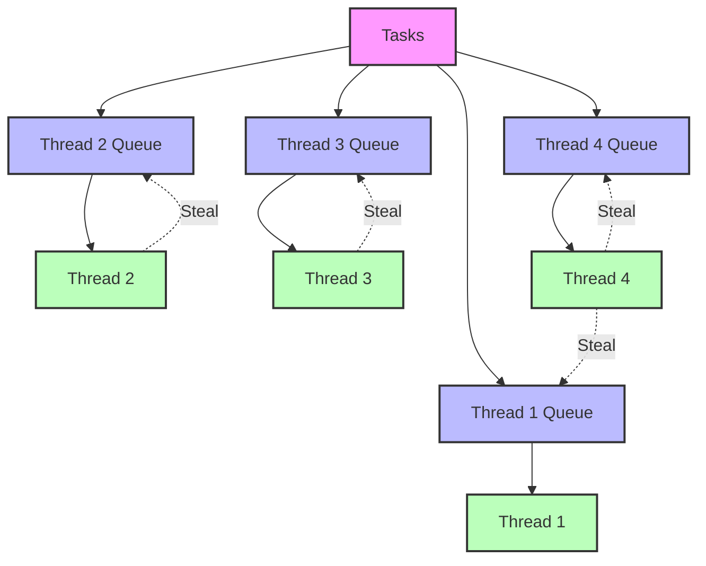

# Performance Optimization

## Introduction to Performance Challenges

Building graph tiles for routing involves processing large amounts of geographic data, which can be computationally intensive and memory-demanding. This chapter explores strategies for optimizing the performance of a graph tile builder, focusing on memory management, parallel processing, and algorithmic improvements.

## Memory Management Strategies

### Memory Usage Patterns

Graph tile building has several distinct memory usage patterns:

1. **Initial Data Loading**: Reading and parsing OSM data
2. **In-Memory Graph**: Storing the complete graph during processing
3. **Tile Building**: Creating and serializing individual tiles
4. **Hierarchical Processing**: Building multiple hierarchy levels

Each stage has different memory requirements and access patterns that can be optimized.

### Memory-Mapped Files

Memory-mapped files provide an efficient way to access large data files without loading them entirely into memory:

```cpp
// Example of using memory-mapped files for OSM data
class OSMDataMapper {
public:
  OSMDataMapper(const std::string& filename) {
    // Open the file
    file_.open(filename, std::ios::binary | std::ios::in);
    if (!file_.is_open()) {
      throw std::runtime_error("Failed to open file: " + filename);
    }
    
    // Get file size
    file_.seekg(0, std::ios::end);
    size_ = file_.tellg();
    file_.seekg(0, std::ios::beg);
    
    // Memory map the file
#ifdef _WIN32
    file_handle_ = CreateFileA(filename.c_str(), GENERIC_READ, FILE_SHARE_READ,
                             NULL, OPEN_EXISTING, FILE_ATTRIBUTE_NORMAL, NULL);
    mapping_ = CreateFileMapping(file_handle_, NULL, PAGE_READONLY, 0, 0, NULL);
    data_ = static_cast<char*>(MapViewOfFile(mapping_, FILE_MAP_READ, 0, 0, 0));
#else
    data_ = static_cast<char*>(mmap(nullptr, size_, PROT_READ, MAP_PRIVATE,
                                  file_.fileno(), 0));
#endif
  }
  
  ~OSMDataMapper() {
    // Unmap the file
#ifdef _WIN32
    UnmapViewOfFile(data_);
    CloseHandle(mapping_);
    CloseHandle(file_handle_);
#else
    munmap(data_, size_);
#endif
    file_.close();
  }
  
  // Access the mapped data
  const char* data() const { return data_; }
  size_t size() const { return size_; }
  
private:
  std::ifstream file_;
  size_t size_;
  char* data_;
#ifdef _WIN32
  HANDLE file_handle_;
  HANDLE mapping_;
#endif
};
```

Memory-mapped files offer several advantages:
- The operating system handles paging data in and out of memory
- Only the accessed portions of the file are loaded into memory
- Multiple processes can share the same mapped file
- Reduced memory usage for large files

### Custom Memory Allocators

Custom memory allocators can significantly improve performance for frequently allocated objects:

```cpp
// Example of a simple memory pool allocator
template<typename T, size_t BlockSize = 4096>
class PoolAllocator {
public:
  PoolAllocator() : current_block_(nullptr), current_pos_(0), current_block_size_(0) {
    // Allocate the first block
    AllocateBlock();
  }
  
  ~PoolAllocator() {
    // Free all blocks
    for (char* block : blocks_) {
      delete[] block;
    }
  }
  
  // Allocate an object
  T* Allocate() {
    // Check if we need a new block
    if (current_pos_ + sizeof(T) > current_block_size_) {
      AllocateBlock();
    }
    
    // Allocate from the current block
    T* result = reinterpret_cast<T*>(current_block_ + current_pos_);
    current_pos_ += sizeof(T);
    
    // Construct the object
    new(result) T();
    
    return result;
  }
  
  // Free an object (does nothing in this simple implementation)
  void Free(T* ptr) {
    // Call the destructor
    ptr->~T();
    
    // Note: Memory is not actually freed until the pool is destroyed
  }
  
private:
  // Allocate a new block
  void AllocateBlock() {
    current_block_ = new char[BlockSize];
    blocks_.push_back(current_block_);
    current_pos_ = 0;
    current_block_size_ = BlockSize;
  }
  
  std::vector<char*> blocks_;
  char* current_block_;
  size_t current_pos_;
  size_t current_block_size_;
};
```

Custom allocators are particularly useful for:
- Small, frequently allocated objects like nodes and edges
- Objects with similar lifetimes
- Reducing memory fragmentation
- Improving cache locality

### Streaming Processing

For datasets too large to fit in memory, streaming processing can be used:

```cpp
// Example of streaming processing for OSM data
class OSMStreamProcessor {
public:
  OSMStreamProcessor(const std::string& filename, size_t buffer_size = 1024 * 1024) 
      : buffer_size_(buffer_size) {
    // Open the file
    file_.open(filename, std::ios::binary);
    if (!file_.is_open()) {
      throw std::runtime_error("Failed to open file: " + filename);
    }
    
    // Allocate the buffer
    buffer_ = new char[buffer_size_];
  }
  
  ~OSMStreamProcessor() {
    delete[] buffer_;
    file_.close();
  }
  
  // Process the file in chunks
  template<typename Func>
  void Process(Func process_func) {
    while (!file_.eof()) {
      // Read a chunk
      file_.read(buffer_, buffer_size_);
      size_t bytes_read = file_.gcount();
      
      if (bytes_read > 0) {
        // Process the chunk
        process_func(buffer_, bytes_read);
      }
    }
  }
  
private:
  std::ifstream file_;
  char* buffer_;
  size_t buffer_size_;
};
```

Streaming processing is essential for:
- Processing planet-scale OSM data
- Systems with limited memory
- Handling multiple large input files
- Progressive processing of data

### Memory Usage Monitoring

Monitoring memory usage helps identify bottlenecks and optimize allocation patterns:

```cpp
// Example of memory usage monitoring
class MemoryMonitor {
public:
  MemoryMonitor() {
    // Initialize counters
    total_allocated_ = 0;
    peak_allocated_ = 0;
    allocation_count_ = 0;
  }
  
  // Track allocation
  void TrackAllocation(size_t size) {
    total_allocated_ += size;
    allocation_count_++;
    peak_allocated_ = std::max(peak_allocated_, total_allocated_);
  }
  
  // Track deallocation
  void TrackDeallocation(size_t size) {
    total_allocated_ -= size;
  }
  
  // Get statistics
  size_t GetTotalAllocated() const { return total_allocated_; }
  size_t GetPeakAllocated() const { return peak_allocated_; }
  size_t GetAllocationCount() const { return allocation_count_; }
  
private:
  size_t total_allocated_;
  size_t peak_allocated_;
  size_t allocation_count_;
};
```

Memory monitoring can help:
- Identify memory leaks
- Optimize allocation patterns
- Determine appropriate buffer sizes
- Plan hardware requirements

## Parallel Processing Techniques

### Task Parallelism

Task parallelism involves dividing the work into independent tasks that can be executed in parallel:

```cpp
// Example of task parallelism using std::thread
class TaskParallelizer {
public:
  TaskParallelizer(size_t num_threads = std::thread::hardware_concurrency())
      : num_threads_(num_threads) {}
  
  // Execute tasks in parallel
  template<typename Func>
  void Execute(const std::vector<Func>& tasks) {
    std::vector<std::thread> threads;
    
    // Create threads
    for (size_t i = 0; i < std::min(tasks.size(), num_threads_); ++i) {
      threads.emplace_back([&tasks, i, this]() {
        // Execute tasks assigned to this thread
        for (size_t j = i; j < tasks.size(); j += num_threads_) {
          tasks[j]();
        }
      });
    }
    
    // Wait for all threads to complete
    for (auto& thread : threads) {
      thread.join();
    }
  }
  
private:
  size_t num_threads_;
};
```

Task parallelism is useful for:
- Processing multiple tiles independently
- Building different hierarchy levels simultaneously
- Handling different aspects of tile building (nodes, edges, etc.)
- Utilizing multi-core processors effectively

### Data Parallelism

Data parallelism involves processing different portions of the data in parallel:

```cpp
// Example of data parallelism for processing OSM data
class DataParallelizer {
public:
  DataParallelizer(size_t num_threads = std::thread::hardware_concurrency())
      : num_threads_(num_threads) {}
  
  // Process data in parallel
  template<typename Data, typename Func>
  void Process(const std::vector<Data>& data, Func process_func) {
    std::vector<std::thread> threads;
    
    // Calculate chunk size
    size_t chunk_size = (data.size() + num_threads_ - 1) / num_threads_;
    
    // Create threads
    for (size_t i = 0; i < num_threads_; ++i) {
      threads.emplace_back([&data, &process_func, i, chunk_size]() {
        // Calculate range for this thread
        size_t start = i * chunk_size;
        size_t end = std::min(start + chunk_size, data.size());
        
        // Process the range
        for (size_t j = start; j < end; ++j) {
          process_func(data[j]);
        }
      });
    }
    
    // Wait for all threads to complete
    for (auto& thread : threads) {
      thread.join();
    }
  }
  
private:
  size_t num_threads_;
};
```

Data parallelism is effective for:
- Processing large numbers of similar items (nodes, ways, etc.)
- Balancing workload across threads
- Maximizing CPU utilization
- Processing independent data chunks

### Thread Pools

Thread pools provide a reusable set of worker threads for executing tasks:

```cpp
// Example of a simple thread pool
class ThreadPool {
public:
  ThreadPool(size_t num_threads = std::thread::hardware_concurrency())
      : stop_(false) {
    // Create worker threads
    for (size_t i = 0; i < num_threads; ++i) {
      workers_.emplace_back([this]() {
        while (true) {
          std::function<void()> task;
          
          // Get a task from the queue
          {
            std::unique_lock<std::mutex> lock(queue_mutex_);
            condition_.wait(lock, [this]() { return stop_ || !tasks_.empty(); });
            
            if (stop_ && tasks_.empty()) {
              return;
            }
            
            task = std::move(tasks_.front());
            tasks_.pop();
          }
          
          // Execute the task
          task();
        }
      });
    }
  }
  
  ~ThreadPool() {
    // Stop all threads
    {
      std::unique_lock<std::mutex> lock(queue_mutex_);
      stop_ = true;
    }
    
    condition_.notify_all();
    
    for (auto& worker : workers_) {
      worker.join();
    }
  }
  
  // Add a task to the pool
  template<typename Func>
  void Enqueue(Func&& func) {
    {
      std::unique_lock<std::mutex> lock(queue_mutex_);
      tasks_.emplace(std::forward<Func>(func));
    }
    
    condition_.notify_one();
  }
  
private:
  std::vector<std::thread> workers_;
  std::queue<std::function<void()>> tasks_;
  std::mutex queue_mutex_;
  std::condition_variable condition_;
  bool stop_;
};
```

Thread pools are beneficial for:
- Reusing threads to avoid creation/destruction overhead
- Managing a large number of small tasks
- Balancing workload dynamically
- Limiting the number of concurrent threads

### Work Stealing

Work stealing is an advanced technique for balancing workload across threads:

```cpp
// Example of work stealing for parallel processing
class WorkStealingExecutor {
public:
  WorkStealingExecutor(size_t num_threads = std::thread::hardware_concurrency())
      : num_threads_(num_threads), stop_(false) {
    // Initialize task queues
    queues_.resize(num_threads_);
    
    // Create worker threads
    for (size_t i = 0; i < num_threads_; ++i) {
      workers_.emplace_back([this, i]() {
        while (true) {
          std::function<void()> task;
          
          // Try to get a task from our queue
          if (TryPopTask(i, task)) {
            task();
            continue;
          }
          
          // Try to steal a task from another queue
          bool stole = false;
          for (size_t j = 0; j < num_threads_ && !stole; ++j) {
            if (j != i && TryStealTask(j, task)) {
              task();
              stole = true;
            }
          }
          
          // If we couldn't find any work, check if we should stop
          if (!stole) {
            std::unique_lock<std::mutex> lock(mutex_);
            if (stop_ && AllQueuesEmpty()) {
              return;
            }
            
            // Wait for new tasks
            condition_.wait(lock);
          }
        }
      });
    }
  }
  
  ~WorkStealingExecutor() {
    // Stop all threads
    {
      std::unique_lock<std::mutex> lock(mutex_);
      stop_ = true;
    }
    
    condition_.notify_all();
    
    for (auto& worker : workers_) {
      worker.join();
    }
  }
  
  // Add a task to a specific queue
  template<typename Func>
  void Enqueue(size_t queue_index, Func&& func) {
    {
      std::unique_lock<std::mutex> lock(mutex_);
      queues_[queue_index].push(std::forward<Func>(func));
    }
    
    condition_.notify_all();
  }
  
private:
  // Try to pop a task from a queue
  bool TryPopTask(size_t queue_index, std::function<void()>& task) {
    std::unique_lock<std::mutex> lock(mutex_);
    if (queues_[queue_index].empty()) {
      return false;
    }
    
    task = std::move(queues_[queue_index].front());
    queues_[queue_index].pop();
    return true;
  }
  
  // Try to steal a task from a queue
  bool TryStealTask(size_t queue_index, std::function<void()>& task) {
    std::unique_lock<std::mutex> lock(mutex_);
    if (queues_[queue_index].empty()) {
      return false;
    }
    
    task = std::move(queues_[queue_index].front());
    queues_[queue_index].pop();
    return true;
  }
  
  // Check if all queues are empty
  bool AllQueuesEmpty() {
    for (const auto& queue : queues_) {
      if (!queue.empty()) {
        return false;
      }
    }
    return true;
  }
  
  size_t num_threads_;
  std::vector<std::thread> workers_;
  std::vector<std::queue<std::function<void()>>> queues_;
  std::mutex mutex_;
  std::condition_variable condition_;
  bool stop_;
};
```

Work stealing is valuable for:
- Handling uneven workloads
- Maximizing thread utilization
- Adapting to varying task durations
- Minimizing thread idle time


