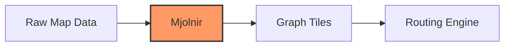
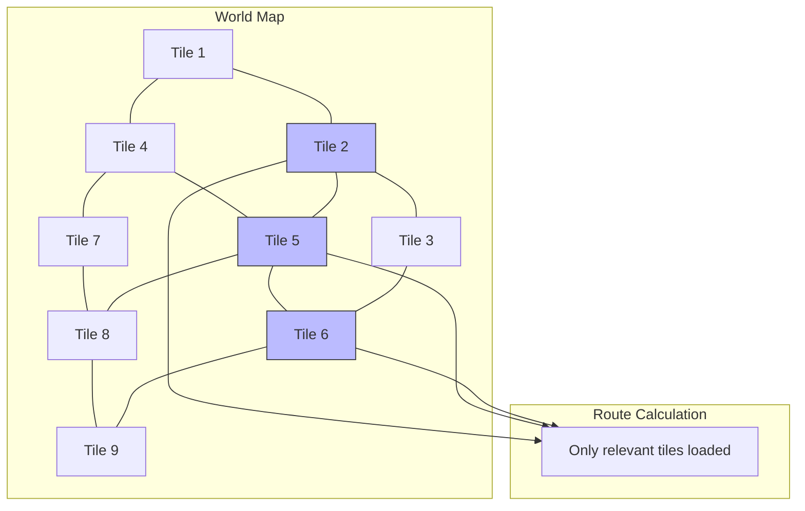

# Understanding Valhalla's Mjolnir

## Introduction

Welcome to "Understanding Valhalla's Mjolnir" - a comprehensive guide to the graph tile building system at the heart of the Valhalla routing engine. This book aims to demystify how Valhalla transforms raw map data into a sophisticated routing graph, providing insights for developers working with routing systems.

### What is Mjolnir?

In Norse mythology, Mjolnir is Thor's hammer - a powerful tool capable of leveling mountains. Similarly, Valhalla's Mjolnir component is a powerful tool that transforms the raw landscape of geographic data into structured, navigable graph tiles.

Mjolnir is responsible for:
- Parsing OpenStreetMap (OSM) data
- Extracting road networks and other transportation features
- Building a hierarchical graph structure
- Creating optimized tiles for efficient routing

Understanding Mjolnir is valuable for anyone looking to:
- Customize Valhalla for specific routing needs
- Integrate different data sources with Valhalla
- Build their own graph tile system
- Understand how modern routing engines work

### The Power of Graph Tiles

At the core of Valhalla's design is the concept of graph tiles - a way of dividing the world into manageable chunks for routing. This approach offers several advantages:

1. **Memory Efficiency**: Only load the tiles needed for a specific route
2. **Parallelization**: Process tiles independently for faster computation
3. **Incremental Updates**: Update only the tiles that have changed
4. **Hierarchical Routing**: Use different levels of detail for different parts of a route

### How This Book is Organized

This book takes you on a journey through Mjolnir's architecture and processes:

1. **Valhalla's Tiled Structure**: Understanding the fundamental concept of graph tiles
2. **OSM Data Processing**: How Mjolnir reads and interprets OpenStreetMap data
3. **Graph Construction**: The process of building a routable graph from raw data
4. **Core Data Structures**: The key components that make up the graph
5. **Tile Creation**: How tiles are generated and managed
6. **Hierarchical Graph Building**: Creating multiple levels for efficient routing
7. **Costing and Edge Attribution**: How road properties affect routing decisions
8. **Special Cases**: Handling complex scenarios like turn restrictions and transit
9. **Binary Tile Format**: How graph data is stored efficiently on disk
10. **Building Your Own**: Guidelines for creating custom graph tile builders

Each chapter combines conceptual explanations with practical code examples from Valhalla's codebase, helping you understand both the theory and implementation.

### Who This Book Is For

This book is designed for:

- **Developers** working with Valhalla or other routing engines
- **GIS specialists** interested in routing technology
- **Data scientists** working with transportation networks
- **Anyone** curious about how modern routing systems work

While some familiarity with C++ and graph theory is helpful, we've tried to make the content accessible by focusing on concepts and providing clear explanations of the code.

### Why Understanding Mjolnir Matters

Mjolnir represents years of engineering experience in solving the complex problem of efficient routing at scale. By understanding its design and implementation, you gain insights into:

- Efficient processing of large geospatial datasets
- Graph algorithms for transportation networks
- Memory-efficient data structures for routing
- Balancing preprocessing complexity with query performance

Whether you're using Valhalla as-is, extending it for custom needs, or building your own routing system, the knowledge in this book will help you make informed decisions and avoid common pitfalls.

Let's begin our exploration of Valhalla's Mjolnir!
