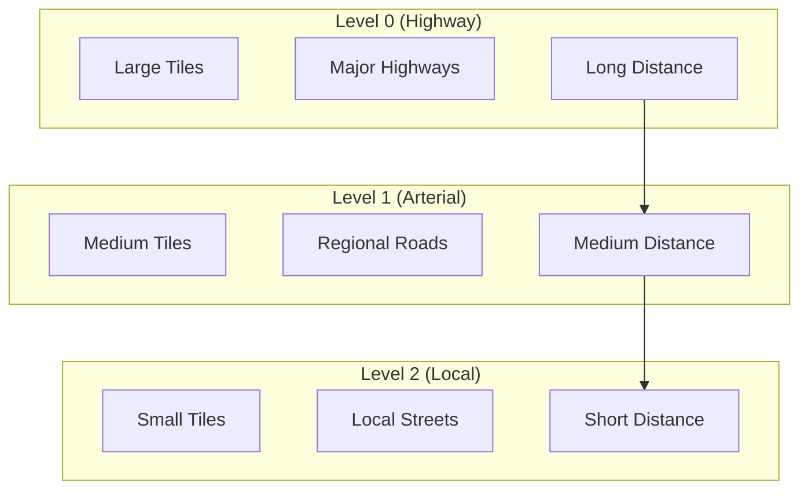
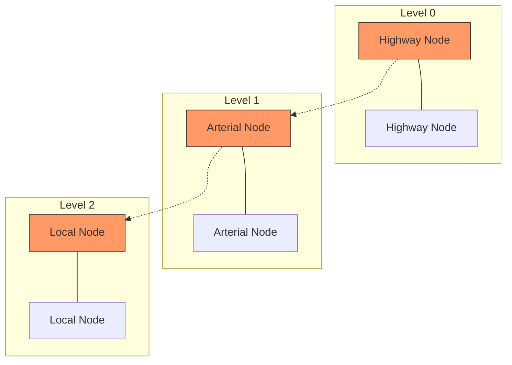

# Understanding Graph Tiles

## The Power of Tiled Routing Graphs

Imagine trying to find the best route from New York to Los Angeles. If you were to load the entire road network of the United States into memory at once, you'd need to process millions of road segments and intersections—far more than necessary for a single route calculation. This is where the concept of graph tiles becomes transformative.

Graph tiles divide the world into manageable geographic chunks, each containing a portion of the road network. When calculating a route, only the tiles that intersect with potential paths need to be loaded into memory. This approach dramatically reduces memory usage and improves performance, especially for long-distance routes.


## Valhalla's Hierarchical Tile System

Valhalla takes the tiled approach a step further by implementing a hierarchical system. This mimics how humans naturally navigate: we use local streets near our origin and destination, but prefer highways for the middle portion of longer journeys.

### The Three-Level Hierarchy

Valhalla organizes its routing graph into three distinct levels:

1. **Highway Level (Level 0)**: Contains major highways and connections
   - Covers large areas (approximately 4° × 4° tiles)
   - Used for long-distance routing
   - Includes motorways, trunks, and primary roads

2. **Arterial Level (Level 1)**: Contains regional and connecting roads
   - Medium-sized tiles (approximately 1° × 1° tiles)
   - Used for medium-distance routing
   - Includes secondary and tertiary roads

3. **Local Level (Level 2)**: Contains detailed local networks
   - Small tiles (approximately 0.25° × 0.25° tiles)
   - Used for short-distance routing and first/last mile
   - Includes residential, service, and other minor roads

This hierarchical structure allows the routing algorithm to quickly traverse long distances using higher-level tiles, then switch to more detailed tiles as it approaches the origin and destination.



### Tile Identification and Coordinates

Each tile in Valhalla is uniquely identified by a combination of:

- **Level**: The hierarchy level (0, 1, or 2)
- **Tile ID**: A unique identifier within the level

The tile ID is derived from geographic coordinates using a space-filling curve algorithm, which ensures that nearby locations are likely to be in the same tile or adjacent tiles. This spatial locality is crucial for efficient routing.

In Valhalla's codebase, this is represented by the `GraphId` structure:

```cpp
struct GraphId {
  uint64_t value;
  
  // Methods to access specific parts of the ID
  uint32_t tileid() const;  // Returns the tile ID
  uint32_t level() const;   // Returns the hierarchy level
  uint32_t id() const;      // Returns the element ID within the tile
};
```

The world is divided into a grid based on these tile sizes, with rows and columns starting from the bottom left (-180°, -90°) and increasing to the top right (180°, 90°).

## Inside a Graph Tile

Each graph tile is a self-contained unit that stores a portion of the routing graph. Let's explore what's inside:

### Tile Header

The header contains metadata about the tile, including:

- Tile ID and level
- Creation date
- Counts of nodes, edges, and other elements
- Bounding box coordinates
- Version information

This metadata helps the routing engine quickly determine if a tile is relevant for a particular query and if it's compatible with the current software version.

### Nodes

Nodes represent intersections in the road network. Each node contains:

- Geographic coordinates (latitude and longitude)
- List of outgoing edges
- Traffic signal information
- Administrative region references
- Elevation (if available)

Nodes are the connection points between road segments and play a crucial role in path finding.

### Directed Edges

Edges represent road segments with direction-specific attributes. Each directed edge contains:

- References to start and end nodes
- Length and travel time
- Road classification
- Access restrictions (e.g., no pedestrians, no trucks)
- Speed limit
- References to names and other shared data
- Connectivity information (transitions to other tiles or hierarchy levels)

Edges are directed, meaning that a two-way street is represented by two separate edges, one in each direction. This allows for modeling direction-specific attributes like one-way restrictions or different speed limits.

### Edge Information

To save space, information that's shared between edges (like road names or shape points) is stored separately:

- Road names in multiple languages
- Shape points (the geometric representation of the road)
- Exit signs and route numbers
- Bike network information

This approach significantly reduces the size of the tiles by avoiding duplication of common data.

### Additional Data

Graph tiles also contain specialized data structures for:

- Turn restrictions (prohibited turns)
- Traffic signs and signals
- Lane information
- Administrative boundaries
- Time-dependent restrictions
- Transit schedules (for multimodal routing)

These additional data structures enable advanced routing features beyond simple shortest-path calculations.

## Tile Connectivity

One of the challenges with a tiled approach is handling routes that cross tile boundaries. Valhalla solves this with two types of special connections:

### Tile Transitions

When a road crosses from one tile to another at the same hierarchy level, Valhalla creates "transition" edges and nodes. These special connections allow routes to seamlessly cross tile boundaries without any disruption to the routing algorithm.

### Hierarchy Transitions

To move between hierarchy levels (e.g., from a highway to local streets), Valhalla uses "transition up/down" edges. These connect nodes that exist in multiple hierarchy levels, allowing routes to efficiently switch between different road types as needed.



## Memory Management

Valhalla uses a sophisticated tile cache to manage memory usage:

```cpp
class GraphReader {
private:
  std::shared_ptr<GraphMemory> memory_;
  CacheLRU<GraphId, GraphTilePtr> cache_;
  // ...
};
```

This cache uses a least-recently-used (LRU) strategy to keep frequently accessed tiles in memory while allowing less-used tiles to be evicted when memory pressure increases. This approach is particularly important for mobile or embedded applications where memory resources may be limited.

## Why This Matters for Overture

Understanding Valhalla's tiled structure is crucial for our work with Overture data because:

1. **Integration Target**: If we want to use Valhalla as a routing engine for Overture data, we need to transform our data into this tiled format.

2. **Design Inspiration**: Even if we create our own custom graph tile format for Overture, many of the principles from Valhalla's design (hierarchy, connectivity, memory management) will be valuable.

3. **Performance Considerations**: The tiled approach has significant performance implications that should inform our data processing pipeline design.

In the next chapters, we'll explore how Valhalla's Mjolnir component transforms raw map data into this sophisticated tiled structure, and how we can adapt these techniques for Overture data.
