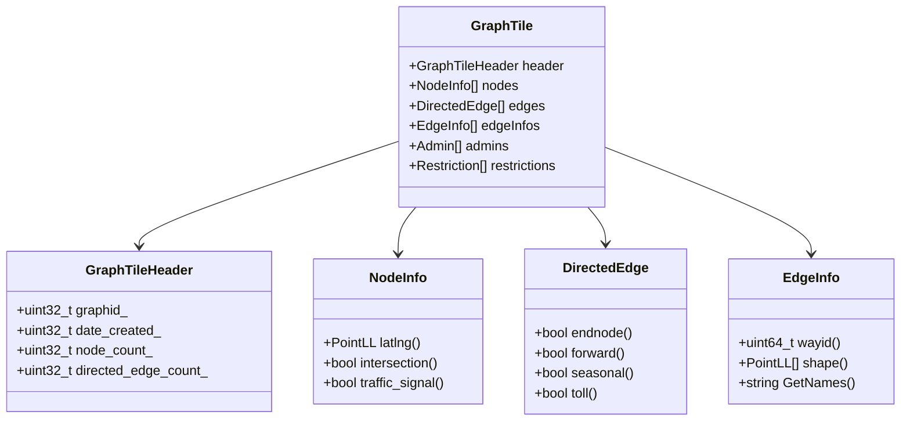

# Core Data Structures

## Overview of Key Data Structures

Mjolnir uses several core data structures to represent the routing graph. Understanding these structures is essential for building a graph tile builder. The most important ones are:

1. **GraphTile**: Contains all data for a specific tile
2. **Node**: Represents an intersection in the road network
3. **DirectedEdge**: Represents a one-way road segment
4. **EdgeInfo**: Contains data shared between opposing directed edges
5. **Admin**: Represents administrative boundaries (countries, states, etc.)
6. **Restriction**: Represents turn restrictions

Let's examine each of these in detail.

## GraphTile Structure

The `GraphTile` class is the container for all data within a tile:

```cpp
// From baldr/graphtile.h
class GraphTile {
public:
  GraphTile(const GraphId& id, char* ptr, size_t size);
  
  // Header information
  const GraphTileHeader* header() const;
  
  // Access to nodes
  const NodeInfo* node(const uint32_t id) const;
  const NodeInfo* node(const GraphId& node) const;
  
  // Access to directed edges
  const DirectedEdge* directededge(const uint32_t idx) const;
  
  // Many more accessor methods...
  
private:
  GraphId graphid_;        // Tile ID
  size_t size_;            // Size in bytes
  char* graphtile_;        // Pointer to memory
  char* header_;           // Pointer to the header
  char* nodes_;            // Pointer to nodes
  char* directededges_;    // Pointer to directed edges
  // ... pointers to other sections ...
};
```

The `GraphTileBuilder` class is used to construct these tiles:

```cpp
// From mjolnir/graphtilebuilder.h
class GraphTileBuilder : public GraphTile {
public:
  GraphTileBuilder(const GraphId& graphid, ...);
  
  // Add elements to the tile
  void AddNodeAccessRestriction(const NodeAccessRestriction& access);
  void AddNodeAdmin(const uint32_t node_index, const uint32_t admin_index);
  void AddAdmin(const std::string& country_name, const std::string& state_name, ...);
  
  // Update elements in the tile
  void UpdateNodeInfo(const uint32_t node_idx, const NodeInfo& nodeinfo);
  void UpdateDirectedEdge(const uint32_t edge_idx, const DirectedEdge& directededge);
  
  // Serialize the tile to disk
  void StoreTileData();
};
```

## Node Structure

Nodes represent intersections in the road network. They're defined by the `NodeInfo` class:

```cpp
// From baldr/nodeinfo.h
class NodeInfo {
public:
  NodeInfo();
  
  // Access methods
  const PointLL& latlng() const;
  bool intersection() const;
  bool traffic_signal() const;
  bool stop_sign() const;
  bool forward_signal() const;
  bool backward_signal() const;
  bool yield_sign() const;
  
  // Many more accessor methods...
  
protected:
  uint64_t field1_;      // Lat,lng packed as uint64_t
  uint32_t field2_;      // Access, intersection type, admin index
  uint32_t field3_;      // Edge index, edge count, time zone
  // ... more fields ...
};
```

The node structure is designed to minimize memory usage while storing all necessary information for routing. Nodes contain information about their geographic location, what type of intersection they represent, and references to the edges connected to them.

## DirectedEdge Structure

Directed edges represent one-way road segments. They're defined by the `DirectedEdge` class:

```cpp
// From baldr/directededge.h
class DirectedEdge {
public:
  DirectedEdge();
  
  // Access methods
  bool endnode() const;
  bool forward() const;
  bool seasonal() const;
  bool toll() const;
  bool tunnel() const;
  bool bridge() const;
  bool roundabout() const;
  
  // Many more accessor methods...
  
protected:
  // Packed data fields
  uint64_t field1_;      // Endpoint node index, use, classification
  uint64_t field2_;      // Restrictions, opposing edge index
  uint64_t field3_;      // Length, speed type, access
  // ... more fields ...
};
```

And the builder uses `DirectedEdgeBuilder` to create these edges:

```cpp
// From mjolnir/directededgebuilder.h
class DirectedEdgeBuilder : public DirectedEdge {
public:
  DirectedEdgeBuilder();
  
  // Set methods
  void set_endnode(const bool endnode);
  void set_forward(const bool forward);
  void set_seasonal(const bool seasonal);
  void set_toll(const bool toll);
  void set_tunnel(const bool tunnel);
  void set_bridge(const bool bridge);
  void set_roundabout(const bool roundabout);
  
  // Many more setter methods...
};
```

DirectedEdges contain critical routing information including:
- Travel mode access (car, pedestrian, bicycle, etc.)
- Speed information
- Road classification
- Directional attributes (one-way, etc.)
- Physical characteristics (bridge, tunnel, etc.)
- References to connected nodes and opposing edges

## EdgeInfo Structure

Edge info contains data shared between opposing directed edges, such as shape points and names:

```cpp
// From baldr/edgeinfo.h
class EdgeInfo {
public:
  EdgeInfo(char* ptr, const char* names_list, const size_t names_list_length);
  
  // Access methods
  bool wayid() const;
  const PointLL* shape() const;
  size_t name_count() const;
  std::string GetNames() const;
  
  // More accessor methods...
};
```

And the builder uses `EdgeInfoBuilder` to create this shared data:

```cpp
// From mjolnir/edgeinfobuilder.h
class EdgeInfoBuilder {
public:
  EdgeInfoBuilder() = delete;
  EdgeInfoBuilder(const OSMWay& way, ...);
  
  // Set methods
  void set_way_id(const uint64_t way_id);
  void set_mean_elevation(const float mean_elevation);
  void set_bike_network(const uint8_t bike_network);
  
  // Add names to the edge
  void AddNameInfo(const std::string& name, ...);
};
```

EdgeInfo is stored separately from DirectedEdge to avoid duplication. For example, a two-way street would have two DirectedEdge objects (one for each direction) but only one EdgeInfo object containing the shared data like street name and shape points.

## Admin Structure

Admin data represents administrative boundaries:

```cpp
// From baldr/admin.h
class Admin {
public:
  Admin(const uint32_t country_offset, const uint32_t state_offset, ...);
  
  // Access methods
  bool IsEquivalent(const Admin& rhs) const;
  std::string country_text() const;
  std::string state_text() const;
  
  // More accessor methods...
};
```

Administrative information is important for:
- Country-specific routing rules (driving side, default access)
- Display of location information
- Cross-border routing considerations

## Restriction Structure

Restrictions represent turn restrictions (e.g., no left turn):

```cpp
// From baldr/restriction.h
class NodeAccessRestriction {
public:
  NodeAccessRestriction(const uint32_t index, const uint32_t type, ...);
  
  // Access methods
  uint32_t index() const;
  uint32_t type() const;
  uint32_t modes() const;
  
  // More accessor methods...
};
```

And complex restrictions (involving multiple edges) use:

```cpp
// From baldr/complexrestriction.h
class ComplexRestriction {
public:
  ComplexRestriction();
  
  // Access methods
  uint64_t from_graphid() const;
  uint64_t to_graphid() const;
  RestrictionType type() const;
  uint64_t via_graphid() const;
  
  // More accessor methods...
};
```

Restrictions are critical for accurate routing as they prevent illegal or impossible maneuvers from being included in routes.

## Memory Layout of a Tile

Understanding the memory layout of a tile is important for efficient serialization and deserialization. Here's the layout:

```
+------------------+
| GraphTileHeader  |
+------------------+
| NodeInfo[]       |
+------------------+
| DirectedEdge[]   |
+------------------+
| EdgeInfo[]       |
+------------------+
| Admin[]          |
+------------------+
| Restriction[]    |
+------------------+
| ... other data   |
+------------------+
```



The `GraphTileBuilder` manages this layout during tile construction:

```cpp
// From src/mjolnir/graphtilebuilder.cc
void GraphTileBuilder::StoreTileData() {
  // Calculate sizes and offsets for each section
  size_t header_size = sizeof(GraphTileHeader);
  size_t nodes_size = nodes_.size() * sizeof(NodeInfo);
  size_t directededges_size = directededges_.size() * sizeof(DirectedEdge);
  // ... calculate other sizes ...
  
  // Create the file
  std::ofstream file(filename_, std::ios::out | std::ios::binary);
  
  // Write the header
  file.write(reinterpret_cast<const char*>(&header_), sizeof(GraphTileHeader));
  
  // Write the nodes
  file.write(reinterpret_cast<const char*>(nodes_.data()), nodes_size);
  
  // Write the directed edges
  file.write(reinterpret_cast<const char*>(directededges_.data()), directededges_size);
  
  // ... write other sections ...
  
  // Close the file
  file.close();
}
```

## Data Compression Techniques

To minimize storage requirements, Valhalla uses several compression techniques:

1. **Bit Packing**: Multiple fields packed into a single integer
2. **Delta Encoding**: Storing differences between values rather than absolute values
3. **Dictionary Encoding**: Using indices into a dictionary for repeated values (like street names)

For example, here's how node coordinates are packed:

```cpp
// From baldr/nodeinfo.h
void NodeInfo::set_latlng(const std::pair<float, float>& ll) {
  PointLL ll_fixed(ll.first, ll.second);
  lat_ = ll_fixed.lat();
  lng_ = ll_fixed.lng();
}
```

And here's how edge attributes are packed:

```cpp
// From baldr/directededge.h
void DirectedEdge::set_attributes(const uint32_t attributes) {
  attributes_ = attributes;
}
```

These compression techniques allow Valhalla to store detailed routing information while keeping the tile sizes manageable, which is particularly important for mobile applications or embedded systems.

## Handling Large Datasets

Processing planet-scale data requires careful memory management. Mjolnir uses several strategies:

1. **Streaming Processing**: Processing data in chunks
2. **Memory-Mapped Files**: For efficient access to large files
3. **Custom Memory Pools**: For allocating many small objects efficiently

For example, here's how tiles are memory-mapped:

```cpp
// From baldr/graphreader.cc
const GraphTile* GraphReader::GetGraphTile(const GraphId& graphid) {
  // Check if the tile is already in the cache
  auto cached = cache_.find(graphid);
  if (cached != cache_.end()) {
    return cached->second.get();
  }
  
  // Not in cache, load it
  std::string filename = tile_dir_ + "/" + GraphTile::FileSuffix(graphid);
  
  // Memory map the file
  std::ifstream file(filename, std::ios::binary);
  if (!file.is_open()) {
    return nullptr;
  }
  
  // Get file size
  file.seekg(0, std::ios::end);
  size_t size = file.tellg();
  file.seekg(0, std::ios::beg);
  
  // Allocate memory and read the file
  char* memory = new char[size];
  file.read(memory, size);
  
  // Create the tile
  auto tile = std::make_shared<GraphTile>(graphid, memory, size);
  
  // Add to cache
  cache_[graphid] = tile;
  
  return tile.get();
}
```

Understanding these core data structures is essential for building a graph tile builder, as they define how the routing graph is represented in memory and on disk.
