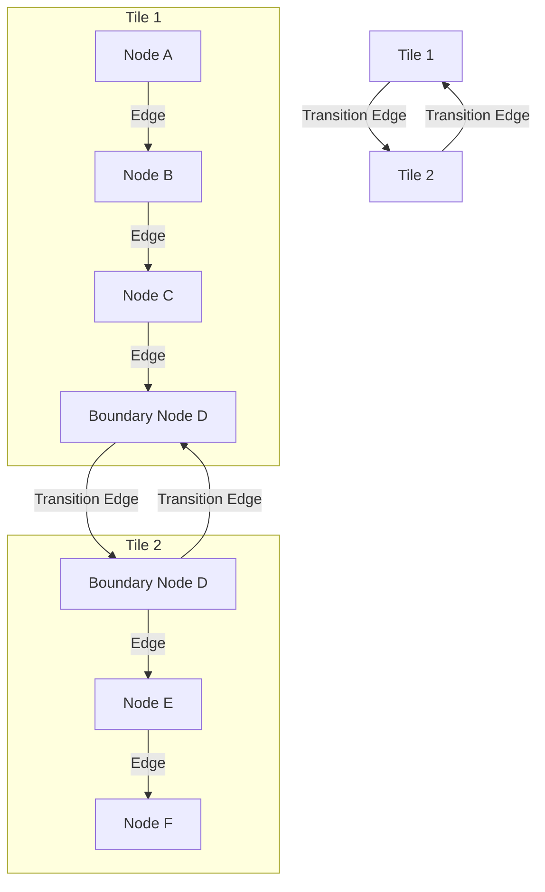
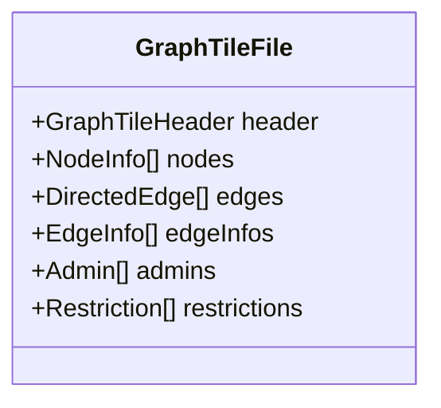
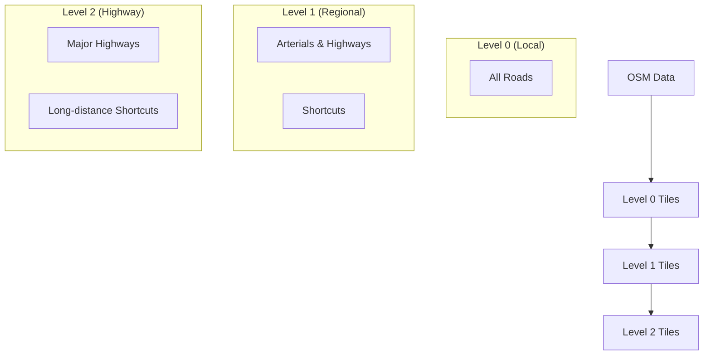

# Tile Creation and Management

## The Tiling System

Valhalla's tiling system is a fundamental aspect of its architecture. It divides the world into a grid of tiles, with each tile containing a portion of the routing graph. This chapter explores how Mjolnir creates and manages these tiles.

## Tile ID Calculation

Each tile is identified by a unique ID that encodes its location and hierarchy level. The `TileHierarchy` class manages this system:

```cpp
// From baldr/tilehierarchy.h
class TileHierarchy {
public:
  TileHierarchy(const boost::property_tree::ptree& pt);
  
  // Get the level information
  const Level& GetLevel(const uint8_t level) const;
  
  // Get the transit level
  const Level& GetTransitLevel() const;
  
  // Convert between lat/lng and tile IDs
  GraphId GetGraphId(const midgard::PointLL& pointll, const uint8_t level) const;
  
  // Get the tile bounds for a given GraphId
  midgard::AABB2<midgard::PointLL> GetTileBounds(const GraphId& id) const;
};
```

The implementation calculates tile IDs based on geographic coordinates:

```cpp
// From baldr/tilehierarchy.cc
GraphId TileHierarchy::GetGraphId(const midgard::PointLL& pointll, const uint8_t level) const {
  const Level& l = levels_[level];
  
  // Get the tile coordinates
  const auto& tiles = l.tiles;
  midgard::PointLL center = tiles.TileOrigin(pointll.lng(), pointll.lat());
  
  // Get the tile ID
  uint32_t tileid = tiles.TileId(pointll.lng(), pointll.lat());
  
  // Create and return the graph ID
  return {tileid, level, 0};
}
```

The tile ID calculation is based on a simple formula that converts latitude and longitude coordinates into a grid-based index. This allows for efficient lookup of tiles based on geographic location.

## GraphTileBuilder: The Core of Tile Creation

The `GraphTileBuilder` class is responsible for creating and populating tiles:

```cpp
// From mjolnir/graphtilebuilder.h
class GraphTileBuilder : public GraphTile {
public:
  GraphTileBuilder(const GraphId& graphid, ...);
  
  // Add elements to the tile
  void AddNodeAccessRestriction(const NodeAccessRestriction& access);
  void AddNodeAdmin(const uint32_t node_index, const uint32_t admin_index);
  void AddAdmin(const std::string& country_name, const std::string& state_name, ...);
  
  // Update elements in the tile
  void UpdateNodeInfo(const uint32_t node_idx, const NodeInfo& nodeinfo);
  void UpdateDirectedEdge(const uint32_t edge_idx, const DirectedEdge& directededge);
  
  // Serialize the tile to disk
  void StoreTileData();
};
```

Let's look at how tiles are created in practice:

```cpp
// From src/mjolnir/graphbuilder.cc
void BuildTileSet(const std::string& tile_dir, const OSMData& osm_data) {
  // Create the tile hierarchy
  TileHierarchy hierarchy;
  
  // Group nodes and edges by tile
  std::unordered_map<GraphId, std::vector<OSMNode>> nodes_by_tile;
  std::unordered_map<GraphId, std::vector<OSMWay>> ways_by_tile;
  
  // Assign nodes to tiles
  for (const auto& node : osm_data.nodes) {
    GraphId tile_id = hierarchy.GetGraphId(node.latlng, 0);
    nodes_by_tile[tile_id].push_back(node);
  }
  
  // Assign ways to tiles
  for (const auto& way : osm_data.ways) {
    // A way can span multiple tiles, so we need to determine which tiles it touches
    std::unordered_set<GraphId> tiles;
    for (const auto& node_id : way.nodes) {
      const auto& node = osm_data.node_map.at(node_id);
      GraphId tile_id = hierarchy.GetGraphId(node.latlng, 0);
      tiles.insert(tile_id);
    }
    
    // Add the way to each tile it touches
    for (const auto& tile_id : tiles) {
      ways_by_tile[tile_id].push_back(way);
    }
  }
  
  // Build each tile
  for (const auto& [tile_id, nodes] : nodes_by_tile) {
    const auto& ways = ways_by_tile[tile_id];
    
    // Create a tile builder
    GraphTileBuilder builder(tile_id, tile_dir);
    
    // Add nodes to the tile
    for (const auto& node : nodes) {
      builder.AddNode(node);
    }
    
    // Add edges to the tile
    for (const auto& way : ways) {
      builder.AddEdges(way);
    }
    
    // Store the tile
    builder.StoreTileData();
  }
}
```

The process involves:
1. Determining which tile each node belongs to
2. Identifying which tiles each way intersects
3. Creating a tile builder for each tile
4. Adding nodes and edges to the appropriate tiles
5. Serializing each tile to disk

## Handling Tile Boundaries

One of the challenges in a tiled system is handling features that cross tile boundaries. Mjolnir uses several strategies:

1. **Duplicate Nodes**: Nodes at tile boundaries are duplicated in both tiles
2. **Edge References**: Edges that cross boundaries have references to nodes in adjacent tiles
3. **Transition Edges**: Special edges that connect to adjacent tiles

Here's how transition edges are created:

```cpp
// From src/mjolnir/graphbuilder.cc
void CreateTransitionEdges(GraphTileBuilder& tile_builder, const TileHierarchy& hierarchy) {
  const GraphTile* tile = tile_builder.GetGraphTile();
  GraphId tile_id = tile->id();
  
  // Get neighboring tiles
  std::vector<GraphId> neighbors = hierarchy.GetNeighboringTileIds(tile_id);
  
  // For each node in the tile
  for (uint32_t node_idx = 0; node_idx < tile->header()->nodecount(); node_idx++) {
    const NodeInfo* node = tile->node(node_idx);
    
    // If the node is at a tile boundary
    if (node->is_boundary()) {
      // For each neighboring tile
      for (const auto& neighbor_id : neighbors) {
        // If the node exists in the neighboring tile
        if (NodeExistsInTile(node, neighbor_id)) {
          // Create a transition edge
          DirectedEdgeBuilder edge;
          edge.set_endnode(true);
          edge.set_trans_up(false);
          edge.set_trans_down(false);
          edge.set_shortcut(false);
          
          // Add the transition edge
          tile_builder.AddTransitionEdge(node_idx, neighbor_id, edge);
        }
      }
    }
  }
}
```

Transition edges are crucial for enabling routing across tile boundaries. Without them, the routing algorithm would be unable to navigate from one tile to another.



## Tile Storage Format

Tiles are stored as binary files on disk. The file format is designed for efficient loading and minimal memory usage. Here's the structure:

```
+------------------+
| GraphTileHeader  |
+------------------+
| NodeInfo[]       |
+------------------+
| DirectedEdge[]   |
+------------------+
| EdgeInfo[]       |
+------------------+
| ... other data   |
+------------------+
```



The `StoreTileData` method handles serialization:

```cpp
// From src/mjolnir/graphtilebuilder.cc
void GraphTileBuilder::StoreTileData() {
  // Create the file name
  std::string filename = tile_dir_ + "/" + GraphTile::FileSuffix(header_->graphid());
  
  // Make sure the directory exists
  boost::filesystem::create_directories(boost::filesystem::path(filename).parent_path());
  
  // Open the file
  std::ofstream file(filename, std::ios::out | std::ios::binary);
  if (!file.is_open()) {
    throw std::runtime_error("Failed to open file: " + filename);
  }
  
  // Write the header
  file.write(reinterpret_cast<const char*>(&header_), sizeof(GraphTileHeader));
  
  // Write the nodes
  file.write(reinterpret_cast<const char*>(nodes_.data()), nodes_.size() * sizeof(NodeInfo));
  
  // Write the directed edges
  file.write(reinterpret_cast<const char*>(directededges_.data()), 
             directededges_.size() * sizeof(DirectedEdge));
  
  // Write the edge info
  file.write(reinterpret_cast<const char*>(edgeinfo_.data()), edgeinfo_.size());
  
  // ... write other sections ...
  
  // Close the file
  file.close();
}
```

The tiles are stored in a directory structure that reflects their hierarchy level and ID. For example, a tile with ID 756425 at level 2 would be stored at `/2/000/756/425.gph`.

## Tile Hierarchy Management

Valhalla uses multiple hierarchy levels for efficient routing. The `HierarchyBuilder` class manages the creation of these levels:

```cpp
// From mjolnir/hierarchybuilder.h
class HierarchyBuilder {
public:
  static void Build(const boost::property_tree::ptree& pt);
};
```

The implementation creates higher-level tiles by selecting important roads from lower levels:

```cpp
// From src/mjolnir/hierarchybuilder.cc
void HierarchyBuilder::Build(const boost::property_tree::ptree& pt) {
  // Get the tile hierarchy
  TileHierarchy hierarchy(pt);
  
  // Build level 0 (already done in GraphBuilder)
  
  // Build level 1
  BuildLevel1(hierarchy, pt);
  
  // Build level 2
  BuildLevel2(hierarchy, pt);
}

void HierarchyBuilder::BuildLevel1(const TileHierarchy& hierarchy, const boost::property_tree::ptree& pt) {
  // For each level 0 tile
  for (const auto& level0_tile_id : GetTileSet(hierarchy, 0)) {
    // Get the level 0 tile
    const GraphTile* level0_tile = reader.GetGraphTile(level0_tile_id);
    
    // Create a level 1 tile builder
    GraphId level1_tile_id = hierarchy.GetLevel1TileId(level0_tile_id);
    GraphTileBuilder level1_builder(level1_tile_id, tile_dir);
    
    // For each edge in the level 0 tile
    for (uint32_t edge_idx = 0; edge_idx < level0_tile->header()->directededgecount(); edge_idx++) {
      const DirectedEdge* edge = level0_tile->directededge(edge_idx);
      
      // If the edge is important enough for level 1
      if (ShouldIncludeInLevel1(edge)) {
        // Add to level 1
        level1_builder.AddEdge(edge);
      }
    }
    
    // Create shortcuts for level 1
    CreateShortcuts(level1_builder);
    
    // Store the level 1 tile
    level1_builder.StoreTileData();
  }
}
```

The hierarchy building process involves:
1. Creating level 0 tiles with all roads
2. Selecting important roads for level 1 (arterials and highways)
3. Creating shortcuts to bypass less important roads
4. Building level 2 with only the most important roads (highways)



## Tile Updates and Maintenance

Valhalla supports updating tiles without rebuilding the entire graph. This is handled by the `GraphTileBuilder` class:

```cpp
// From mjolnir/graphtilebuilder.h
class GraphTileBuilder : public GraphTile {
public:
  // Constructor for updating an existing tile
  GraphTileBuilder(const GraphTile* tile, bool serialize_directed_edges = false);
  
  // Update methods
  void UpdateNodeInfo(const uint32_t node_idx, const NodeInfo& nodeinfo);
  void UpdateDirectedEdge(const uint32_t edge_idx, const DirectedEdge& directededge);
  
  // Save the updated tile
  void StoreTileData();
};
```

This allows for incremental updates to the graph, which is essential for maintaining up-to-date routing data. For example, when a road is closed for construction, only the affected tiles need to be updated rather than rebuilding the entire graph.

## Memory Management During Tile Creation

Creating tiles for planet-scale data requires careful memory management. Mjolnir uses several strategies:

1. **Streaming Processing**: Processing tiles one at a time
2. **Memory-Mapped Files**: For efficient access to large files
3. **Custom Memory Pools**: For allocating many small objects efficiently

```cpp
// Example of memory management during tile creation
void ProcessTiles(const std::vector<GraphId>& tile_ids) {
  // Process one tile at a time to limit memory usage
  for (const auto& tile_id : tile_ids) {
    // Create a tile builder
    GraphTileBuilder builder(tile_id, tile_dir);
    
    // Process the tile
    ProcessTile(builder);
    
    // Store the tile and free memory
    builder.StoreTileData();
  }
}
```

This approach allows Valhalla to process planet-scale data on modest hardware by limiting the amount of memory used at any given time.

## Tile Statistics and Validation

Mjolnir includes tools for validating tiles and collecting statistics:

```cpp
// From mjolnir/graphvalidator.h
class GraphValidator {
public:
  static void Validate(const boost::property_tree::ptree& pt);
};
```

The implementation checks for various issues:

```cpp
// From src/mjolnir/graphvalidator.cc
void GraphValidator::Validate(const boost::property_tree::ptree& pt) {
  // Get the tile hierarchy
  TileHierarchy hierarchy(pt);
  
  // For each tile
  for (const auto& tile_id : GetTileSet(hierarchy)) {
    // Get the tile
    const GraphTile* tile = reader.GetGraphTile(tile_id);
    
    // Check for disconnected nodes
    CheckConnectivity(tile);
    
    // Check for invalid edges
    CheckEdges(tile);
    
    // Check for unreachable nodes
    CheckReachability(tile);
    
    // ... other checks ...
  }
}
```

Validation is an important step in the tile creation process, as it helps identify issues that could affect routing quality. Common issues include:
- Disconnected nodes (islands in the graph)
- Invalid edge attributes
- Missing or incorrect turn restrictions
- Inconsistent administrative boundaries

Understanding tile creation and management is essential for building a graph tile builder, as it defines how the routing graph is divided and stored for efficient access.
