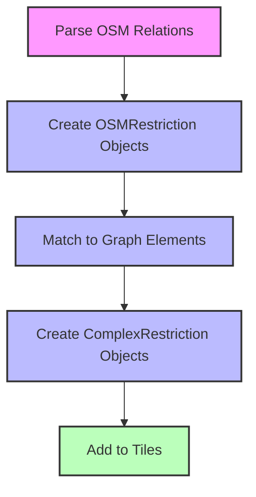
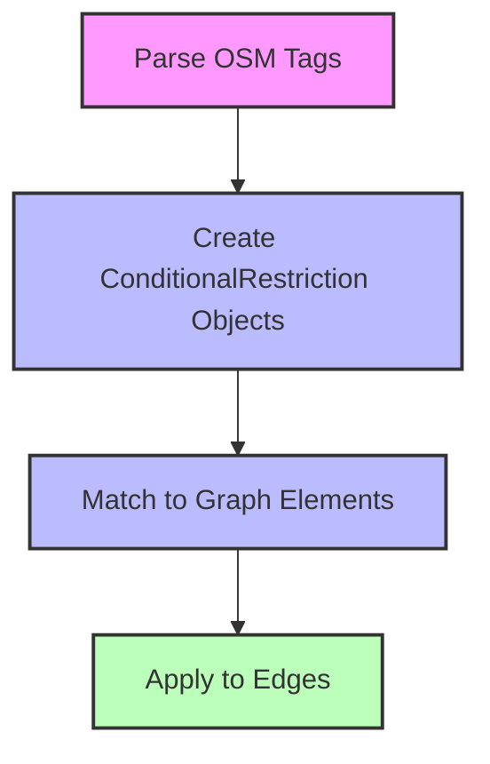
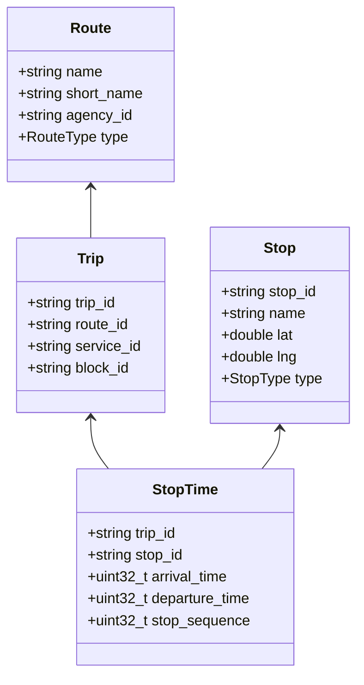
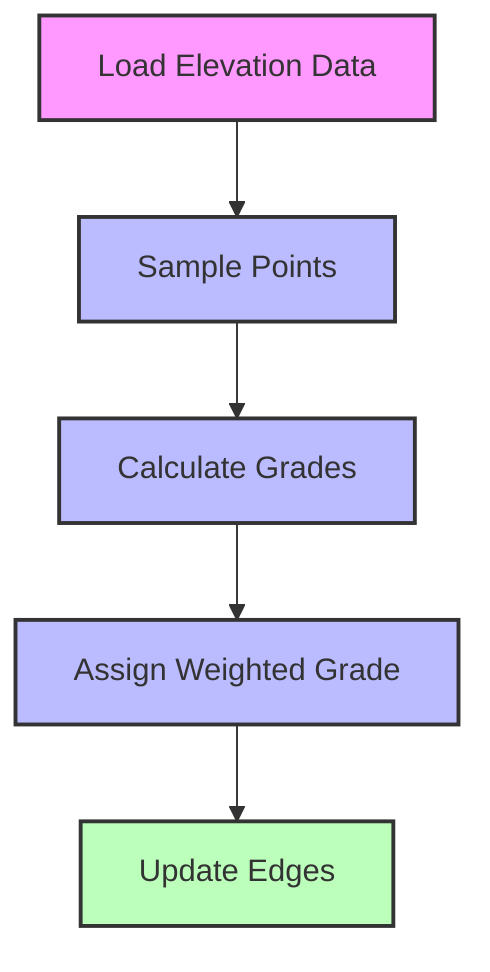
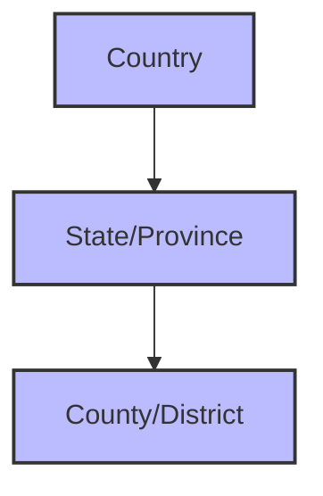

# Special Cases and Features

## Overview of Special Cases

While the basic graph building process handles most scenarios, there are several special cases that require additional attention. This chapter explores how Mjolnir handles these special cases and implements advanced features.

## Complex Restrictions

Turn restrictions (e.g., no left turn, no U-turn) are crucial for accurate routing. Mjolnir handles these using the `ComplexRestrictionBuilder`:

```cpp
// From valhalla/mjolnir/complexrestrictionbuilder.h
class ComplexRestrictionBuilder {
public:
  ComplexRestrictionBuilder();
  
  // Set various attributes
  void set_from_id(const GraphId& id);
  void set_to_id(const GraphId& id);
  void set_via_id(const GraphId& id);
  void set_type(const RestrictionType type);
  void set_modes(const uint32_t modes);
  void set_time_domain(const uint32_t time_domain);
};
```

The implementation processes OSM restriction relations:

```cpp
// From src/mjolnir/complexrestrictionbuilder.cc
void BuildRestrictions(const OSMData& osm_data) {
  // For each restriction relation
  for (const auto& relation : osm_data.restrictions) {
    // Create a complex restriction
    ComplexRestrictionBuilder builder;
    
    // Set the basic attributes
    builder.set_from_id(relation.from_way_id);
    builder.set_to_id(relation.to_way_id);
    builder.set_via_id(relation.via_node_id);
    builder.set_type(relation.type);
    
    // Set the modes affected by this restriction
    builder.set_modes(relation.modes);
    
    // Set time restrictions if any
    if (relation.has_time_restriction) {
      builder.set_time_domain(relation.time_domain);
    }
    
    // Add the restriction to the graph
    AddRestriction(builder);
  }
}
```

### Restriction Types

Valhalla supports various types of restrictions:

```cpp
// From baldr/graphconstants.h
enum class RestrictionType : uint8_t {
  kNoLeftTurn = 0,
  kNoRightTurn = 1,
  kNoStraightOn = 2,
  kNoUTurn = 3,
  kOnlyRightTurn = 4,
  kOnlyLeftTurn = 5,
  kOnlyStraightOn = 6,
  kNoEntry = 7,
  kNoExit = 8,
  kNoTurn = 9
};
```

### Restriction Flow

The process of handling restrictions follows these steps:

1. **Parse OSM Relations**: Extract restriction relations from OSM data
2. **Create OSMRestriction Objects**: Convert to internal representation
3. **Match to Graph Elements**: Find the corresponding nodes and edges in the graph
4. **Create ComplexRestriction Objects**: Build the final restriction objects
5. **Add to Tiles**: Store restrictions in the appropriate tiles



## Time-Based Restrictions

Some restrictions only apply at certain times (e.g., no left turn during rush hour). Mjolnir handles these using time domains:

```cpp
// From valhalla/mjolnir/timeparsing.h
class TimeDomain {
public:
  TimeDomain(const std::string& time_string);
  
  // Check if a restriction is active at a given time
  bool IsRestricted(const uint32_t date_time) const;
};
```

The implementation parses OSM time restriction strings:

```cpp
// From src/mjolnir/timeparsing.cc
TimeDomain::TimeDomain(const std::string& time_string) {
  // Parse the time string (e.g., "Mo-Fr 07:00-09:00")
  std::vector<std::string> tokens = split(time_string, ' ');
  
  // Parse days
  if (tokens.size() > 0) {
    days_ = ParseDays(tokens[0]);
  }
  
  // Parse hours
  if (tokens.size() > 1) {
    hours_ = ParseHours(tokens[1]);
  }
}
```

### Time Domain Format

Time domains are stored as bit fields for efficient storage and comparison:

```
Days of Week (7 bits):
+---+---+---+---+---+---+---+
| Su| Mo| Tu| We| Th| Fr| Sa|
+---+---+---+---+---+---+---+

Hours (24 bits):
+---+---+---+---+---+---+---+---+---+---+---+---+---+---+---+---+---+---+---+---+---+---+---+---+
| 0 | 1 | 2 | 3 | 4 | 5 | 6 | 7 | 8 | 9 |10 |11 |12 |13 |14 |15 |16 |17 |18 |19 |20 |21 |22 |23 |
+---+---+---+---+---+---+---+---+---+---+---+---+---+---+---+---+---+---+---+---+---+---+---+---+
```

This bit field representation allows for efficient storage and quick evaluation of whether a restriction is active at a given time.

## Conditional Access

Some roads have conditional access restrictions (e.g., no trucks during certain hours). Mjolnir handles these using the `ConditionalRestriction` class:

```cpp
// From valhalla/mjolnir/osmrestriction.h
struct ConditionalRestriction {
  uint64_t way_id;
  uint32_t value;
  uint32_t time_domain;
  
  // Type of restriction (access, speed, etc.)
  RestrictionType type;
};
```

### Conditional Access Flow

The process for handling conditional access follows these steps:

1. **Parse OSM Tags**: Extract conditional access tags from OSM ways
2. **Create ConditionalRestriction Objects**: Convert to internal representation
3. **Match to Graph Elements**: Find the corresponding edges in the graph
4. **Apply to Edges**: Modify edge access attributes based on conditions



Conditional access is important for accurate routing at different times of day, as it allows the routing engine to respect time-based restrictions like rush hour lanes or delivery-only zones during business hours.

## Transit Integration

For multi-modal routing, Mjolnir integrates transit data:

```cpp
// From valhalla/mjolnir/transitbuilder.h
class TransitBuilder {
public:
  static void Build(const boost::property_tree::ptree& pt);
};
```

The implementation processes GTFS (General Transit Feed Specification) data:

```cpp
// From src/mjolnir/transitbuilder.cc
void TransitBuilder::Build(const boost::property_tree::ptree& pt) {
  // Read GTFS data
  transit::Data transit_data;
  transit_data.Read(pt.get<std::string>("mjolnir.transit_dir"));
  
  // Process stops
  for (const auto& stop : transit_data.stops) {
    // Find the nearest node in the graph
    GraphId node_id = FindNearestNode(stop.lat, stop.lng);
    
    // Add a transit connection
    AddTransitConnection(node_id, stop);
  }
  
  // Process routes
  for (const auto& route : transit_data.routes) {
    // Add the route to the graph
    AddTransitRoute(route);
  }
  
  // Process schedules
  for (const auto& trip : transit_data.trips) {
    // Add the trip to the graph
    AddTransitTrip(trip);
  }
}
```

### Transit Data Model

Valhalla's transit data model includes:

1. **Stops**: Physical locations where vehicles pick up or drop off passengers
2. **Routes**: Named services following a specific path
3. **Trips**: Specific instances of a route at a specific time
4. **Stop Times**: Times when a trip arrives at and departs from a stop



## Service Days Calculation

For transit routing, calculating service days is important:

```cpp
// From valhalla/mjolnir/servicedays.h
class ServiceDays {
public:
  ServiceDays(const uint32_t start_date, const uint32_t end_date, const uint32_t dow_mask);
  
  // Check if service is available on a given day
  bool IsServiceAvailable(const uint32_t date) const;
};
```

The implementation calculates which days a transit service operates:

```cpp
// From src/mjolnir/servicedays.cc
ServiceDays::ServiceDays(const uint32_t start_date, const uint32_t end_date, const uint32_t dow_mask) {
  // Calculate the number of days in the range
  uint32_t days = end_date - start_date + 1;
  
  // Initialize the bit set
  service_days_.resize(days, false);
  
  // Set bits for days that have service
  for (uint32_t i = 0; i < days; i++) {
    uint32_t current_date = start_date + i;
    uint8_t dow = GetDayOfWeek(current_date);
    
    // Check if this day of week has service
    if ((dow_mask & (1 << dow)) != 0) {
      service_days_[i] = true;
    }
  }
}
```

Service days calculation allows the routing engine to determine which transit services are available on a specific date, which is essential for accurate multi-modal routing.

## Elevation Integration

Elevation data is important for realistic routing, especially for bicycles and pedestrians:

```cpp
// From valhalla/mjolnir/elevationbuilder.h
class ElevationBuilder {
public:
  static void Build(const boost::property_tree::ptree& pt);
};
```

The implementation samples elevation data along each edge:

```cpp
// From src/mjolnir/elevationbuilder.cc
void ElevationBuilder::Build(const boost::property_tree::ptree& pt) {
  // Get the elevation service
  Skadi::sample elevation_service(pt);
  
  // For each tile
  for (const auto& tile_id : GetTileSet(hierarchy, 0)) {
    // Get the tile
    const GraphTile* tile = reader.GetGraphTile(tile_id);
    
    // Create a tile builder
    GraphTileBuilder builder(tile_id, tile_dir);
    
    // For each edge in the tile
    for (uint32_t edge_idx = 0; edge_idx < tile->header()->directededgecount(); edge_idx++) {
      const DirectedEdge* edge = tile->directededge(edge_idx);
      
      // Get the shape of the edge
      auto shape = tile->edgeinfo(edge->edgeinfo_offset()).shape();
      
      // Sample elevation at each point
      std::vector<float> elevations = elevation_service.get_all(shape);
      
      // Calculate the weighted grade
      float grade = CalculateWeightedGrade(shape, elevations);
      
      // Update the edge with the grade
      DirectedEdge new_edge = *edge;
      new_edge.set_weighted_grade(grade);
      builder.UpdateDirectedEdge(edge_idx, new_edge);
    }
    
    // Store the updated tile
    builder.StoreTileData();
  }
}
```

### Elevation Data Flow

The process for adding elevation data follows these steps:

1. **Load Elevation Data**: Read elevation data from files or services
2. **Sample Points**: Get elevation values for points along each edge
3. **Calculate Grades**: Compute the grade (slope) for each edge segment
4. **Assign Weighted Grade**: Assign a representative grade value to the edge
5. **Update Edges**: Store the grade information in the edge attributes



Elevation data is particularly important for bicycle and pedestrian routing, as it allows the routing engine to consider the effort required to traverse hills and mountains.

## Administrative Information

Administrative information (countries, states, etc.) is important for routing and display:

```cpp
// From valhalla/mjolnir/adminbuilder.h
class AdminBuilder {
public:
  static void Build(const boost::property_tree::ptree& pt);
};
```

The implementation processes administrative boundaries:

```cpp
// From src/mjolnir/adminbuilder.cc
void AdminBuilder::Build(const boost::property_tree::ptree& pt) {
  // Read admin data
  OSMAdminData admin_data;
  admin_data.Read(pt.get<std::string>("mjolnir.admin_file"));
  
  // For each tile
  for (const auto& tile_id : GetTileSet(hierarchy, 0)) {
    // Get the tile
    const GraphTile* tile = reader.GetGraphTile(tile_id);
    
    // Create a tile builder
    GraphTileBuilder builder(tile_id, tile_dir);
    
    // For each node in the tile
    for (uint32_t node_idx = 0; node_idx < tile->header()->nodecount(); node_idx++) {
      const NodeInfo* node = tile->node(node_idx);
      
      // Find the admin area containing this node
      uint32_t admin_index = FindAdminArea(node->latlng(), admin_data);
      
      // Update the node with the admin index
      NodeInfo new_node = *node;
      new_node.set_admin_index(admin_index);
      builder.UpdateNodeInfo(node_idx, new_node);
    }
    
    // Store the updated tile
    builder.StoreTileData();
  }
}
```

### Admin Data Structure

Administrative data is stored in a hierarchical structure:



Administrative information is used for:
- Determining which side of the road to drive on
- Applying country-specific routing rules
- Displaying location information in turn-by-turn directions
- Handling cross-border routing considerations

## Lane Information

Lane information is crucial for accurate turn-by-turn directions:

```cpp
// From baldr/directededge.h
class DirectedEdge {
public:
  // Lane methods
  bool has_lanes() const;
  uint32_t lanecount() const;
  bool has_turn_lanes() const;
  
  // Get turn lanes
  uint16_t turnlanes() const;
};
```

The implementation extracts lane information from OSM tags:

```cpp
// From src/mjolnir/osmway.cc
void OSMWay::SetLanes(const Tags& tags) {
  // Get the number of lanes
  auto lanes_tag = tags.find("lanes");
  if (lanes_tag != tags.end()) {
    try {
      lanes_ = std::stoi(lanes_tag->second);
    } catch (...) {
      lanes_ = 1;  // Default to 1 lane
    }
  }
  
  // Get turn lane information
  auto turn_lanes_tag = tags.find("turn:lanes");
  if (turn_lanes_tag != tags.end()) {
    turn_lanes_ = turn_lanes_tag->second;
  }
}
```

### Lane Encoding

Turn lanes are encoded as bit fields for efficient storage:

```
Turn Lane Bits:
+-----+-----+-----+-----+-----+-----+-----+-----+
| U   | L   | SL  | S   | SR  | R   | M   | N   |
+-----+-----+-----+-----+-----+-----+-----+-----+
  U = U-turn
  L = Left
  SL = Slight Left
  S = Straight
  SR = Slight Right
  R = Right
  M = Merge
  N = None
```

Lane information is used to generate lane guidance for turn-by-turn directions, such as "Use the left two lanes to turn left" or "Keep right to stay on Highway 101."

Handling these special cases and features is essential for building a comprehensive routing system. Each one addresses a specific aspect of real-world transportation networks, making the routing more accurate and useful. By properly handling these special cases, the routing engine can provide more realistic and helpful directions to users.
