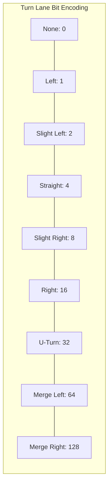
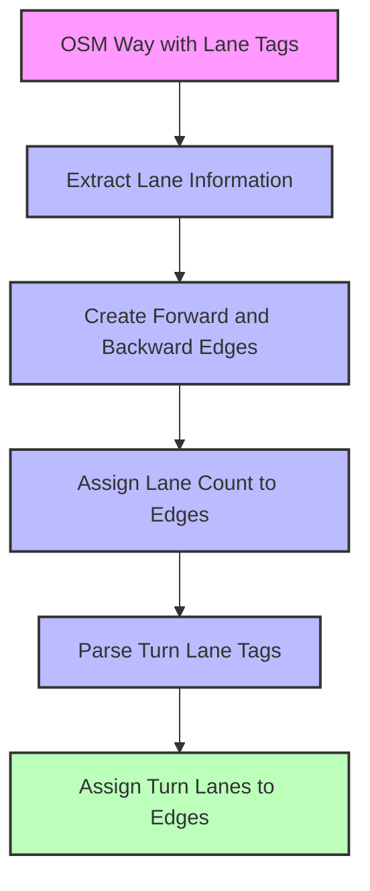
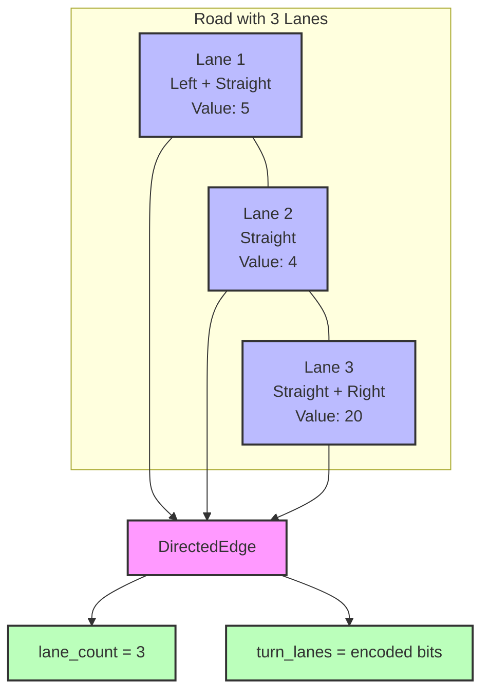
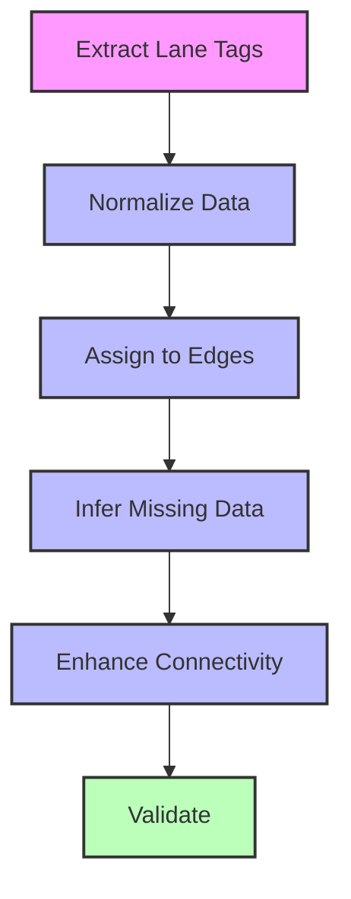

# Lane Handling and Turn Lanes

## The Importance of Lane Information

Lane information is critical for providing accurate turn-by-turn directions in a routing engine. Without proper lane guidance, users might find themselves in the wrong lane for an upcoming turn, leading to missed turns or dangerous last-minute lane changes. This chapter explores how Mjolnir processes and stores lane information from OpenStreetMap data.

## OSM Lane Tags

OpenStreetMap provides several tags for describing lanes:

1. **lanes**: The total number of lanes across both directions
2. **lanes:forward**: The number of lanes in the forward direction
3. **lanes:backward**: The number of lanes in the backward direction
4. **turn:lanes**: Turn lane markings for all lanes
5. **turn:lanes:forward**: Turn lane markings for forward lanes
6. **turn:lanes:backward**: Turn lane markings for backward lanes

Here's how Mjolnir extracts this information:

```cpp
// From src/mjolnir/osmway.cc
void OSMWay::SetLanes(const Tags& tags) {
  // Get the total number of lanes
  auto lanes_tag = tags.find("lanes");
  if (lanes_tag != tags.end()) {
    try {
      lanes_ = std::stoi(lanes_tag->second);
    } catch (...) {
      lanes_ = 1;  // Default to 1 lane
    }
  }
  
  // Get forward lanes
  auto forward_lanes_tag = tags.find("lanes:forward");
  if (forward_lanes_tag != tags.end()) {
    try {
      forward_lanes_ = std::stoi(forward_lanes_tag->second);
    } catch (...) {
      forward_lanes_ = 1;  // Default to 1 lane
    }
  }
  
  // Get backward lanes
  auto backward_lanes_tag = tags.find("lanes:backward");
  if (backward_lanes_tag != tags.end()) {
    try {
      backward_lanes_ = std::stoi(backward_lanes_tag->second);
    } catch (...) {
      backward_lanes_ = 1;  // Default to 1 lane
    }
  }
}
```

The lane information is stored in the OSMWay object and later transferred to the directed edges during graph building.

## Turn Lane Parsing

Turn lane information in OSM is stored as a semicolon-separated list of values, where each value represents a lane. For example:

```
turn:lanes=left|through;through;through|right
```

This indicates a road with three lanes where:
- The leftmost lane allows left turns and through movement
- The middle lane allows only through movement
- The rightmost lane allows through movement and right turns

Mjolnir parses these strings and converts them to a compact binary representation:

```cpp
// From src/mjolnir/graphbuilder.cc
uint16_t ParseTurnLanes(const std::string& turn_lanes_string) {
  uint16_t turn_lanes = 0;
  
  // Split the string by semicolons
  std::vector<std::string> lanes = split(turn_lanes_string, ';');
  
  // For each lane
  for (const auto& lane : lanes) {
    // Split the lane by pipes
    std::vector<std::string> directions = split(lane, '|');
    
    // For each direction in this lane
    for (const auto& direction : directions) {
      if (direction == "left") {
        turn_lanes |= kTurnLaneLeft;
      } else if (direction == "slight_left") {
        turn_lanes |= kTurnLaneSlightLeft;
      } else if (direction == "through") {
        turn_lanes |= kTurnLaneStraight;
      } else if (direction == "slight_right") {
        turn_lanes |= kTurnLaneSlightRight;
      } else if (direction == "right") {
        turn_lanes |= kTurnLaneRight;
      } else if (direction == "merge_to_left") {
        turn_lanes |= kTurnLaneMergeToLeft;
      } else if (direction == "merge_to_right") {
        turn_lanes |= kTurnLaneMergeToRight;
      } else if (direction == "none" || direction == "empty") {
        turn_lanes |= kTurnLaneNone;
      }
    }
  }
  
  return turn_lanes;
}
```

This parsing process converts the human-readable OSM turn lane tags into a binary format that can be efficiently stored and processed.

## Turn Lane Encoding

To efficiently store turn lane information, Valhalla uses a bit field encoding:

```cpp
// From baldr/graphconstants.h
constexpr uint16_t kTurnLaneNone        = 0;
constexpr uint16_t kTurnLaneLeft        = 1;
constexpr uint16_t kTurnLaneSlightLeft  = 2;
constexpr uint16_t kTurnLaneStraight    = 4;
constexpr uint16_t kTurnLaneSlightRight = 8;
constexpr uint16_t kTurnLaneRight       = 16;
constexpr uint16_t kTurnLaneUTurn       = 32;
constexpr uint16_t kTurnLaneMergeToLeft = 64;
constexpr uint16_t kTurnLaneMergeToRight = 128;
```

This allows multiple turn types to be combined for a single lane by OR-ing the values together. For example, a lane that allows both left turns and through movement would have a value of `kTurnLaneLeft | kTurnLaneStraight` (5).



## Lane Assignment to Directed Edges

Since Valhalla's graph represents roads as directed edges (one-way segments), the lane information needs to be assigned to the appropriate edges:

```cpp
// From src/mjolnir/graphbuilder.cc
void AssignLanesToEdges(GraphTileBuilder& tilebuilder, const OSMWay& way) {
  // Get the edges created from this way
  std::vector<DirectedEdge*> edges = GetEdgesForWay(tilebuilder, way.id());
  
  // Separate into forward and backward edges
  std::vector<DirectedEdge*> forward_edges;
  std::vector<DirectedEdge*> backward_edges;
  
  for (auto* edge : edges) {
    if (edge->forward()) {
      forward_edges.push_back(edge);
    } else {
      backward_edges.push_back(edge);
    }
  }
  
  // Assign lane counts
  for (auto* edge : forward_edges) {
    edge->set_lanecount(way.forward_lanes());
    
    // Parse and assign turn lanes
    if (!way.turn_lanes_forward().empty()) {
      uint16_t turn_lanes = ParseTurnLanes(way.turn_lanes_forward());
      edge->set_turnlanes(turn_lanes);
    }
  }
  
  for (auto* edge : backward_edges) {
    edge->set_lanecount(way.backward_lanes());
    
    // Parse and assign turn lanes
    if (!way.turn_lanes_backward().empty()) {
      uint16_t turn_lanes = ParseTurnLanes(way.turn_lanes_backward());
      edge->set_turnlanes(turn_lanes);
    }
  }
}
```

This process ensures that each directed edge has the appropriate lane count and turn lane information for its direction of travel.



## Lane Connectivity at Intersections

One of the challenges in handling lanes is maintaining lane connectivity through intersections. Mjolnir uses a combination of turn lanes and edge attributes to infer how lanes connect:

```cpp
// From src/mjolnir/graphenhancer.cc
void EnhanceLaneConnectivity(GraphTileBuilder& tilebuilder) {
  // For each node in the tile
  for (uint32_t node_idx = 0; node_idx < tilebuilder.header()->nodecount(); node_idx++) {
    const NodeInfo* node = tilebuilder.node(node_idx);
    
    // Skip if not an intersection
    if (!node->intersection()) {
      continue;
    }
    
    // Get all incoming edges
    std::vector<DirectedEdge*> incoming_edges;
    for (uint32_t edge_idx = node->edge_index(); edge_idx < node->edge_index() + node->edge_count(); edge_idx++) {
      DirectedEdge* edge = tilebuilder.directededge(edge_idx);
      if (edge->endnode()) {
        incoming_edges.push_back(edge);
      }
    }
    
    // Get all outgoing edges
    std::vector<DirectedEdge*> outgoing_edges;
    for (uint32_t edge_idx = node->edge_index(); edge_idx < node->edge_index() + node->edge_count(); edge_idx++) {
      DirectedEdge* edge = tilebuilder.directededge(edge_idx);
      if (!edge->endnode()) {
        outgoing_edges.push_back(edge);
      }
    }
    
    // For each incoming edge with turn lanes
    for (auto* incoming : incoming_edges) {
      if (incoming->has_turn_lanes()) {
        // Connect turn lanes to outgoing edges
        ConnectTurnLanes(tilebuilder, incoming, outgoing_edges);
      }
    }
  }
}
```

Lane connectivity is crucial for generating accurate lane guidance at intersections. By analyzing the turn lanes of incoming edges and the geometry of outgoing edges, Mjolnir can determine which lanes connect to which outgoing roads.

## Lane Diagram

Here's a visual representation of how lanes are represented in Valhalla:

```
Road with 3 lanes:
+-----+-----+-----+
| L,S |  S  | S,R |  <-- Turn lane markings
+-----+-----+-----+
  Lane  Lane  Lane
   1     2     3

Encoded as:
Lane 1: kTurnLaneLeft | kTurnLaneStraight = 5
Lane 2: kTurnLaneStraight = 4
Lane 3: kTurnLaneStraight | kTurnLaneRight = 20

Stored in DirectedEdge as:
edge->set_lanecount(3);
edge->set_turnlanes(5 | 4 | 20);
```



## Lane Usage in Routing

Lane information is used during the routing process to:

1. **Determine optimal lanes**: Choose the best lane for an upcoming maneuver
2. **Generate lane guidance**: Provide instructions like "Use the left two lanes to turn left"
3. **Calculate penalties**: Apply penalties for lane changes or using suboptimal lanes

```cpp
// From src/thor/pathalgorithm.cc
float CalculateLanePenalty(const DirectedEdge* edge, const DirectedEdge* next_edge) {
  // If no turn lanes, no penalty
  if (!edge->has_turn_lanes()) {
    return 0.0f;
  }
  
  // Get the turn lanes
  uint16_t turn_lanes = edge->turnlanes();
  
  // Determine the maneuver type
  TurnType turn_type = DetermineTurnType(edge, next_edge);
  
  // Check if any lane supports this maneuver
  bool has_valid_lane = false;
  switch (turn_type) {
    case TurnType::kLeft:
      has_valid_lane = (turn_lanes & kTurnLaneLeft) != 0;
      break;
    case TurnType::kRight:
      has_valid_lane = (turn_lanes & kTurnLaneRight) != 0;
      break;
    // ... other turn types ...
  }
  
  // Apply penalty if no valid lane
  return has_valid_lane ? 0.0f : kInvalidLanePenalty;
}
```

By considering lane information during routing, Valhalla can generate routes that minimize lane changes and ensure that the driver is in the correct lane for upcoming maneuvers.

## Lane Data in the Tile Format

Lane information is stored in the graph tile as part of the directed edge data:

```cpp
// From baldr/directededge.h
class DirectedEdge {
public:
  // Lane methods
  bool has_lanes() const;
  uint32_t lanecount() const;
  bool has_turn_lanes() const;
  uint16_t turnlanes() const;
  
private:
  // Packed data fields
  uint64_t field1_;      // Endpoint node index, use, classification
  uint64_t field2_;      // Restrictions, opposing edge index
  uint64_t field3_;      // Length, speed type, access
  uint64_t field4_;      // Lane count, turn lanes, etc.
};
```

The lane count and turn lane information are packed into bit fields for efficient storage:

```cpp
// From baldr/directededge.cc
bool DirectedEdge::has_lanes() const {
  return (field4_ & kHasLanesMask) != 0;
}

uint32_t DirectedEdge::lanecount() const {
  return (field4_ & kLaneCountMask) >> kLaneCountShift;
}

bool DirectedEdge::has_turn_lanes() const {
  return (field4_ & kHasTurnLanesMask) != 0;
}

uint16_t DirectedEdge::turnlanes() const {
  return (field4_ & kTurnLanesMask) >> kTurnLanesShift;
}
```

This bit-packing approach allows Valhalla to store lane information efficiently while still providing quick access to the data during routing.

## Challenges in Lane Handling

Lane handling presents several challenges:

1. **Incomplete Data**: Many roads in OSM lack detailed lane information
2. **Inconsistent Tagging**: Different mappers use different conventions
3. **Complex Intersections**: Some intersections have complex lane configurations
4. **Lane Continuity**: Ensuring lanes connect properly through intersections

Mjolnir addresses these challenges through:

1. **Default Values**: Assigning reasonable defaults based on road class
2. **Normalization**: Converting various tagging styles to a consistent format
3. **Inference**: Inferring lane information from other attributes
4. **Validation**: Checking for and correcting inconsistencies

```cpp
// From src/mjolnir/graphenhancer.cc
void InferLaneCount(DirectedEdge& edge) {
  // If lane count is already set, use it
  if (edge.has_lanes()) {
    return;
  }
  
  // Infer based on road class
  switch (edge.classification()) {
    case RoadClass::kMotorway:
      edge.set_lanecount(2);  // Default to 2 lanes for motorways
      break;
    case RoadClass::kTrunk:
    case RoadClass::kPrimary:
      edge.set_lanecount(1);  // Default to 1 lane for major roads
      break;
    default:
      edge.set_lanecount(1);  // Default to 1 lane for other roads
      break;
  }
}
```

These inference techniques help fill in gaps in the OSM data, ensuring that the routing graph has reasonable lane information even when the source data is incomplete.

## Lane Handling Flow

The complete process for handling lanes in Mjolnir follows these steps:

1. **Extract Lane Tags**: Parse lane-related tags from OSM ways
2. **Normalize Data**: Convert to a consistent format
3. **Assign to Edges**: Assign lane counts and turn lanes to directed edges
4. **Infer Missing Data**: Fill in missing information
5. **Enhance Connectivity**: Ensure lanes connect properly through intersections
6. **Validate**: Check for and correct inconsistencies



Understanding lane handling is crucial for building a graph tile builder that can provide accurate turn-by-turn directions. The lane information enables the routing engine to guide users into the correct lanes for upcoming maneuvers, improving the overall navigation experience.
