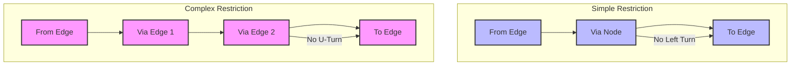
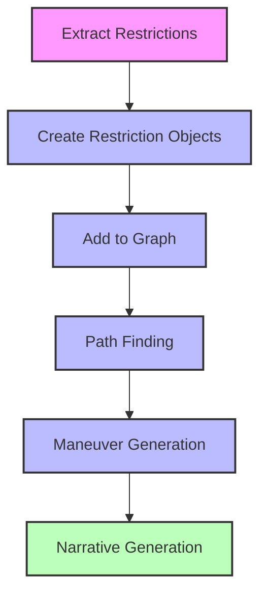

# Turn Restrictions and Maneuvers

## The Importance of Turn Restrictions

Turn restrictions are critical for accurate routing. Without them, a routing engine might suggest illegal or dangerous turns, leading to poor user experience or even safety issues. This chapter explores how Mjolnir processes and stores turn restrictions from OpenStreetMap data.

## Types of Turn Restrictions

Valhalla supports various types of turn restrictions:

```cpp
// From baldr/graphconstants.h
enum class RestrictionType : uint8_t {
  kNoLeftTurn = 0,
  kNoRightTurn = 1,
  kNoStraightOn = 2,
  kNoUTurn = 3,
  kOnlyRightTurn = 4,
  kOnlyLeftTurn = 5,
  kOnlyStraightOn = 6,
  kNoEntry = 7,
  kNoExit = 8,
  kNoTurn = 9
};
```



```mermaid
graph TD
    subgraph "Restriction Types"
        A[No Left Turn] --- B[No Right Turn]
        B --- C[No Straight On]
        C --- D[No U-Turn]
        D --- E[Only Right Turn]
        E --- F[Only Left Turn]
        F --- G[Only Straight On]
        G --- H[No Entry]
        H --- I[No Exit]
        I --- J[No Turn]
    end
    
    style A fill:#bbf,stroke:#333,stroke-width:2px
    style B fill:#bbf,stroke:#333,stroke-width:2px
    style C fill:#bbf,stroke:#333,stroke-width:2px
    style D fill:#bbf,stroke:#333,stroke-width:2px
    style E fill:#bbf,stroke:#333,stroke-width:2px
    style F fill:#bbf,stroke:#333,stroke-width:2px
    style G fill:#bbf,stroke:#333,stroke-width:2px
    style H fill:#bbf,stroke:#333,stroke-width:2px
    style I fill:#bbf,stroke:#333,stroke-width:2px
    style J fill:#bbf,stroke:#333,stroke-width:2px
```

## OSM Restriction Relations

In OpenStreetMap, turn restrictions are represented as relations with specific roles:

- **from**: The way where the restriction begins
- **to**: The way where the restriction ends
- **via**: The node or way connecting the "from" and "to" ways
- **type**: Always "restriction"
- **restriction**: The type of restriction (e.g., "no_left_turn", "only_right_turn")

Here's an example of how Mjolnir processes these relations:

```cpp
// From src/mjolnir/pbfgraphparser.cc
void PBFGraphParser::ParseRelations(const OSMPBF::PrimitiveBlock& primblock) {
  // For each primitive group
  for (int i = 0; i < primblock.primitivegroup_size(); ++i) {
    const OSMPBF::PrimitiveGroup& pg = primblock.primitivegroup(i);
    
    // Relations
    for (int j = 0; j < pg.relations_size(); ++j) {
      const OSMPBF::Relation& relation = pg.relations(j);
      
      // Get tags
      std::vector<Tag> tags = GetTagsFromRelation(primblock, relation);
      
      // Check if this is a restriction relation
      if (IsRestriction(tags)) {
        // Process restriction
        OSMRestriction restriction;
        
        // Get the members
        for (int k = 0; k < relation.memids_size(); ++k) {
          int64_t member_id = relation.memids(k);
          std::string role = GetString(primblock, relation.roles_sid(k));
          
          if (role == "from") {
            restriction.from_way_id = member_id;
          } else if (role == "to") {
            restriction.to_way_id = member_id;
          } else if (role == "via") {
            if (relation.types(k) == OSMPBF::Relation::NODE) {
              restriction.via_node_id = member_id;
            } else if (relation.types(k) == OSMPBF::Relation::WAY) {
              restriction.via_way_id = member_id;
            }
          }
        }
        
        // Get the restriction type
        for (const auto& tag : tags) {
          if (tag.first == "restriction") {
            restriction.type = GetRestrictionType(tag.second);
          } else if (tag.first == "day_on") {
            restriction.day_on = GetDayFromString(tag.second);
          } else if (tag.first == "day_off") {
            restriction.day_off = GetDayFromString(tag.second);
          } else if (tag.first == "hour_on") {
            restriction.hour_on = GetHourFromString(tag.second);
          } else if (tag.first == "hour_off") {
            restriction.hour_off = GetHourFromString(tag.second);
          }
        }
        
        // Add the restriction
        osmdata_.restrictions.push_back(restriction);
      }
    }
  }
}
```

The parsing process extracts all the necessary information from the OSM relation to create a restriction object that can be used during graph building.

## Simple vs. Complex Restrictions

Valhalla distinguishes between two types of restrictions:

1. **Simple Restrictions**: Involve a single node connecting two edges
2. **Complex Restrictions**: Involve multiple edges or a via way

```cpp
// From valhalla/mjolnir/complexrestrictionbuilder.h
class ComplexRestrictionBuilder {
public:
  ComplexRestrictionBuilder();
  
  // Set various attributes
  void set_from_id(const GraphId& id);
  void set_to_id(const GraphId& id);
  void set_via_id(const GraphId& id);
  void set_via_count(const uint32_t count);
  void set_type(const RestrictionType type);
  void set_modes(const uint32_t modes);
  void set_time_domain(const uint32_t time_domain);
};
```

Simple restrictions can be handled directly in the edge attributes, while complex restrictions require additional data structures to represent the sequence of edges involved.



## Restriction Builder

The `RestrictionBuilder` class is responsible for creating restrictions in the graph:

```cpp
// From valhalla/mjolnir/restrictionbuilder.h
class RestrictionBuilder {
public:
  static void Build(const boost::property_tree::ptree& pt,
                   const std::string& complex_restriction_file);
};
```

The implementation processes OSM restriction relations and adds them to the graph:

```cpp
// From src/mjolnir/restrictionbuilder.cc
void RestrictionBuilder::Build(const boost::property_tree::ptree& pt,
                             const std::string& complex_restriction_file) {
  // Read the restrictions
  std::vector<OSMRestriction> restrictions;
  ReadRestrictions(complex_restriction_file, restrictions);
  
  // For each restriction
  for (const auto& restriction : restrictions) {
    // Find the edges in the graph
    GraphId from_edge_id = FindEdge(restriction.from_way_id);
    GraphId to_edge_id = FindEdge(restriction.to_way_id);
    
    // If both edges were found
    if (from_edge_id.Is_Valid() && to_edge_id.Is_Valid()) {
      // If this is a simple restriction (via node)
      if (restriction.via_node_id != 0) {
        // Add a simple restriction
        AddSimpleRestriction(from_edge_id, to_edge_id, restriction);
      }
      // If this is a complex restriction (via way)
      else if (restriction.via_way_id != 0) {
        // Add a complex restriction
        AddComplexRestriction(from_edge_id, to_edge_id, restriction);
      }
    }
  }
}
```

This process involves finding the corresponding graph edges for the OSM ways in the restriction, then adding the appropriate restriction type to the graph.

## Time-Based Restrictions

Some restrictions only apply at certain times (e.g., no left turn during rush hour). Mjolnir handles these using time domains:

```cpp
// From valhalla/mjolnir/timeparsing.h
class TimeDomain {
public:
  TimeDomain(const std::string& time_string);
  
  // Check if a restriction is active at a given time
  bool IsRestricted(const uint32_t date_time) const;
};
```

The implementation parses OSM time restriction strings:

```cpp
// From src/mjolnir/timeparsing.cc
TimeDomain::TimeDomain(const std::string& time_string) {
  // Parse the time string (e.g., "Mo-Fr 07:00-09:00")
  std::vector<std::string> tokens = split(time_string, ' ');
  
  // Parse days
  if (tokens.size() > 0) {
    days_ = ParseDays(tokens[0]);
  }
  
  // Parse hours
  if (tokens.size() > 1) {
    hours_ = ParseHours(tokens[1]);
  }
}
```

Time-based restrictions allow for more accurate routing based on the time of day, which is particularly important for areas with rush hour restrictions or other time-dependent traffic rules.

## Restriction Storage in Tiles

Restrictions are stored in the graph tiles as part of the directed edge data:

```cpp
// From baldr/directededge.h
class DirectedEdge {
public:
  // Restriction methods
  bool has_restrictions() const;
  bool begin_restriction() const;
  bool end_restriction() const;
  
private:
  // Packed data fields
  uint64_t field1_;      // Endpoint node index, use, classification
  uint64_t field2_;      // Restrictions, opposing edge index
  uint64_t field3_;      // Length, speed type, access
  uint64_t field4_;      // Lane count, turn lanes, etc.
};
```

Complex restrictions are stored in a separate section of the tile:

```cpp
// From baldr/graphtile.h
class GraphTile {
public:
  // Access to restrictions
  const std::vector<ComplexRestriction>& GetRestrictions() const;
  
private:
  ComplexRestriction* complex_restrictions_;  // Complex restrictions
  uint32_t complex_restriction_count_;        // Number of complex restrictions
};
```

This dual storage approach allows simple restrictions to be checked quickly during routing, while still supporting more complex restrictions when needed.

## Maneuver Generation

Maneuvers are generated based on the graph structure and restrictions. The `ManeuverBuilder` class is responsible for this:

```cpp
// From odin/maneuverbuilder.h
class ManeuverBuilder {
public:
  ManeuverBuilder(const DirectionsOptions& directions_options);
  
  // Create maneuvers from a path
  std::list<Maneuver> Build(const std::vector<PathInfo>& path,
                          const std::vector<PathLocation>& path_locations);
};
```

The implementation analyzes the path and creates appropriate maneuvers:

```cpp
// From src/odin/maneuverbuilder.cc
std::list<Maneuver> ManeuverBuilder::Build(const std::vector<PathInfo>& path,
                                        const std::vector<PathLocation>& path_locations) {
  std::list<Maneuver> maneuvers;
  
  // Create the initial maneuver
  maneuvers.emplace_back();
  
  // For each edge in the path
  for (size_t i = 0; i < path.size(); ++i) {
    // Get the current edge
    const PathInfo& path_info = path[i];
    
    // If this is the first edge
    if (i == 0) {
      // Update the origin maneuver
      UpdateOriginManeuver(maneuvers.back(), path_info);
    }
    // If this is the last edge
    else if (i == path.size() - 1) {
      // Update the destination maneuver
      UpdateDestinationManeuver(maneuvers.back(), path_info);
    }
    // Otherwise, this is an intermediate edge
    else {
      // Get the previous and next edges
      const PathInfo& prev_path_info = path[i-1];
      const PathInfo& next_path_info = path[i+1];
      
      // Determine if a new maneuver is needed
      if (IsManeuverNeeded(prev_path_info, path_info, next_path_info)) {
        // Create a new maneuver
        maneuvers.emplace_back();
        
        // Set the maneuver type
        SetManeuverType(maneuvers.back(), prev_path_info, path_info, next_path_info);
      }
      
      // Update the current maneuver
      UpdateManeuver(maneuvers.back(), path_info);
    }
  }
  
  // Combine short maneuvers
  CombineShortManeuvers(maneuvers);
  
  // Enhance maneuvers with additional information
  EnhanceManeuvers(maneuvers, path_locations);
  
  return maneuvers;
}
```

Maneuver generation is a post-processing step that occurs after routing. It transforms the raw path (sequence of edges) into a series of human-understandable instructions.

## Maneuver Types

Valhalla supports various types of maneuvers:

```cpp
// From odin/enhancedtrippath.h
enum class TripDirections_Maneuver_Type {
  kNone = 0,
  kStart = 1,
  kStartRight = 2,
  kStartLeft = 3,
  kDestination = 4,
  kDestinationRight = 5,
  kDestinationLeft = 6,
  kContinue = 7,
  kSlightRight = 8,
  kRight = 9,
  kSharpRight = 10,
  kUturnRight = 11,
  kUturnLeft = 12,
  kSharpLeft = 13,
  kLeft = 14,
  kSlightLeft = 15,
  kRampStraight = 16,
  kRampRight = 17,
  kRampLeft = 18,
  kExitRight = 19,
  kExitLeft = 20,
  kStayStraight = 21,
  kStayRight = 22,
  kStayLeft = 23,
  kMerge = 24,
  kRoundaboutEnter = 25,
  kRoundaboutExit = 26,
  kFerryEnter = 27,
  kFerryExit = 28,
  kTransit = 29,
  kTransitTransfer = 30,
  kTransitRemainOn = 31,
  kTransitConnectionStart = 32,
  kTransitConnectionTransfer = 33,
  kTransitConnectionDestination = 34,
  kPostTransitConnectionDestination = 35
};
```

These maneuver types cover a wide range of navigation scenarios, from basic turns to complex transit transfers.

## Turn Type Determination

The type of turn is determined based on the angle between edges:

```cpp
// From src/odin/maneuverbuilder.cc
TripDirections_Maneuver_Type DetermineTurnType(float turn_degree) {
  if (turn_degree < 17) {
    return TripDirections_Maneuver_Type::kContinue;
  } else if (turn_degree < 50) {
    return TripDirections_Maneuver_Type::kSlightRight;
  } else if (turn_degree < 120) {
    return TripDirections_Maneuver_Type::kRight;
  } else if (turn_degree < 160) {
    return TripDirections_Maneuver_Type::kSharpRight;
  } else if (turn_degree < 200) {
    return TripDirections_Maneuver_Type::kUturnRight;
  } else if (turn_degree < 240) {
    return TripDirections_Maneuver_Type::kUturnLeft;
  } else if (turn_degree < 300) {
    return TripDirections_Maneuver_Type::kSharpLeft;
  } else if (turn_degree < 340) {
    return TripDirections_Maneuver_Type::kLeft;
  } else {
    return TripDirections_Maneuver_Type::kSlightLeft;
  }
}
```



```mermaid
graph TD
    subgraph "Turn Types by Angle"
        A["Continue (0-17°)"] --- B["Slight Right (17-50°)"]
        B --- C["Right (50-120°)"]
        C --- D["Sharp Right (120-160°)"]
        D --- E["U-Turn Right (160-200°)"]
        E --- F["U-Turn Left (200-240°)"]
        F --- G["Sharp Left (240-300°)"]
        G --- H["Left (300-340°)"]
        H --- I["Slight Left (340-360°)"]
    end
    
    style A fill:#bbf,stroke:#333,stroke-width:2px
    style B fill:#bbf,stroke:#333,stroke-width:2px
    style C fill:#bbf,stroke:#333,stroke-width:2px
    style D fill:#bbf,stroke:#333,stroke-width:2px
    style E fill:#bbf,stroke:#333,stroke-width:2px
    style F fill:#bbf,stroke:#333,stroke-width:2px
    style G fill:#bbf,stroke:#333,stroke-width:2px
    style H fill:#bbf,stroke:#333,stroke-width:2px
    style I fill:#bbf,stroke:#333,stroke-width:2px
```

This angle-based approach allows for consistent and intuitive turn instructions.

## Maneuver Combination

Short maneuvers are combined to create more natural directions:

```cpp
// From src/odin/maneuverbuilder.cc
void ManeuverBuilder::CombineShortManeuvers(std::list<Maneuver>& maneuvers) {
  auto prev_maneuver = maneuvers.begin();
  auto curr_maneuver = maneuvers.begin();
  
  // Advance to the first non-origin maneuver
  curr_maneuver++;
  
  // Iterate through the maneuvers
  while (curr_maneuver != maneuvers.end()) {
    // If the previous maneuver is short
    if (prev_maneuver->length() < kShortManeuverThreshold) {
      // And the current maneuver is also short
      if (curr_maneuver->length() < kShortManeuverThreshold) {
        // Combine the maneuvers
        prev_maneuver->set_length(prev_maneuver->length() + curr_maneuver->length());
        prev_maneuver->set_time(prev_maneuver->time() + curr_maneuver->time());
        
        // Erase the current maneuver
        curr_maneuver = maneuvers.erase(curr_maneuver);
        continue;
      }
    }
    
    // Advance to the next maneuver
    prev_maneuver = curr_maneuver;
    curr_maneuver++;
  }
}
```

Combining short maneuvers helps create more natural and less verbose directions, avoiding situations like "Turn right, then immediately turn left."

## Narrative Generation

After maneuvers are generated, narratives (text instructions) are created:

```cpp
// From odin/narrativebuilder.h
class NarrativeBuilder {
public:
  NarrativeBuilder(const DirectionsOptions& directions_options);
  
  // Build narratives for maneuvers
  void Build(std::list<Maneuver>& maneuvers);
};
```

The implementation creates appropriate text instructions for each maneuver:

```cpp
// From src/odin/narrativebuilder.cc
void NarrativeBuilder::Build(std::list<Maneuver>& maneuvers) {
  // For each maneuver
  for (auto& maneuver : maneuvers) {
    // Build the instruction based on the maneuver type
    switch (maneuver.type()) {
      case TripDirections_Maneuver_Type::kStart:
        BuildStartInstruction(maneuver);
        break;
      case TripDirections_Maneuver_Type::kDestination:
        BuildDestinationInstruction(maneuver);
        break;
      case TripDirections_Maneuver_Type::kContinue:
        BuildContinueInstruction(maneuver);
        break;
      case TripDirections_Maneuver_Type::kRight:
      case TripDirections_Maneuver_Type::kSlightRight:
      case TripDirections_Maneuver_Type::kSharpRight:
        BuildTurnInstruction(maneuver);
        break;
      // ... other maneuver types ...
    }
  }
}
```

Narrative generation transforms the structured maneuver data into human-readable text instructions that can be presented to the user.

## Restriction and Maneuver Flow

The complete process for handling restrictions and generating maneuvers follows these steps:

1. **Extract Restrictions**: Parse restriction relations from OSM data
2. **Create Restriction Objects**: Convert to internal representation
3. **Add to Graph**: Store restrictions in the appropriate tiles
4. **Path Finding**: Find a path that respects restrictions
5. **Maneuver Generation**: Create maneuvers based on the path
6. **Narrative Generation**: Create text instructions for each maneuver



Understanding turn restrictions and maneuvers is crucial for building a graph tile builder that can support accurate routing and navigation. The restriction information ensures that routes respect legal and physical constraints, while the maneuver generation enables clear and helpful turn-by-turn directions.
