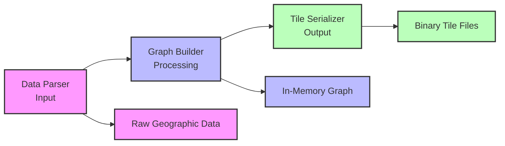
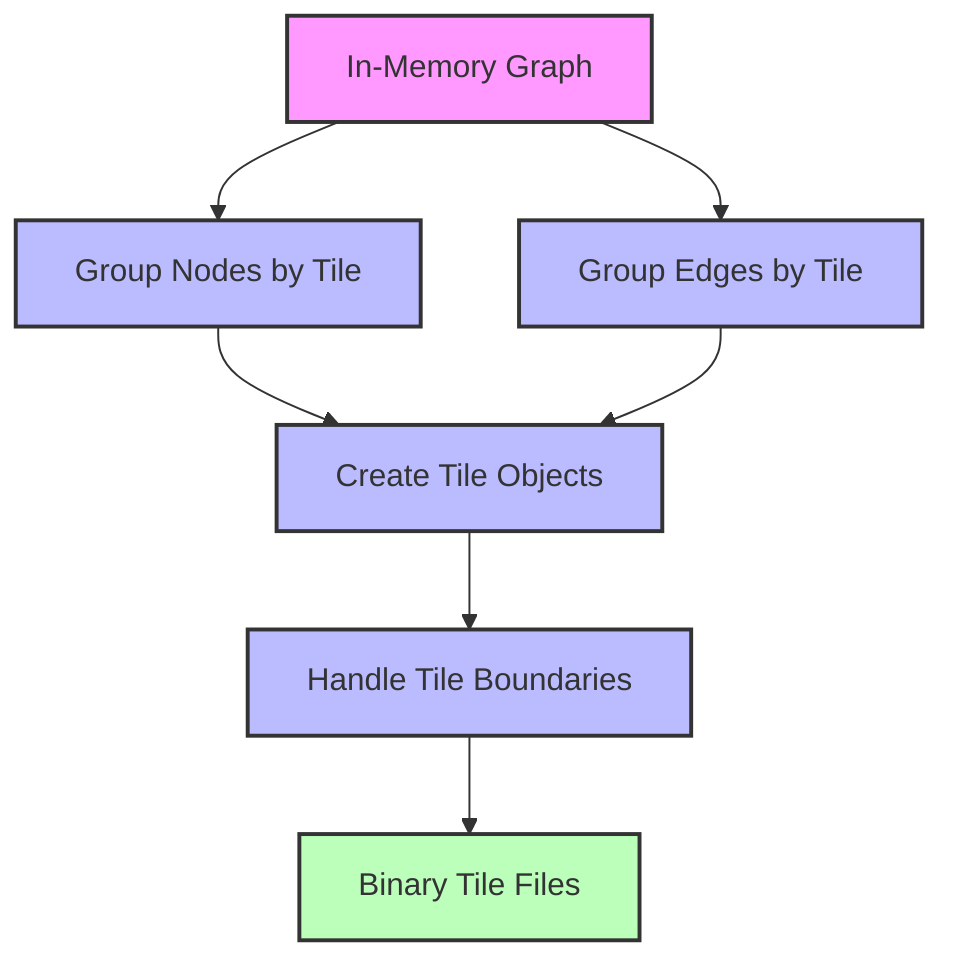
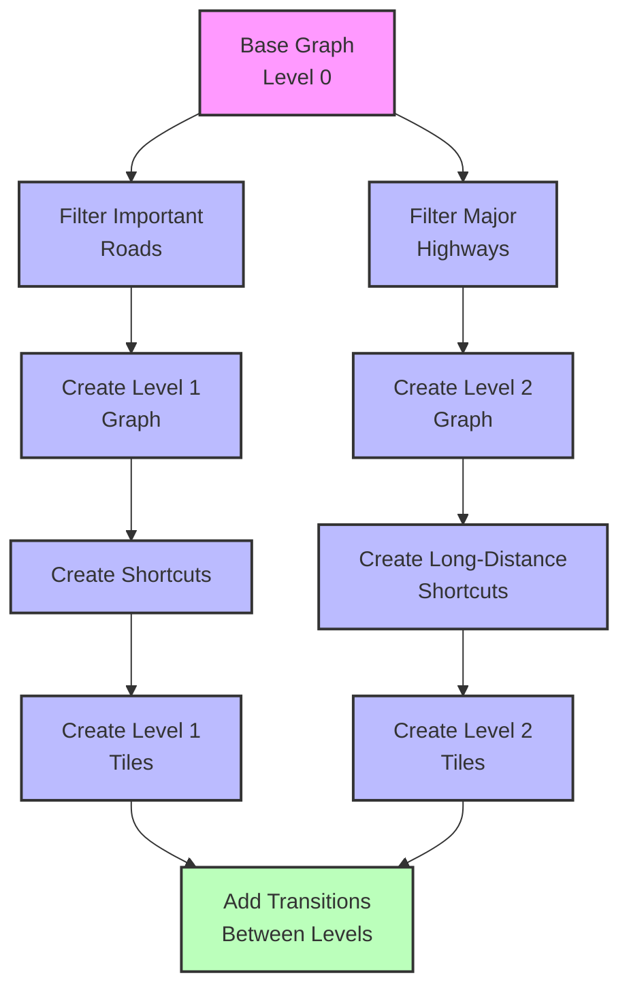
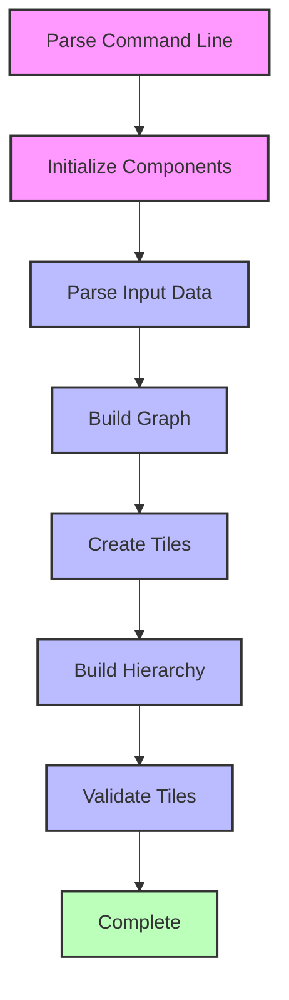

# Building Your Own Graph Tile Builder

## Overview

After exploring Mjolnir's architecture, data structures, and processes in detail, we're now ready to discuss how to build a custom graph tile builder. This chapter provides a comprehensive guide to implementing a graph tile builder that's compatible with Valhalla's routing engine.

## Design Considerations

Before diving into implementation, consider these key design aspects:

### 1. Input Data Sources

Decide which data sources the tile builder will support:

- **OpenStreetMap**: The most common source, available globally
- **Proprietary Data**: Commercial datasets with potentially better quality
- **Custom Data**: Organization-specific data for specialized routing

### 2. Performance Requirements

Consider the scale of data to process:

- **Planet-Scale**: Processing the entire planet requires significant optimization
- **Regional**: Processing smaller regions allows for simpler implementations
- **Incremental Updates**: Supporting updates without rebuilding everything

### 3. Feature Support

Determine which routing features to support:

- **Basic Routing**: Simple A-to-B routing for cars
- **Multi-Modal**: Support for pedestrians, bicycles, transit, etc.
- **Advanced Features**: Turn restrictions, traffic, time-dependent routing, etc.

## Architecture Overview

A well-designed graph tile builder should have these components:



## Step 1: Data Parsing

The first step is to parse input data into a format suitable for graph building:

```cpp
class DataParser {
public:
  DataParser(const Config& config);
  
  // Parse input data
  bool Parse(const std::vector<std::string>& input_files);
  
  // Get the parsed data
  const ParsedData& GetData() const;
  
private:
  // Parse different types of data
  void ParseNodes(const InputData& data);
  void ParseWays(const InputData& data);
  void ParseRelations(const InputData& data);
  
  // Store parsed data
  ParsedData parsed_data_;
};
```

For OSM data, handle:

1. **Nodes**: Points with latitude and longitude
2. **Ways**: Ordered lists of nodes forming roads, paths, etc.
3. **Relations**: Groups of elements with specific roles (e.g., turn restrictions)

```cpp
// Example implementation for parsing OSM PBF files
bool DataParser::Parse(const std::vector<std::string>& input_files) {
  for (const auto& file : input_files) {
    // Open the file
    std::ifstream input(file, std::ios::binary);
    if (!input.is_open()) {
      std::cerr << "Failed to open file: " << file << std::endl;
      return false;
    }
    
    // Parse the file
    OSMPBF::Parser parser;
    parser.parse(input);
    
    // Process nodes
    ParseNodes(parser.nodes);
    
    // Process ways
    ParseWays(parser.ways);
    
    // Process relations
    ParseRelations(parser.relations);
  }
  
  return true;
}
```

The data parsing stage should:
- Read and decode the input format (PBF, XML, etc.)
- Filter out irrelevant data
- Convert to an internal representation
- Validate data integrity

## Step 2: Graph Building

After parsing the data, build an in-memory graph representation:

```cpp
class GraphBuilder {
public:
  GraphBuilder(const Config& config);
  
  // Build the graph from parsed data
  bool Build(const ParsedData& data);
  
  // Get the built graph
  const Graph& GetGraph() const;
  
private:
  // Build different components of the graph
  void BuildNodes(const ParsedData& data);
  void BuildEdges(const ParsedData& data);
  void BuildRestrictions(const ParsedData& data);
  
  // Store the graph
  Graph graph_;
};
```

The graph building process involves:

1. **Creating Nodes**: Convert geographic points to graph nodes
2. **Creating Edges**: Convert road segments to directed edges
3. **Adding Attributes**: Assign road properties, speeds, access restrictions, etc.
4. **Building Connectivity**: Ensure nodes are properly connected by edges

```cpp
// Example implementation for building nodes
void GraphBuilder::BuildNodes(const ParsedData& data) {
  for (const auto& node : data.nodes) {
    // Skip nodes that aren't used by any way
    if (!node.used_by_way) {
      continue;
    }
    
    // Create a graph node
    GraphNode graph_node;
    graph_node.id = node.id;
    graph_node.lat = node.lat;
    graph_node.lng = node.lng;
    
    // Set node attributes
    if (node.is_intersection) {
      graph_node.type = NodeType::kIntersection;
    } else if (node.is_traffic_signal) {
      graph_node.type = NodeType::kTrafficSignal;
    } else {
      graph_node.type = NodeType::kStreetIntersection;
    }
    
    // Add the node to the graph
    graph_.AddNode(graph_node);
  }
}
```

The graph building stage should:
- Create a memory-efficient graph structure
- Apply tag transformations to determine road properties
- Handle one-way streets and access restrictions
- Process turn restrictions and other special cases

## Step 3: Tile Creation

Once the graph is built, divide it into tiles:

```cpp
class TileCreator {
public:
  TileCreator(const Config& config);
  
  // Create tiles from the graph
  bool CreateTiles(const Graph& graph);
  
private:
  // Determine which tile a node belongs to
  TileId GetTileId(const GraphNode& node);
  
  // Create a single tile
  bool CreateTile(const TileId& tile_id, const std::vector<GraphNode>& nodes,
                const std::vector<DirectedEdge>& edges);
  
  // Configuration
  Config config_;
};
```

The tile creation process involves:

1. **Tile Assignment**: Determine which tile each node and edge belongs to
2. **Tile Building**: Create tile objects with the appropriate nodes and edges
3. **Edge Connectivity**: Ensure edges properly connect across tile boundaries

```cpp
// Example implementation for creating tiles
bool TileCreator::CreateTiles(const Graph& graph) {
  // Group nodes by tile
  std::unordered_map<TileId, std::vector<GraphNode>> nodes_by_tile;
  for (const auto& node : graph.GetNodes()) {
    TileId tile_id = GetTileId(node);
    nodes_by_tile[tile_id].push_back(node);
  }
  
  // Group edges by tile
  std::unordered_map<TileId, std::vector<DirectedEdge>> edges_by_tile;
  for (const auto& edge : graph.GetEdges()) {
    const GraphNode& start_node = graph.GetNode(edge.start_node_id);
    TileId tile_id = GetTileId(start_node);
    edges_by_tile[tile_id].push_back(edge);
  }
  
  // Create each tile
  for (const auto& [tile_id, nodes] : nodes_by_tile) {
    const auto& edges = edges_by_tile[tile_id];
    if (!CreateTile(tile_id, nodes, edges)) {
      return false;
    }
  }
  
  return true;
}
```



The tile creation stage should:
- Implement the correct tile size and hierarchy levels
- Handle edges that cross tile boundaries
- Create transition edges between tiles
- Ensure all nodes and edges are assigned to the correct tiles

## Step 4: Tile Serialization

Finally, serialize the tiles to binary format:

```cpp
class TileSerializer {
public:
  TileSerializer(const Config& config);
  
  // Serialize a tile to binary format
  bool Serialize(const Tile& tile, const std::string& filename);
  
private:
  // Serialize different components of the tile
  void SerializeHeader(const Tile& tile, std::ofstream& file);
  void SerializeNodes(const Tile& tile, std::ofstream& file);
  void SerializeEdges(const Tile& tile, std::ofstream& file);
  
  // Configuration
  Config config_;
};
```

The serialization process involves:

1. **Header Writing**: Write the tile header with metadata
2. **Node Writing**: Write node data in binary format
3. **Edge Writing**: Write edge data in binary format
4. **Additional Data**: Write other data like restrictions, admin info, etc.

```cpp
// Example implementation for serializing a tile
bool TileSerializer::Serialize(const Tile& tile, const std::string& filename) {
  // Create the directory if it doesn't exist
  std::filesystem::path path(filename);
  std::filesystem::create_directories(path.parent_path());
  
  // Open the file
  std::ofstream file(filename, std::ios::binary);
  if (!file.is_open()) {
    std::cerr << "Failed to open file: " << filename << std::endl;
    return false;
  }
  
  // Serialize the header
  SerializeHeader(tile, file);
  
  // Serialize the nodes
  SerializeNodes(tile, file);
  
  // Serialize the edges
  SerializeEdges(tile, file);
  
  // Serialize additional data
  // ...
  
  // Close the file
  file.close();
  
  return true;
}
```

The tile serialization stage should:
- Follow Valhalla's binary format exactly
- Use bit packing and other compression techniques
- Ensure correct byte alignment and endianness
- Create the proper directory structure for tiles

## Step 5: Hierarchical Graph Building

For optimal routing performance, build a hierarchical graph:

```cpp
class HierarchyBuilder {
public:
  HierarchyBuilder(const Config& config);
  
  // Build the hierarchy
  bool BuildHierarchy(const Graph& base_graph);
  
private:
  // Build different levels of the hierarchy
  bool BuildLevel1(const Graph& base_graph);
  bool BuildLevel2(const Graph& base_graph);
  
  // Create shortcuts for faster routing
  void CreateShortcuts(Graph& graph);
  
  // Configuration
  Config config_;
};
```

The hierarchy building process involves:

1. **Road Classification**: Determine which roads belong to which hierarchy level
2. **Level Building**: Create separate graphs for each level
3. **Shortcut Creation**: Create direct connections between important nodes
4. **Transition Creation**: Add connections between hierarchy levels

```cpp
// Example implementation for building hierarchy level 1
bool HierarchyBuilder::BuildLevel1(const Graph& base_graph) {
  // Create a new graph for level 1
  Graph level1_graph;
  
  // Add important nodes to level 1
  for (const auto& node : base_graph.GetNodes()) {
    if (IsImportantNode(node)) {
      level1_graph.AddNode(node);
    }
  }
  
  // Add important edges to level 1
  for (const auto& edge : base_graph.GetEdges()) {
    if (IsImportantEdge(edge)) {
      level1_graph.AddEdge(edge);
    }
  }
  
  // Create shortcuts
  CreateShortcuts(level1_graph);
  
  // Create tiles for level 1
  TileCreator tile_creator(config_);
  return tile_creator.CreateTiles(level1_graph);
}
```



The hierarchy building stage should:
- Implement the correct criteria for each hierarchy level
- Create efficient shortcuts for long-distance routing
- Ensure proper connectivity between hierarchy levels
- Balance the size and number of tiles at each level

## Step 6: Adding Special Features

Enhance the tile builder with special features:

### Turn Restrictions

```cpp
class RestrictionBuilder {
public:
  RestrictionBuilder(const Config& config);
  
  // Build restrictions
  bool BuildRestrictions(const ParsedData& data, Graph& graph);
  
private:
  // Process different types of restrictions
  void ProcessSimpleRestrictions(const ParsedData& data, Graph& graph);
  void ProcessComplexRestrictions(const ParsedData& data, Graph& graph);
  
  // Configuration
  Config config_;
};
```

Turn restrictions are critical for accurate routing. The implementation should:
- Handle both simple and complex restrictions
- Support time-based restrictions
- Process restriction relations from OSM
- Store restrictions efficiently in the tile format

### Lane Information

```cpp
class LaneBuilder {
public:
  LaneBuilder(const Config& config);
  
  // Build lane information
  bool BuildLanes(const ParsedData& data, Graph& graph);
  
private:
  // Process lane tags
  void ProcessLaneTags(const Way& way, DirectedEdge& edge);
  
  // Configuration
  Config config_;
};
```

Lane information improves turn-by-turn directions. The implementation should:
- Parse lane count and turn lane tags
- Assign lane information to directed edges
- Handle lane connectivity at intersections
- Encode lane data efficiently in the tile format

### Administrative Information

```cpp
class AdminBuilder {
public:
  AdminBuilder(const Config& config);
  
  // Build administrative information
  bool BuildAdmins(const ParsedData& data, Graph& graph);
  
private:
  // Process admin boundaries
  void ProcessAdminBoundaries(const ParsedData& data);
  
  // Assign admin areas to nodes
  void AssignAdminsToNodes(Graph& graph);
  
  // Configuration
  Config config_;
};
```

Administrative information is important for country-specific rules. The implementation should:
- Process administrative boundary relations
- Determine which admin area each node belongs to
- Store admin information efficiently in the tile format
- Support country-specific routing rules

## Step 7: Optimization

Optimize the tile builder for performance:

### Memory Management

```cpp
class MemoryManager {
public:
  MemoryManager(const Config& config);
  
  // Allocate memory
  void* Allocate(size_t size);
  
  // Free memory
  void Free(void* ptr);
  
  // Get memory usage statistics
  MemoryStats GetStats() const;
  
private:
  // Memory pools for different sizes
  std::vector<MemoryPool> pools_;
  
  // Configuration
  Config config_;
};
```

Efficient memory management is crucial for processing large datasets. The implementation should:
- Use memory pools for small, frequently allocated objects
- Implement streaming processing for large files
- Monitor and limit memory usage
- Handle out-of-memory conditions gracefully

### Parallel Processing

```cpp
class ParallelProcessor {
public:
  ParallelProcessor(const Config& config);
  
  // Process items in parallel
  template<typename T, typename Func>
  void Process(const std::vector<T>& items, Func process_func);
  
private:
  // Thread pool
  ThreadPool thread_pool_;
  
  // Configuration
  Config config_;
};
```

Parallel processing can significantly improve performance. The implementation should:
- Use multiple threads for independent tasks
- Balance workload across threads
- Handle thread synchronization properly
- Scale with available CPU cores

### Streaming Processing

```cpp
class StreamProcessor {
public:
  StreamProcessor(const Config& config);
  
  // Process a stream of data
  template<typename T, typename Func>
  void Process(std::istream& input, Func process_func);
  
private:
  // Buffer for streaming
  std::vector<char> buffer_;
  
  // Configuration
  Config config_;
};
```

Streaming processing allows handling datasets larger than available memory. The implementation should:
- Process data in chunks
- Minimize memory usage
- Handle I/O efficiently
- Support resuming after interruptions

## Step 8: Testing and Validation

Ensure the tile builder produces correct and efficient tiles:

### Unit Testing

```cpp
class TileBuilderTest {
public:
  // Test parsing
  void TestParsing();
  
  // Test graph building
  void TestGraphBuilding();
  
  // Test tile creation
  void TestTileCreation();
  
  // Test serialization
  void TestSerialization();
};
```

Unit tests verify individual components. The implementation should:
- Test each component in isolation
- Cover edge cases and error conditions
- Verify correctness of algorithms
- Ensure proper memory management

### Validation

```cpp
class TileValidator {
public:
  TileValidator(const Config& config);
  
  // Validate a tile
  bool Validate(const std::string& filename);
  
private:
  // Check different aspects of the tile
  bool CheckHeader(const Tile& tile);
  bool CheckNodes(const Tile& tile);
  bool CheckEdges(const Tile& tile);
  bool CheckConnectivity(const Tile& tile);
  
  // Configuration
  Config config_;
};
```

Validation ensures the tiles are correct and usable. The implementation should:
- Verify tile format correctness
- Check connectivity between nodes and edges
- Validate cross-tile connections
- Ensure all required data is present

### Benchmarking

```cpp
class TileBenchmark {
public:
  TileBenchmark(const Config& config);
  
  // Benchmark tile building
  void BenchmarkBuild(const std::vector<std::string>& input_files);
  
  // Benchmark routing on the tiles
  void BenchmarkRouting(const std::string& tile_dir);
  
private:
  // Configuration
  Config config_;
};
```

Benchmarking measures performance. The implementation should:
- Measure processing time for each stage
- Track memory usage
- Compare performance with different configurations
- Identify bottlenecks

## Step 9: Integration with Valhalla

Ensure the tiles work with Valhalla's routing engine:

### Tile Format Compatibility

```cpp
class TileCompatibilityChecker {
public:
  TileCompatibilityChecker(const Config& config);
  
  // Check if a tile is compatible with Valhalla
  bool IsCompatible(const std::string& filename);
  
private:
  // Check different aspects of compatibility
  bool CheckVersion(const Tile& tile);
  bool CheckStructure(const Tile& tile);
  bool CheckFields(const Tile& tile);
  
  // Configuration
  Config config_;
};
```

Compatibility ensures the tiles work with Valhalla. The implementation should:
- Verify tile format version
- Check structure and field layouts
- Ensure all required data is present
- Test with the target Valhalla version

### Routing Integration

```cpp
class RoutingIntegrationTest {
public:
  RoutingIntegrationTest(const Config& config);
  
  // Test routing with custom tiles
  bool TestRouting(const std::string& tile_dir);
  
private:
  // Test different routing scenarios
  bool TestSimpleRoute();
  bool TestComplexRoute();
  bool TestMultiModalRoute();
  
  // Configuration
  Config config_;
};
```

Integration testing verifies the tiles work with Valhalla. The implementation should:
- Test various routing scenarios
- Verify route correctness
- Check performance with custom tiles
- Ensure all features work as expected

## Step 10: Deployment and Maintenance

Plan for ongoing maintenance of the tile builder:

### Incremental Updates

```cpp
class TileUpdater {
public:
  TileUpdater(const Config& config);
  
  // Update tiles with new data
  bool UpdateTiles(const std::string& tile_dir, const std::vector<std::string>& update_files);
  
private:
  // Determine which tiles need updating
  std::vector<TileId> GetTilesToUpdate(const std::vector<std::string>& update_files);
  
  // Update a single tile
  bool UpdateTile(const TileId& tile_id, const ParsedData& update_data);
  
  // Configuration
  Config config_;
};
```

Incremental updates avoid rebuilding all tiles. The implementation should:
- Identify which tiles need updating
- Modify only the affected tiles
- Preserve unchanged data
- Ensure consistency across updates

### Monitoring

```cpp
class TileMonitor {
public:
  TileMonitor(const Config& config);
  
  // Monitor tile usage
  void MonitorUsage(const std::string& tile_dir);
  
  // Get usage statistics
  UsageStats GetStats() const;
  
private:
  // Track tile access
  void TrackAccess(const TileId& tile_id);
  
  // Configuration
  Config config_;
};
```

Monitoring helps optimize tile usage. The implementation should:
- Track which tiles are accessed most frequently
- Identify performance bottlenecks
- Monitor disk and memory usage
- Generate usage reports

## Complete Implementation Example

Here's a simplified example of a complete tile builder implementation:

```cpp
int main(int argc, char** argv) {
  // Parse command line arguments
  Config config = ParseCommandLine(argc, argv);
  
  // Initialize components
  DataParser parser(config);
  GraphBuilder graph_builder(config);
  TileCreator tile_creator(config);
  TileSerializer serializer(config);
  HierarchyBuilder hierarchy_builder(config);
  
  // Parse input data
  std::cout << "Parsing input data..." << std::endl;
  if (!parser.Parse(config.input_files)) {
    std::cerr << "Failed to parse input data" << std::endl;
    return 1;
  }
  
  // Build the graph
  std::cout << "Building graph..." << std::endl;
  if (!graph_builder.Build(parser.GetData())) {
    std::cerr << "Failed to build graph" << std::endl;
    return 1;
  }
  
  // Create tiles
  std::cout << "Creating tiles..." << std::endl;
  if (!tile_creator.CreateTiles(graph_builder.GetGraph())) {
    std::cerr << "Failed to create tiles" << std::endl;
    return 1;
  }
  
  // Build hierarchy
  std::cout << "Building hierarchy..." << std::endl;
  if (!hierarchy_builder.BuildHierarchy(graph_builder.GetGraph())) {
    std::cerr << "Failed to build hierarchy" << std::endl;
    return 1;
  }
  
  // Validate tiles
  std::cout << "Validating tiles..." << std::endl;
  TileValidator validator(config);
  if (!validator.ValidateAll(config.tile_dir)) {
    std::cerr << "Tile validation failed" << std::endl;
    return 1;
  }
  
  std::cout << "Tile building completed successfully" << std::endl;
  return 0;
}
```



## Conclusion

Building a custom graph tile builder is a complex but rewarding task. By following the steps outlined in this chapter and leveraging the insights from previous chapters, it's possible to create a tile builder that meets specific needs while remaining compatible with Valhalla's routing engine.

The key to a successful implementation is:
- A deep understanding of the tile format
- Careful attention to detail in the graph building process
- Thorough testing to ensure correctness and performance
- Proper integration with the Valhalla ecosystem
