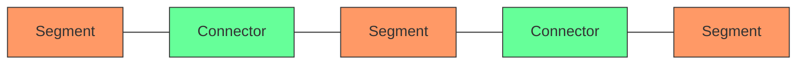
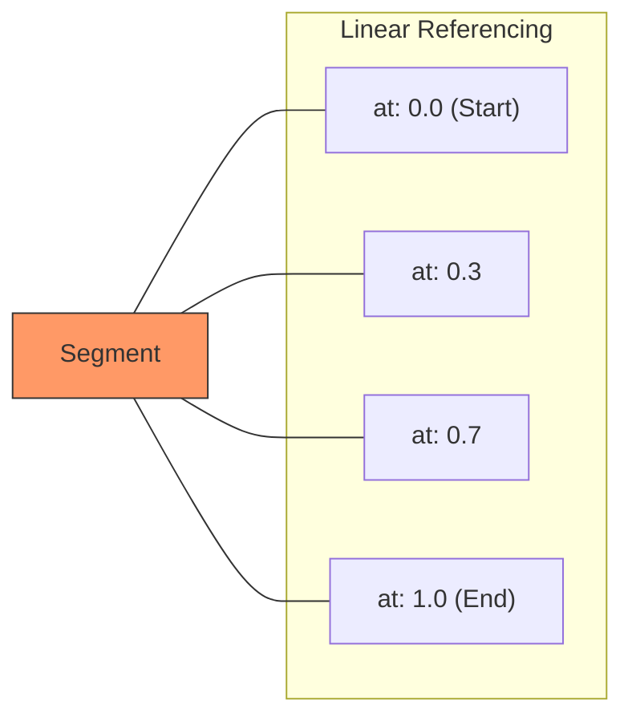

# Overture Transportation Schema

## Introduction to Overture Maps Foundation

The [Overture Maps Foundation](https://overturemaps.org/) is a collaborative effort to create reliable, easy-to-use, and interoperable open map data. Founded by Amazon, Meta, Microsoft, and TomTom, with additional members including Esri, Precisely, SafeGraph, and Sparkgeo, Overture aims to combine resources to build map data that is openly available, extensible, and customizable.

One of Overture's key contributions is its transportation schema, which provides a standardized way to represent road networks and other transportation infrastructure. This schema is designed to be comprehensive, consistent, and suitable for a wide range of applications, including routing.

## The Transportation Schema

Overture's transportation schema is part of its broader geospatial data model. The transportation schema specifically focuses on representing elements of transportation networks, such as roads, railways, and waterways.

### Core Entities

The transportation schema has two primary entities:

1. **Segments**: Paths that can be traveled by people or things
2. **Connectors**: Physical connections between segments



#### Segments

Segments represent paths that can be traveled. They are compatible with GeoJSON LineString features and include properties that describe their characteristics. Here's a simplified example of a segment:

```json
{
  "id": "123e4567-e89b-12d3-a456-426614174000",
  "geometry": {
    "type": "LineString",
    "coordinates": [
      [-122.4194, 37.7749],
      [-122.4184, 37.7750],
      [-122.4174, 37.7751]
    ]
  },
  "properties": {
    "subtype": "road",
    "class": "motorway",
    "access_restrictions": {
      "vehicle": "yes",
      "foot": "no"
    },
    "speed_limits": {
      "default": 100
    },
    "connectors": [
      {
        "connector_id": "123e4567-e89b-12d3-a456-426614174001",
        "at": 0.0
      },
      {
        "connector_id": "123e4567-e89b-12d3-a456-426614174002",
        "at": 1.0
      }
    ]
  }
}
```

Key properties of segments include:

- **subtype**: The broad category of transportation segment (road, rail, water)
- **class**: For roads, captures the kind of road and its position in the network hierarchy
- **access_restrictions**: Specifies which types of travel modes can use the segment
- **speed_limits**: Defines speed limits, potentially with time-based or direction-based variations
- **connectors**: Lists the connectors that this segment is physically connected to and their relative positions

#### Connectors

Connectors create physical connections between segments. They are compatible with GeoJSON Point features and represent places where travelers can transition between segments. Here's a simplified example of a connector:

```json
{
  "id": "123e4567-e89b-12d3-a456-426614174001",
  "geometry": {
    "type": "Point",
    "coordinates": [-122.4194, 37.7749]
  },
  "properties": {
    "traffic_signals": true
  }
}
```

Connectors are relatively simple entities but play a crucial role in defining the topology of the transportation network. By explicitly representing the connections between segments, Overture's schema makes it easier to understand and process the network structure.

### Road-Specific Properties

For road segments (subtype: "road"), the schema includes additional properties:

- **road_surface**: Describes the physical surface of the road
- **road_flags**: Boolean flags indicating characteristics like "is_bridge", "is_tunnel", etc.
- **prohibited_transitions**: Specifies turn restrictions
- **width_rules**: Defines the width of the road, potentially with variations along its length
- **level**: Indicates the vertical level (useful for overpasses, tunnels, etc.)

### Linear Referencing

Overture uses linear referencing to associate properties with specific portions of a segment. This allows for representing variations in attributes along a segment, such as changes in speed limits or lane configurations.

Linear referencing uses a parameter "at" that ranges from 0.0 (start of the segment) to 1.0 (end of the segment) to indicate relative positions along the segment.



### Scoping Rules

Overture's schema includes sophisticated scoping rules that allow for specifying when certain properties apply. These include:

- **Temporal scoping**: Properties that apply only during certain times
- **Heading scoping**: Properties that apply only when traveling in a specific direction
- **Vehicle attribute scoping**: Properties that apply only to vehicles with specific characteristics

This flexible scoping system allows for representing complex real-world scenarios, such as time-dependent turn restrictions or vehicle-specific access limitations.

## Comparison with OSM Data Model

To understand how Overture's transportation schema differs from the OpenStreetMap data model that Valhalla's Mjolnir is designed for, let's compare the key aspects:

| Aspect | Overture | OpenStreetMap |
|--------|----------|---------------|
| **Basic Elements** | Segments and Connectors | Nodes, Ways, and Relations |
| **Topology** | Explicit (via Connectors) | Implicit (shared Nodes between Ways) |
| **Attributes** | Structured Schema | Key-Value Tags |
| **Road Classification** | Standardized Classes | Various Tags (highway=*) |
| **Access Restrictions** | Structured with Scoping | Multiple Tags (access=*, vehicle=*) |
| **Turn Restrictions** | Part of Segment Properties | Relations with type=restriction |
| **Data Format** | GeoParquet | OSM PBF or XML |

The key differences include:

1. **Explicit vs. Implicit Topology**: Overture explicitly represents connections between segments through connector entities, while OSM relies on shared nodes between ways to imply connectivity.

2. **Structured vs. Flat Attributes**: Overture uses a structured schema with nested properties, while OSM uses a flat key-value tagging system.

3. **Standardized vs. Varied Classification**: Overture has a standardized set of road classes, while OSM uses various highway tags with sometimes inconsistent application.

4. **Linear Referencing**: Overture's linear referencing system allows for more precise representation of attribute variations along a segment.

These differences have significant implications for how we approach building graph tiles from Overture data, as we'll explore in the following chapters.

## Implications for Graph Tile Building

The unique characteristics of Overture's transportation schema present both opportunities and challenges for graph tile building:

### Opportunities

1. **Explicit Topology**: The explicit representation of connectors makes it easier to understand and process the network structure.

2. **Standardized Attributes**: The structured schema with standardized attributes reduces the need for complex tag parsing and interpretation.

3. **Linear Referencing**: The ability to associate properties with specific portions of a segment allows for more accurate representation of real-world conditions.

### Challenges

1. **Schema Translation**: We need to map Overture's schema to the data structures expected by routing engines like Valhalla.

2. **Connector Processing**: We need to develop strategies for handling connectors, which don't have a direct equivalent in many routing engines.

3. **Attribute Mapping**: We need to map Overture's structured attributes to the formats expected by routing engines.

In the next chapters, we'll explore different approaches to addressing these challenges and building effective graph tiles from Overture data.
