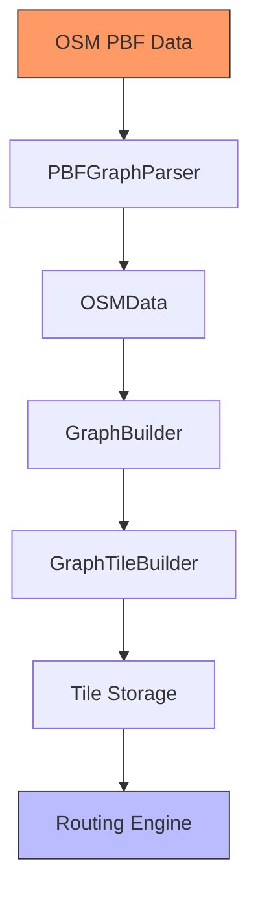
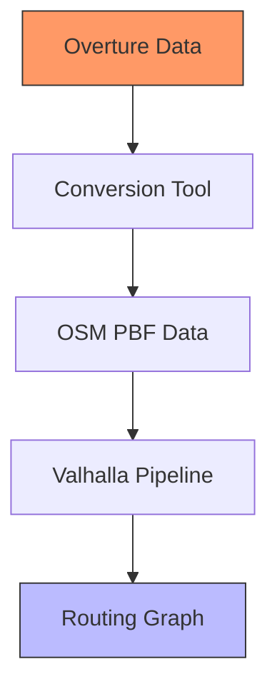
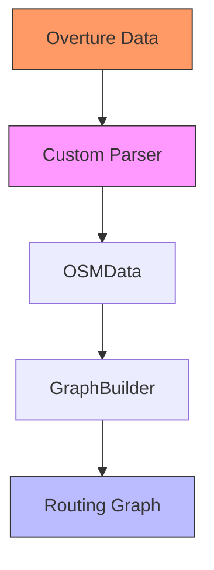
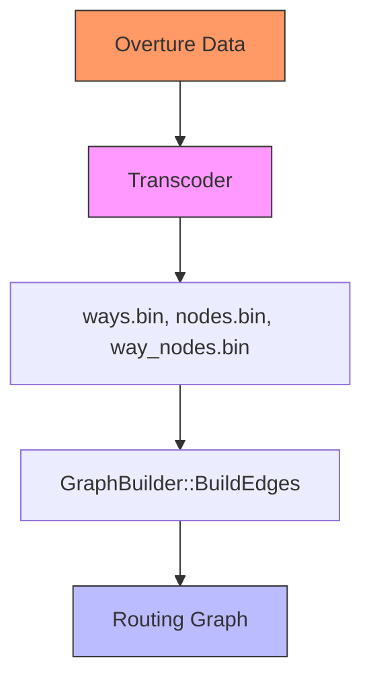
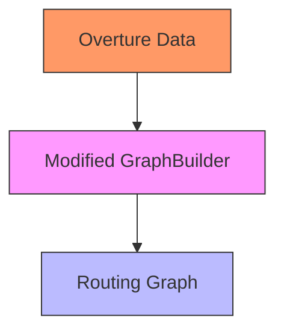
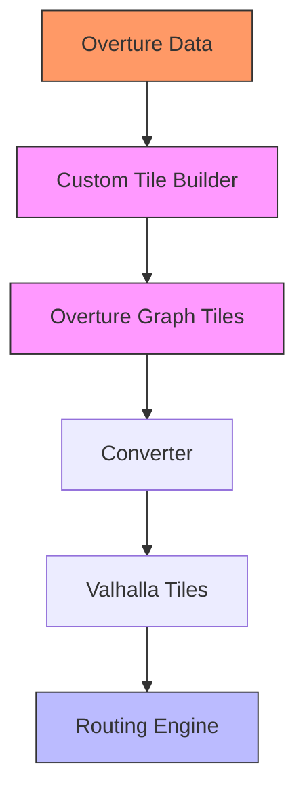
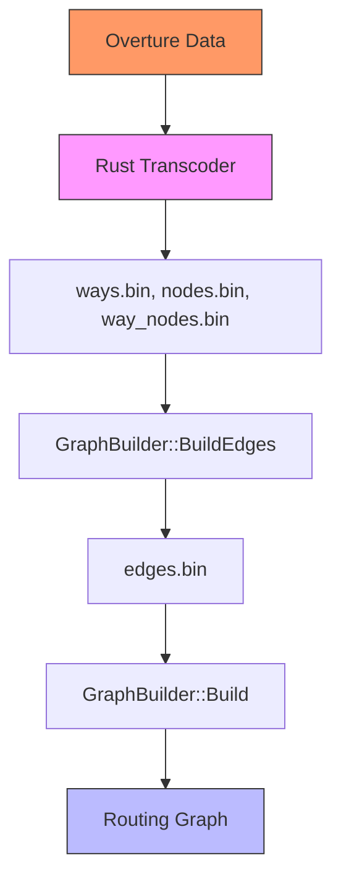
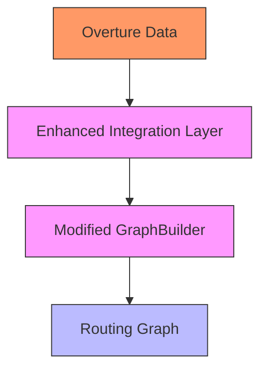
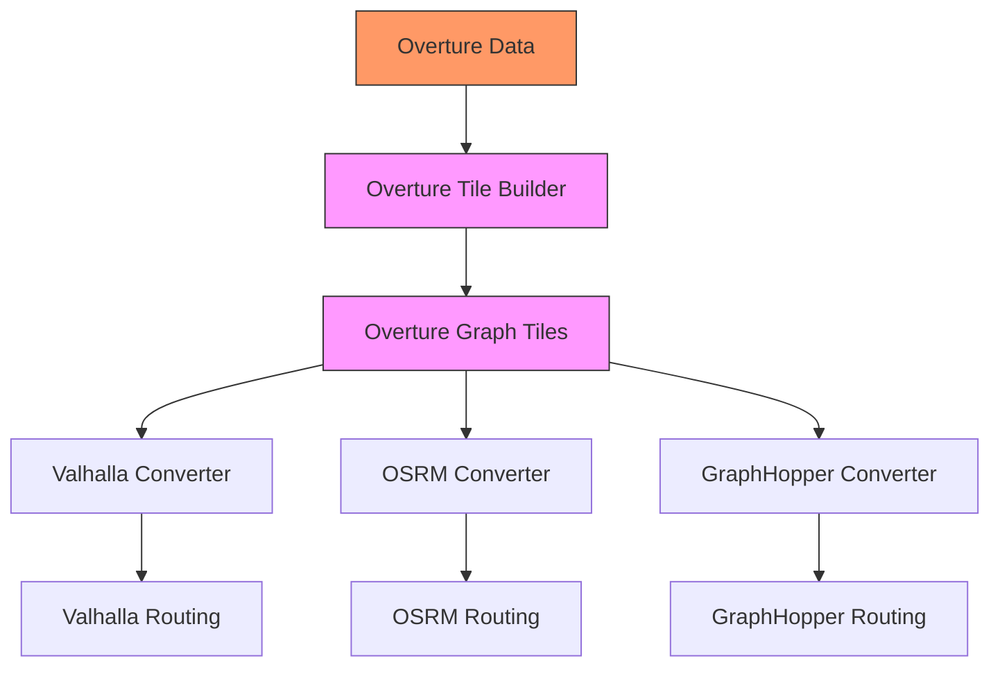

# Integration Approaches

## The Integration Challenge

Now that we understand both Valhalla's Mjolnir system and Overture's transportation schema, we face a key challenge: how do we integrate these two different worlds? How can we transform Overture's data into a format that Valhalla can use for routing?

This challenge is not unique to Valhalla—any routing engine designed for OpenStreetMap data will require some form of adaptation to work with Overture data. In this chapter, we'll explore different approaches to this integration, with a particular focus on Valhalla.

## Understanding Valhalla's Pipeline

Before diving into integration approaches, let's review Valhalla's data processing pipeline:

1. **PBFGraphParser**: Reads OSM PBF files and extracts nodes, ways, and relations
2. **OSMData**: In-memory representation of OSM entities
3. **GraphBuilder**: Transforms OSM entities into graph structures
4. **GraphTileBuilder**: Creates tile files with the graph data
5. **Tile Storage**: Stores tiles on disk in a hierarchical structure
6. **Routing Engine**: Uses tiles for path finding

Our goal is to insert Overture data into this pipeline at the appropriate point.

## Integration Approaches

We can identify several potential approaches for integrating Overture data with Valhalla:

### Approach 1: Convert to OSM Format

The most straightforward approach is to convert Overture data to OSM format (PBF or XML) and then use Valhalla's existing pipeline:

**Advantages:**
- Uses Valhalla's existing code without modifications
- Simplest to implement initially
- Benefits from Valhalla's mature OSM processing

**Disadvantages:**
- Loses Overture-specific advantages (explicit topology, structured attributes)
- May introduce inaccuracies in the translation
- Adds an extra processing step

### Approach 2: Create OSMData Directly

Instead of converting to OSM format files, we could create the in-memory `OSMData` structures directly from Overture data:

**Advantages:**
- Bypasses the PBF parsing step
- More direct control over the translation
- No intermediate file format

**Disadvantages:**
- Requires understanding Valhalla's internal `OSMData` structures
- Still constrained by OSM data model limitations
- Tightly coupled to Valhalla's implementation details

### Approach 3: Generate Binary Files for BuildEdges

A more efficient approach is to bypass both the PBF parsing and OSMData creation steps, and instead generate the binary files that Valhalla's `GraphBuilder::BuildEdges` function expects:

**Advantages:**
- More efficient than previous approaches
- Bypasses OSM-specific processing
- Minimal changes to Valhalla's code

**Disadvantages:**
- Requires understanding Valhalla's binary file formats
- Still works within Valhalla's data model constraints
- Potential compatibility issues with future Valhalla versions

### Approach 4: Direct Integration with GraphBuilder

For even more control, we could modify Valhalla's `GraphBuilder` to work directly with Overture data:

**Advantages:**
- Most direct approach
- Can fully leverage Overture's data model
- Potentially most efficient

**Disadvantages:**
- Requires significant modifications to Valhalla's code
- Creates a maintenance burden for keeping up with Valhalla updates
- Higher development complexity

### Approach 5: Custom Graph Tile Builder

The most ambitious approach is to create a custom graph tile builder specifically designed for Overture data:

**Advantages:**
- Fully optimized for Overture's data model
- Could support multiple routing engines
- Maximum flexibility and control

**Disadvantages:**
- Highest development effort
- Requires deep understanding of graph tile structures
- Needs converters for each target routing engine

## Recommended Approach: A Phased Strategy

Rather than choosing a single approach, we recommend a phased strategy that starts with simpler approaches and progressively moves toward more sophisticated ones:

### Phase 1: Generate Binary Files for BuildEdges (Approach 3)

For our initial implementation, we recommend generating the binary files that Valhalla's `GraphBuilder::BuildEdges` function expects. This approach offers a good balance of efficiency, control, and development effort.

Key components of this approach:

1. **Rust Transcoder**: A custom tool that reads Overture data and generates Valhalla's binary files
2. **Entity Mapping**: Mapping between Overture entities and Valhalla structures
3. **Attribute Translation**: Converting Overture's structured attributes to Valhalla's format
4. **Integration Script**: Automating the process of running the transcoder and Valhalla's build pipeline

### Phase 2: Direct Integration and Research (Approach 4)

As we gain experience with Valhalla and Overture data, we can explore more direct integration by modifying Valhalla's `GraphBuilder` to work with in-memory structures created from Overture data.

In parallel, we'll research tile formats and design an Overture-specific tile format.

### Phase 3: Custom Graph Tiles (Approach 5)

In the long term, we aim to create a custom graph tile builder specifically designed for Overture data, with converters for multiple routing engines.

This phased approach allows us to deliver value quickly while working toward a more optimized long-term solution.

## Implementation Considerations

Regardless of the approach chosen, there are several important considerations for implementation:

### Data Processing Efficiency

Overture data can be large, so efficient processing is crucial:

- Use streaming processing where possible
- Implement parallel processing for independent tasks
- Optimize memory usage with appropriate data structures
- Consider incremental processing for updates

### Error Handling and Validation

Robust error handling and validation are essential:

- Validate Overture data against the schema
- Handle missing or invalid attributes gracefully
- Provide clear error messages for troubleshooting
- Implement validation checks for the generated output

### Testing and Quality Assurance

Comprehensive testing ensures routing quality:

- Create test cases with known routes
- Compare results with expected outcomes
- Test with diverse geographic areas and road types
- Validate against real-world routing scenarios

### Documentation and Maintenance

Good documentation and maintenance practices are important:

- Document the mapping between Overture and Valhalla structures
- Explain implementation decisions and trade-offs
- Create clear instructions for users
- Plan for updates as both Overture and Valhalla evolve

In the next chapter, we'll dive deeper into the specific attribute mapping challenges and solutions for integrating Overture data with Valhalla.
