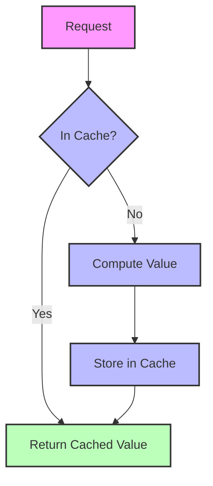
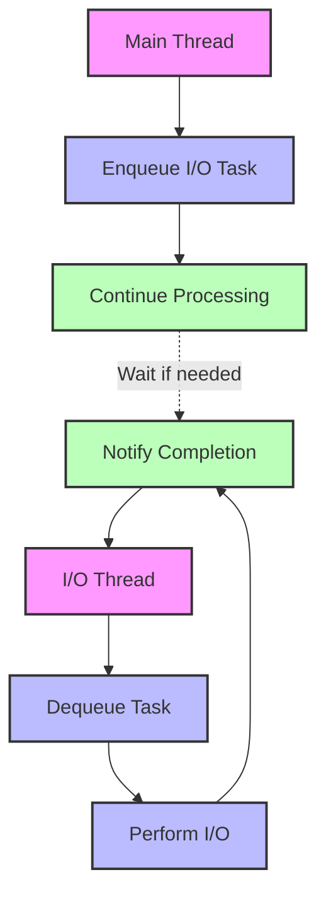

# Performance Optimization (Part 2)

## Algorithmic Optimizations

Beyond memory management and parallel processing, algorithmic optimizations can significantly improve performance.

### Spatial Indexing

Spatial indexing accelerates geographic queries:

```cpp
// Example of a simple grid-based spatial index
class SpatialIndex {
public:
  SpatialIndex(const BoundingBox& bounds, double cell_size)
      : bounds_(bounds), cell_size_(cell_size) {
    // Calculate grid dimensions
    grid_width_ = static_cast<size_t>(std::ceil((bounds.max_x - bounds.min_x) / cell_size));
    grid_height_ = static_cast<size_t>(std::ceil((bounds.max_y - bounds.min_y) / cell_size));
    
    // Initialize the grid
    grid_.resize(grid_width_ * grid_height_);
  }
  
  // Add an item to the index
  template<typename T>
  void Insert(const T& item, const Point& location) {
    // Calculate grid cell
    size_t cell_x = static_cast<size_t>((location.x - bounds_.min_x) / cell_size_);
    size_t cell_y = static_cast<size_t>((location.y - bounds_.min_y) / cell_size_);
    
    // Clamp to grid bounds
    cell_x = std::min(cell_x, grid_width_ - 1);
    cell_y = std::min(cell_y, grid_height_ - 1);
    
    // Add to the cell
    grid_[cell_y * grid_width_ + cell_x].push_back(item);
  }
  
  // Query items within a radius
  template<typename T>
  std::vector<T> QueryRadius(const Point& center, double radius) {
    std::vector<T> results;
    
    // Calculate grid cell range
    size_t min_cell_x = static_cast<size_t>((center.x - radius - bounds_.min_x) / cell_size_);
    size_t min_cell_y = static_cast<size_t>((center.y - radius - bounds_.min_y) / cell_size_);
    size_t max_cell_x = static_cast<size_t>((center.x + radius - bounds_.min_x) / cell_size_);
    size_t max_cell_y = static_cast<size_t>((center.y + radius - bounds_.min_y) / cell_size_);
    
    // Clamp to grid bounds
    min_cell_x = std::max(min_cell_x, static_cast<size_t>(0));
    min_cell_y = std::max(min_cell_y, static_cast<size_t>(0));
    max_cell_x = std::min(max_cell_x, grid_width_ - 1);
    max_cell_y = std::min(max_cell_y, grid_height_ - 1);
    
    // Check each cell in the range
    for (size_t cell_y = min_cell_y; cell_y <= max_cell_y; ++cell_y) {
      for (size_t cell_x = min_cell_x; cell_x <= max_cell_x; ++cell_x) {
        const auto& cell = grid_[cell_y * grid_width_ + cell_x];
        
        // Add all items in the cell to the results
        results.insert(results.end(), cell.begin(), cell.end());
      }
    }
    
    return results;
  }
  
private:
  BoundingBox bounds_;
  double cell_size_;
  size_t grid_width_;
  size_t grid_height_;
  std::vector<std::vector<T>> grid_;
};
```

Spatial indexing is valuable for:
- Finding nodes within a specific area
- Determining which tile a node belongs to
- Identifying nearby features
- Optimizing spatial queries

### Efficient Data Structures

Choosing the right data structures can significantly impact performance:

```cpp
// Example of using efficient data structures for graph building
class EfficientGraphBuilder {
public:
  EfficientGraphBuilder() {}
  
  // Add a node to the graph
  void AddNode(uint64_t node_id, double lat, double lng) {
    // Use unordered_map for O(1) lookups
    nodes_[node_id] = {lat, lng};
    
    // Use vector for sequential access
    node_ids_.push_back(node_id);
  }
  
  // Add an edge to the graph
  void AddEdge(uint64_t from_node_id, uint64_t to_node_id) {
    // Use adjacency list for efficient graph representation
    adjacency_list_[from_node_id].push_back(to_node_id);
    
    // Use pair for edge representation
    edges_.push_back({from_node_id, to_node_id});
  }
  
  // Get nodes connected to a node
  const std::vector<uint64_t>& GetConnectedNodes(uint64_t node_id) {
    return adjacency_list_[node_id];
  }
  
  // Check if a node exists
  bool HasNode(uint64_t node_id) {
    return nodes_.find(node_id) != nodes_.end();
  }
  
private:
  // Use unordered_map for O(1) node lookups
  std::unordered_map<uint64_t, std::pair<double, double>> nodes_;
  
  // Use vector for sequential access to node IDs
  std::vector<uint64_t> node_ids_;
  
  // Use adjacency list for efficient graph representation
  std::unordered_map<uint64_t, std::vector<uint64_t>> adjacency_list_;
  
  // Use vector of pairs for edge representation
  std::vector<std::pair<uint64_t, uint64_t>> edges_;
};
```

Efficient data structures include:
- **Hash Maps**: For fast lookups by ID
- **Vectors**: For sequential access and cache locality
- **Adjacency Lists**: For efficient graph representation
- **Bit Sets**: For compact storage of flags and attributes

### Caching Strategies

Caching frequently accessed data can improve performance:

```cpp
// Example of a simple LRU cache
template<typename Key, typename Value>
class LRUCache {
public:
  LRUCache(size_t capacity) : capacity_(capacity) {}
  
  // Get a value from the cache
  std::optional<Value> Get(const Key& key) {
    auto it = cache_map_.find(key);
    if (it == cache_map_.end()) {
      return std::nullopt;
    }
    
    // Move the accessed item to the front of the list
    cache_list_.splice(cache_list_.begin(), cache_list_, it->second);
    
    return it->second->second;
  }
  
  // Put a value in the cache
  void Put(const Key& key, const Value& value) {
    auto it = cache_map_.find(key);
    
    // If the key exists, update the value and move to the front
    if (it != cache_map_.end()) {
      it->second->second = value;
      cache_list_.splice(cache_list_.begin(), cache_list_, it->second);
      return;
    }
    
    // If the cache is full, remove the least recently used item
    if (cache_map_.size() >= capacity_) {
      auto last = cache_list_.end();
      --last;
      cache_map_.erase(last->first);
      cache_list_.pop_back();
    }
    
    // Insert the new item at the front
    cache_list_.emplace_front(key, value);
    cache_map_[key] = cache_list_.begin();
  }
  
private:
  size_t capacity_;
  std::list<std::pair<Key, Value>> cache_list_;
  std::unordered_map<Key, typename std::list<std::pair<Key, Value>>::iterator> cache_map_;
};
```

Caching is beneficial for:
- Frequently accessed tiles
- Repeated lookups of the same data
- Expensive computations
- Reducing disk I/O



### Lazy Evaluation

Lazy evaluation defers computation until results are needed:

```cpp
// Example of lazy evaluation for edge attributes
class LazyEdge {
public:
  LazyEdge(uint64_t from_node_id, uint64_t to_node_id)
      : from_node_id_(from_node_id), to_node_id_(to_node_id),
        length_computed_(false), length_(0.0) {}
  
  // Get the length of the edge (computed on demand)
  double GetLength(const std::unordered_map<uint64_t, Point>& nodes) {
    if (!length_computed_) {
      // Compute the length
      const Point& from = nodes.at(from_node_id_);
      const Point& to = nodes.at(to_node_id_);
      length_ = std::sqrt(std::pow(to.x - from.x, 2) + std::pow(to.y - from.y, 2));
      length_computed_ = true;
    }
    
    return length_;
  }
  
private:
  uint64_t from_node_id_;
  uint64_t to_node_id_;
  bool length_computed_;
  double length_;
};
```

Lazy evaluation is useful for:
- Expensive computations that may not be needed
- Attributes that are only needed in specific contexts
- Reducing initial processing time
- Optimizing memory usage

## I/O Optimizations

### Efficient File I/O

Optimizing file I/O can significantly improve performance:

```cpp
// Example of efficient file I/O
class EfficientFileIO {
public:
  // Read a file efficiently
  static std::vector<char> ReadFile(const std::string& filename) {
    // Open the file
    std::ifstream file(filename, std::ios::binary | std::ios::ate);
    if (!file.is_open()) {
      throw std::runtime_error("Failed to open file: " + filename);
    }
    
    // Get file size
    size_t size = file.tellg();
    file.seekg(0, std::ios::beg);
    
    // Allocate buffer
    std::vector<char> buffer(size);
    
    // Read the entire file at once
    file.read(buffer.data(), size);
    
    return buffer;
  }
  
  // Write a file efficiently
  static void WriteFile(const std::string& filename, const std::vector<char>& data) {
    // Create the directory if it doesn't exist
    std::filesystem::path path(filename);
    std::filesystem::create_directories(path.parent_path());
    
    // Open the file
    std::ofstream file(filename, std::ios::binary);
    if (!file.is_open()) {
      throw std::runtime_error("Failed to open file: " + filename);
    }
    
    // Write the entire file at once
    file.write(data.data(), data.size());
  }
};
```

Efficient file I/O techniques include:
- Reading/writing in large chunks
- Using binary mode for files
- Memory mapping for large files
- Buffering for small, frequent operations

### Compression

Compression can reduce storage requirements and I/O time:

```cpp
// Example of using compression for tile storage
class CompressedTileStorage {
public:
  // Compress tile data
  static std::vector<char> CompressTile(const std::vector<char>& tile_data) {
    // Allocate output buffer (worst case: compressed data is larger than input)
    std::vector<char> compressed_data(tile_data.size() + 1024);
    
    // Compress the data
    z_stream stream;
    stream.zalloc = Z_NULL;
    stream.zfree = Z_NULL;
    stream.opaque = Z_NULL;
    
    deflateInit(&stream, Z_DEFAULT_COMPRESSION);
    
    stream.avail_in = tile_data.size();
    stream.next_in = reinterpret_cast<Bytef*>(const_cast<char*>(tile_data.data()));
    stream.avail_out = compressed_data.size();
    stream.next_out = reinterpret_cast<Bytef*>(compressed_data.data());
    
    deflate(&stream, Z_FINISH);
    deflateEnd(&stream);
    
    // Resize the output buffer to the actual compressed size
    compressed_data.resize(stream.total_out);
    
    return compressed_data;
  }
  
  // Decompress tile data
  static std::vector<char> DecompressTile(const std::vector<char>& compressed_data, size_t original_size) {
    // Allocate output buffer
    std::vector<char> tile_data(original_size);
    
    // Decompress the data
    z_stream stream;
    stream.zalloc = Z_NULL;
    stream.zfree = Z_NULL;
    stream.opaque = Z_NULL;
    
    inflateInit(&stream);
    
    stream.avail_in = compressed_data.size();
    stream.next_in = reinterpret_cast<Bytef*>(const_cast<char*>(compressed_data.data()));
    stream.avail_out = tile_data.size();
    stream.next_out = reinterpret_cast<Bytef*>(tile_data.data());
    
    inflate(&stream, Z_FINISH);
    inflateEnd(&stream);
    
    return tile_data;
  }
};
```

Compression benefits include:
- Reduced storage requirements
- Faster file I/O (less data to read/write)
- Lower network bandwidth for distributed systems
- Better cache utilization

### Asynchronous I/O

Asynchronous I/O allows computation to continue while I/O operations are in progress:

```cpp
// Example of asynchronous I/O
class AsyncFileIO {
public:
  AsyncFileIO() {
    // Start the I/O thread
    io_thread_ = std::thread([this]() {
      while (true) {
        std::function<void()> task;
        
        // Get a task from the queue
        {
          std::unique_lock<std::mutex> lock(queue_mutex_);
          condition_.wait(lock, [this]() { return stop_ || !tasks_.empty(); });
          
          if (stop_ && tasks_.empty()) {
            return;
          }
          
          task = std::move(tasks_.front());
          tasks_.pop();
        }
        
        // Execute the task
        task();
      }
    });
  }
  
  ~AsyncFileIO() {
    // Stop the I/O thread
    {
      std::unique_lock<std::mutex> lock(queue_mutex_);
      stop_ = true;
    }
    
    condition_.notify_all();
    io_thread_.join();
  }
  
  // Read a file asynchronously
  std::future<std::vector<char>> ReadFile(const std::string& filename) {
    // Create a promise
    auto promise = std::make_shared<std::promise<std::vector<char>>>();
    std::future<std::vector<char>> future = promise->get_future();
    
    // Add a task to the queue
    {
      std::unique_lock<std::mutex> lock(queue_mutex_);
      tasks_.emplace([promise, filename]() {
        try {
          // Read the file
          std::ifstream file(filename, std::ios::binary | std::ios::ate);
          if (!file.is_open()) {
            throw std::runtime_error("Failed to open file: " + filename);
          }
          
          // Get file size
          size_t size = file.tellg();
          file.seekg(0, std::ios::beg);
          
          // Allocate buffer
          std::vector<char> buffer(size);
          
          // Read the entire file at once
          file.read(buffer.data(), size);
          
          // Set the result
          promise->set_value(std::move(buffer));
        } catch (const std::exception& e) {
          promise->set_exception(std::current_exception());
        }
      });
    }
    
    condition_.notify_one();
    
    return future;
  }
  
  // Write a file asynchronously
  std::future<void> WriteFile(const std::string& filename, const std::vector<char>& data) {
    // Create a promise
    auto promise = std::make_shared<std::promise<void>>();
    std::future<void> future = promise->get_future();
    
    // Add a task to the queue
    {
      std::unique_lock<std::mutex> lock(queue_mutex_);
      tasks_.emplace([promise, filename, data]() {
        try {
          // Create the directory if it doesn't exist
          std::filesystem::path path(filename);
          std::filesystem::create_directories(path.parent_path());
          
          // Open the file
          std::ofstream file(filename, std::ios::binary);
          if (!file.is_open()) {
            throw std::runtime_error("Failed to open file: " + filename);
          }
          
          // Write the entire file at once
          file.write(data.data(), data.size());
          
          // Set the result
          promise->set_value();
        } catch (const std::exception& e) {
          promise->set_exception(std::current_exception());
        }
      });
    }
    
    condition_.notify_one();
    
    return future;
  }
  
private:
  std::thread io_thread_;
  std::queue<std::function<void()>> tasks_;
  std::mutex queue_mutex_;
  std::condition_variable condition_;
  bool stop_ = false;
};
```

Asynchronous I/O advantages include:
- Overlapping I/O with computation
- Hiding I/O latency
- Better utilization of system resources
- Improved responsiveness


