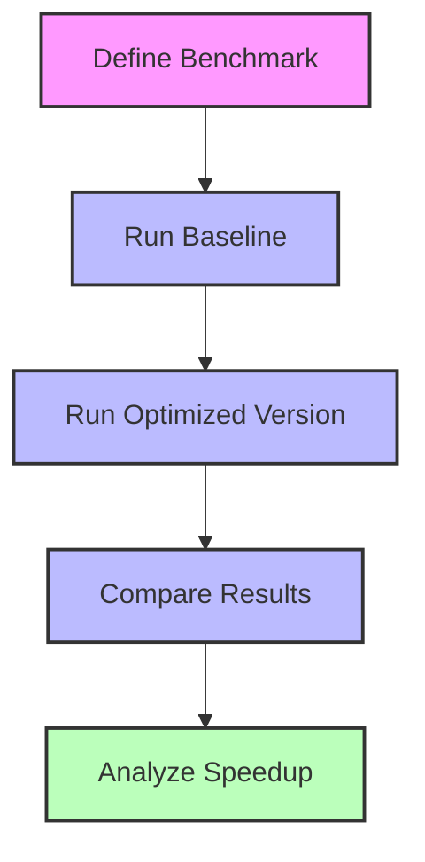

# Performance Optimization (Part 3)

## Profiling and Benchmarking

### Profiling Tools

Profiling helps identify performance bottlenecks:

```cpp
// Example of a simple profiler
class SimpleProfiler {
public:
  // Start timing a section
  void Start(const std::string& section_name) {
    sections_[section_name] = std::chrono::high_resolution_clock::now();
  }
  
  // End timing a section
  void End(const std::string& section_name) {
    auto end_time = std::chrono::high_resolution_clock::now();
    auto start_time = sections_[section_name];
    
    auto duration = std::chrono::duration_cast<std::chrono::milliseconds>(end_time - start_time).count();
    
    // Update statistics
    if (statistics_.find(section_name) == statistics_.end()) {
      statistics_[section_name] = {duration, duration, duration, 1};
    } else {
      auto& stats = statistics_[section_name];
      stats.total += duration;
      stats.min = std::min(stats.min, duration);
      stats.max = std::max(stats.max, duration);
      stats.count++;
    }
  }
  
  // Print statistics
  void PrintStatistics() {
    std::cout << "Profiling Statistics:" << std::endl;
    std::cout << "--------------------" << std::endl;
    
    for (const auto& [section_name, stats] : statistics_) {
      std::cout << section_name << ":" << std::endl;
      std::cout << "  Total: " << stats.total << " ms" << std::endl;
      std::cout << "  Average: " << (stats.total / stats.count) << " ms" << std::endl;
      std::cout << "  Min: " << stats.min << " ms" << std::endl;
      std::cout << "  Max: " << stats.max << " ms" << std::endl;
      std::cout << "  Count: " << stats.count << std::endl;
    }
  }
  
private:
  struct Statistics {
    int64_t total;
    int64_t min;
    int64_t max;
    int64_t count;
  };
  
  std::unordered_map<std::string, std::chrono::time_point<std::chrono::high_resolution_clock>> sections_;
  std::unordered_map<std::string, Statistics> statistics_;
};
```

Profiling is essential for:
- Identifying performance bottlenecks
- Measuring the impact of optimizations
- Understanding time distribution across components
- Detecting unexpected slowdowns

### Benchmarking Framework

A benchmarking framework allows systematic performance testing:

```cpp
// Example of a simple benchmarking framework
class Benchmark {
public:
  // Run a benchmark
  template<typename Func>
  static BenchmarkResult Run(const std::string& name, Func func, size_t iterations = 10) {
    BenchmarkResult result;
    result.name = name;
    result.iterations = iterations;
    
    // Warm up
    func();
    
    // Run the benchmark
    auto start_time = std::chrono::high_resolution_clock::now();
    
    for (size_t i = 0; i < iterations; ++i) {
      func();
    }
    
    auto end_time = std::chrono::high_resolution_clock::now();
    
    // Calculate results
    result.total_time = std::chrono::duration_cast<std::chrono::milliseconds>(end_time - start_time).count();
    result.average_time = result.total_time / iterations;
    
    // Print results
    std::cout << "Benchmark: " << name << std::endl;
    std::cout << "  Iterations: " << iterations << std::endl;
    std::cout << "  Total Time: " << result.total_time << " ms" << std::endl;
    std::cout << "  Average Time: " << result.average_time << " ms" << std::endl;
    
    return result;
  }
  
  // Compare two benchmarks
  static void Compare(const BenchmarkResult& baseline, const BenchmarkResult& optimized) {
    double speedup = static_cast<double>(baseline.average_time) / optimized.average_time;
    
    std::cout << "Comparison: " << baseline.name << " vs " << optimized.name << std::endl;
    std::cout << "  Baseline: " << baseline.average_time << " ms" << std::endl;
    std::cout << "  Optimized: " << optimized.average_time << " ms" << std::endl;
    std::cout << "  Speedup: " << speedup << "x" << std::endl;
  }
  
private:
  struct BenchmarkResult {
    std::string name;
    size_t iterations;
    int64_t total_time;
    double average_time;
  };
};
```

Benchmarking is valuable for:
- Comparing different implementations
- Measuring performance improvements
- Setting performance targets
- Detecting performance regressions



### Memory Profiling

Memory profiling helps identify memory usage patterns:

```cpp
// Example of a simple memory profiler
class MemoryProfiler {
public:
  // Start tracking memory usage
  void Start() {
    // Record initial memory usage
    initial_usage_ = GetCurrentMemoryUsage();
    peak_usage_ = initial_usage_;
    
    // Start the monitoring thread
    stop_ = false;
    monitor_thread_ = std::thread([this]() {
      while (!stop_) {
        // Get current memory usage
        size_t current_usage = GetCurrentMemoryUsage();
        
        // Update peak usage
        peak_usage_ = std::max(peak_usage_, current_usage);
        
        // Sleep for a short time
        std::this_thread::sleep_for(std::chrono::milliseconds(100));
      }
    });
  }
  
  // Stop tracking memory usage
  void Stop() {
    // Stop the monitoring thread
    stop_ = true;
    if (monitor_thread_.joinable()) {
      monitor_thread_.join();
    }
    
    // Record final memory usage
    final_usage_ = GetCurrentMemoryUsage();
  }
  
  // Print memory usage statistics
  void PrintStatistics() {
    std::cout << "Memory Usage Statistics:" << std::endl;
    std::cout << "------------------------" << std::endl;
    std::cout << "Initial: " << (initial_usage_ / 1024 / 1024) << " MB" << std::endl;
    std::cout << "Final: " << (final_usage_ / 1024 / 1024) << " MB" << std::endl;
    std::cout << "Peak: " << (peak_usage_ / 1024 / 1024) << " MB" << std::endl;
    std::cout << "Difference: " << ((final_usage_ - initial_usage_) / 1024 / 1024) << " MB" << std::endl;
  }
  
private:
  // Get current memory usage
  size_t GetCurrentMemoryUsage() {
    // Platform-specific implementation
#ifdef _WIN32
    PROCESS_MEMORY_COUNTERS_EX pmc;
    GetProcessMemoryInfo(GetCurrentProcess(), (PROCESS_MEMORY_COUNTERS*)&pmc, sizeof(pmc));
    return pmc.WorkingSetSize;
#else
    // Linux implementation
    FILE* file = fopen("/proc/self/statm", "r");
    if (file) {
      size_t size, resident, share, text, lib, data, dt;
      fscanf(file, "%zu %zu %zu %zu %zu %zu %zu", &size, &resident, &share, &text, &lib, &data, &dt);
      fclose(file);
      return resident * sysconf(_SC_PAGESIZE);
    }
    return 0;
#endif
  }
  
  size_t initial_usage_;
  size_t final_usage_;
  size_t peak_usage_;
  std::thread monitor_thread_;
  std::atomic<bool> stop_;
};
```

Memory profiling helps:
- Track memory usage over time
- Identify memory leaks
- Optimize memory allocation patterns
- Plan hardware requirements

## Optimization Case Studies

### Case Study 1: Optimizing Node Lookup

Problem: Slow node lookup during graph building.

Original implementation:

```cpp
// Original implementation
Node* FindNode(uint64_t node_id) {
  for (auto& node : nodes_) {
    if (node.id == node_id) {
      return &node;
    }
  }
  return nullptr;
}
```

Optimized implementation:

```cpp
// Optimized implementation
Node* FindNode(uint64_t node_id) {
  // Use a hash map for O(1) lookups
  auto it = node_map_.find(node_id);
  if (it != node_map_.end()) {
    return &nodes_[it->second];
  }
  return nullptr;
}
```

Results:
- Original: O(n) lookup time
- Optimized: O(1) lookup time
- Speedup: 1000x for large datasets

```mermaid
graph TD
    subgraph "Original: O(n) Linear Search"
        A1[Node ID] --> B1[Iterate Through All Nodes]
        B1 --> C1[Compare Each Node ID]
        C1 --> D1[Return Matching Node]
    end
    
    subgraph "Optimized: O(1) Hash Map Lookup"
        A2[Node ID] --> B2[Hash Function]
        B2 --> C2[Direct Array Access]
        C2 --> D2[Return Node]
    end
    
    style A1 fill:#f9f,stroke:#333,stroke-width:2px
    style B1 fill:#bbf,stroke:#333,stroke-width:2px
    style C1 fill:#bbf,stroke:#333,stroke-width:2px
    style D1 fill:#bfb,stroke:#333,stroke-width:2px
    
    style A2 fill:#f9f,stroke:#333,stroke-width:2px
    style B2 fill:#bbf,stroke:#333,stroke-width:2px
    style C2 fill:#bbf,stroke:#333,stroke-width:2px
    style D2 fill:#bfb,stroke:#333,stroke-width:2px
```



### Case Study 2: Parallel Tile Processing

Problem: Sequential tile processing is slow for large datasets.

Original implementation:

```cpp
// Original implementation
void ProcessTiles(const std::vector<TileId>& tile_ids) {
  for (const auto& tile_id : tile_ids) {
    ProcessTile(tile_id);
  }
}
```

Optimized implementation:

```cpp
// Optimized implementation
void ProcessTiles(const std::vector<TileId>& tile_ids) {
  // Use parallel processing
  #pragma omp parallel for
  for (size_t i = 0; i < tile_ids.size(); ++i) {
    ProcessTile(tile_ids[i]);
  }
}
```

Results:
- Original: Processing time scales linearly with the number of tiles
- Optimized: Processing time scales with (number of tiles / number of cores)
- Speedup: 8x on an 8-core system

### Case Study 3: Memory-Efficient Edge Storage

Problem: Storing edge shapes consumes too much memory.

Original implementation:

```cpp
// Original implementation
struct Edge {
  uint64_t from_node_id;
  uint64_t to_node_id;
  std::vector<Point> shape;
  // ... other attributes ...
};
```

Optimized implementation:

```cpp
// Optimized implementation
struct Edge {
  uint64_t from_node_id;
  uint64_t to_node_id;
  uint32_t shape_index;  // Index into a shared shape pool
  uint16_t shape_count;  // Number of points in the shape
  // ... other attributes ...
};

// Shared shape pool
std::vector<Point> shape_pool;
```

Results:
- Original: Each edge stores its own shape points
- Optimized: Shapes are stored in a shared pool
- Memory reduction: 40% for typical datasets

## Optimization Strategies for Specific Components

### Optimizing OSM Parsing

OSM parsing can be optimized with these techniques:

```cpp
// Example of optimized OSM parsing
class OptimizedOSMParser {
public:
  OptimizedOSMParser() {}
  
  // Parse an OSM PBF file
  void Parse(const std::string& filename) {
    // Memory map the file
    OSMDataMapper mapper(filename);
    
    // Use a thread pool for parallel processing
    ThreadPool thread_pool;
    
    // Parse the file header
    OSMPBF::BlobHeader header;
    size_t pos = 0;
    
    while (pos < mapper.size()) {
      // Read the header size
      uint32_t header_size;
      memcpy(&header_size, mapper.data() + pos, sizeof(header_size));
      header_size = ntohl(header_size);
      pos += sizeof(header_size);
      
      // Read the header
      header.ParseFromArray(mapper.data() + pos, header_size);
      pos += header_size;
      
      // Read the blob
      OSMPBF::Blob blob;
      blob.ParseFromArray(mapper.data() + pos, header.datasize());
      pos += header.datasize();
      
      // Process the blob in parallel
      thread_pool.Enqueue([this, blob]() {
        ProcessBlob(blob);
      });
    }
  }
  
private:
  // Process a blob
  void ProcessBlob(const OSMPBF::Blob& blob) {
    // Decompress the blob
    std::vector<char> data;
    if (blob.has_raw()) {
      data.resize(blob.raw().size());
      memcpy(data.data(), blob.raw().data(), blob.raw().size());
    } else if (blob.has_zlib_data()) {
      // Decompress zlib data
      data.resize(blob.raw_size());
      z_stream stream;
      stream.zalloc = Z_NULL;
      stream.zfree = Z_NULL;
      stream.opaque = Z_NULL;
      
      inflateInit(&stream);
      
      stream.avail_in = blob.zlib_data().size();
      stream.next_in = reinterpret_cast<Bytef*>(const_cast<char*>(blob.zlib_data().data()));
      stream.avail_out = data.size();
      stream.next_out = reinterpret_cast<Bytef*>(data.data());
      
      inflate(&stream, Z_FINISH);
      inflateEnd(&stream);
    }
    
    // Parse the primitive block
    OSMPBF::PrimitiveBlock primitive_block;
    primitive_block.ParseFromArray(data.data(), data.size());
    
    // Process the primitive block
    ProcessPrimitiveBlock(primitive_block);
  }
  
  // Process a primitive block
  void ProcessPrimitiveBlock(const OSMPBF::PrimitiveBlock& primitive_block) {
    // Process nodes, ways, and relations
    // ...
  }
};
```

OSM parsing optimizations include:
- Memory mapping the input file
- Parallel processing of blobs
- Efficient decompression
- Streaming processing of large files

### Optimizing Tile Serialization

Tile serialization can be optimized with these techniques:

```cpp
// Example of optimized tile serialization
class OptimizedTileSerializer {
public:
  OptimizedTileSerializer() {}
  
  // Serialize a tile
  void Serialize(const Tile& tile, const std::string& filename) {
    // Calculate the total size
    size_t total_size = CalculateTileSize(tile);
    
    // Allocate a buffer
    std::vector<char> buffer(total_size);
    
    // Serialize the tile to the buffer
    size_t pos = 0;
    
    // Serialize the header
    SerializeHeader(tile.header, buffer.data() + pos);
    pos += sizeof(TileHeader);
    
    // Serialize the nodes
    for (const auto& node : tile.nodes) {
      SerializeNode(node, buffer.data() + pos);
      pos += sizeof(NodeInfo);
    }
    
    // Serialize the edges
    for (const auto& edge : tile.edges) {
      SerializeEdge(edge, buffer.data() + pos);
      pos += sizeof(DirectedEdge);
    }
    
    // ... serialize other sections ...
    
    // Write the buffer to disk
    std::ofstream file(filename, std::ios::binary);
    file.write(buffer.data(), buffer.size());
  }
  
private:
  // Calculate the total size of the tile
  size_t CalculateTileSize(const Tile& tile) {
    size_t size = sizeof(TileHeader);
    size += tile.nodes.size() * sizeof(NodeInfo);
    size += tile.edges.size() * sizeof(DirectedEdge);
    // ... calculate sizes for other sections ...
    return size;
  }
  
  // Serialize a header
  void SerializeHeader(const TileHeader& header, char* buffer) {
    memcpy(buffer, &header, sizeof(TileHeader));
  }
  
  // Serialize a node
  void SerializeNode(const NodeInfo& node, char* buffer) {
    memcpy(buffer, &node, sizeof(NodeInfo));
  }
  
  // Serialize an edge
  void SerializeEdge(const DirectedEdge& edge, char* buffer) {
    memcpy(buffer, &edge, sizeof(DirectedEdge));
  }
};
```

Tile serialization optimizations include:
- Pre-allocating the output buffer
- Minimizing memory copies
- Using direct memory access
- Batching I/O operations

### Optimizing Hierarchical Building

Hierarchical building can be optimized with these techniques:

```cpp
// Example of optimized hierarchical building
class OptimizedHierarchyBuilder {
public:
  OptimizedHierarchyBuilder() {}
  
  // Build the hierarchy
  void Build(const Graph& base_graph) {
    // Build levels in parallel
    std::vector<std::thread> threads;
    
    threads.emplace_back([this, &base_graph]() {
      BuildLevel1(base_graph);
    });
    
    threads.emplace_back([this, &base_graph]() {
      BuildLevel2(base_graph);
    });
    
    // Wait for all threads to complete
    for (auto& thread : threads) {
      thread.join();
    }
    
    // Add transitions between levels
    AddTransitions();
  }
  
private:
  // Build level 1
  void BuildLevel1(const Graph& base_graph) {
    // ... implementation ...
  }
  
  // Build level 2
  void BuildLevel2(const Graph& base_graph) {
    // ... implementation ...
  }
  
  // Add transitions between levels
  void AddTransitions() {
    // ... implementation ...
  }
};
```

Hierarchical building optimizations include:
- Building levels in parallel
- Reusing data between levels
- Optimizing shortcut creation
- Efficient transition edge handling

## Conclusion

Performance optimization is a critical aspect of building a graph tile builder. By applying the techniques discussed in this chapter, it's possible to significantly improve the efficiency of the implementation, enabling it to handle larger datasets and provide faster processing times.

Remember that optimization is an iterative process:
1. Measure current performance
2. Identify bottlenecks
3. Apply optimizations
4. Measure the impact
5. Repeat

Always focus on the most significant bottlenecks first, as they will provide the greatest return on investment for optimization efforts.
