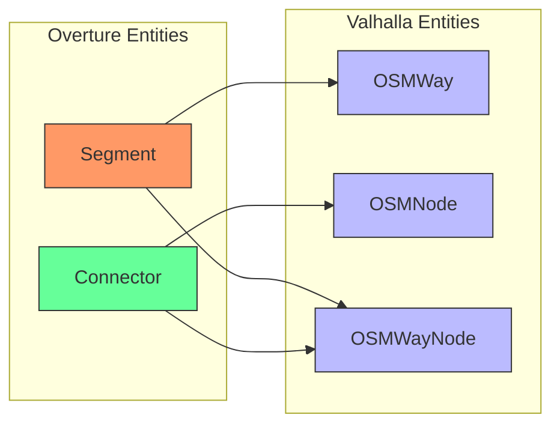

# Attribute Mapping

## The Challenge of Attribute Translation

One of the most complex aspects of integrating Overture data with Valhalla is mapping attributes between the two systems. Overture's transportation schema and Valhalla's data structures represent similar concepts but in different ways, with different terminology, organization, and level of detail.

Effective attribute mapping is crucial for accurate routing. If attributes like road classification, access restrictions, or speed limits are incorrectly translated, the resulting routes may be suboptimal or even invalid.

In this chapter, we'll explore the key attribute mapping challenges and propose solutions for translating between Overture and Valhalla's attribute systems.

## Core Entity Mapping

Before diving into specific attributes, let's establish the fundamental mapping between Overture and Valhalla entities:



### Segment → OSMWay

Overture segments map naturally to Valhalla's `OSMWay` structures. Both represent road segments with various attributes.

Key mapping considerations:
- Segment IDs need to be converted to 64-bit integers for `OSMWay.way_id`
- Segment geometry points need to be converted to node references
- Segment properties need to be mapped to OSMWay attributes

### Connector → OSMNode

Overture connectors map to Valhalla's `OSMNode` structures. Both represent points in the transportation network, though connectors have a more explicit role in defining topology.

Key mapping considerations:
- Connector IDs need to be converted to 64-bit integers for `OSMNode.node_id`
- Connector properties need to be mapped to OSMNode attributes
- Additional node attributes may need to be inferred from connected segments

### Segment-Connector Relationship → OSMWayNode

The relationship between segments and connectors needs to be represented in Valhalla's `OSMWayNode` structures, which link ways to nodes.

Key mapping considerations:
- Each segment-connector relationship becomes an OSMWayNode entry
- The order of nodes in a way needs to be preserved
- Linear referencing positions need to be translated to sequential node ordering

## Road Classification Mapping

Road classification is fundamental to routing decisions, affecting both route selection and the hierarchical structure of the graph.

### Overture Road Classes

Overture defines road classes in its schema:

```yaml
roadClass:
  type: string
  enum:
    - motorway
    - primary
    - secondary
    - tertiary
    - residential
    - living_street
    - trunk
    - unclassified
    - service
    - pedestrian
    - footway
    - steps
    - path
    - track
    - cycleway
    - bridleway
    - unknown
```

### Valhalla Road Classes

Valhalla defines road classes in `baldr/graphconstants.h`:

```cpp
enum class RoadClass : uint8_t {
  kMotorway = 0,
  kTrunk = 1,
  kPrimary = 2,
  kSecondary = 3,
  kTertiary = 4,
  kUnclassified = 5,
  kResidential = 6,
  kService = 7,
  kOther = 8
};
```

### Mapping Table

| Overture Class | Valhalla Road Class |
|----------------|---------------------|
| motorway | RoadClass::kMotorway |
| trunk | RoadClass::kTrunk |
| primary | RoadClass::kPrimary |
| secondary | RoadClass::kSecondary |
| tertiary | RoadClass::kTertiary |
| residential | RoadClass::kResidential |
| living_street | RoadClass::kResidential |
| unclassified | RoadClass::kUnclassified |
| service | RoadClass::kService |
| pedestrian | RoadClass::kOther |
| footway | RoadClass::kOther |
| steps | RoadClass::kOther |
| path | RoadClass::kOther |
| track | RoadClass::kOther |
| cycleway | RoadClass::kOther |
| bridleway | RoadClass::kOther |
| unknown | RoadClass::kOther |

For the classes that map to `RoadClass::kOther`, additional information should be preserved in the `use` field to distinguish between different types of paths.

## Access Restriction Mapping

Access restrictions determine which types of travel modes can use a particular road segment.

### Overture Access Restrictions

Overture represents access restrictions with a structured property:

```json
"access_restrictions": {
  "vehicle": "yes",
  "foot": "no",
  "bicycle": "yes",
  "hgv": "no"
}
```

Access can also be scoped with temporal or conditional rules:

```json
"access_restrictions": [
  {
    "vehicle": "no",
    "when": {
      "time_range": {
        "from": "07:00",
        "to": "19:00"
      },
      "day_of_week": ["monday", "tuesday", "wednesday", "thursday", "friday"]
    }
  }
]
```

### Valhalla Access Flags

Valhalla represents access as bit flags in `baldr/graphconstants.h`:

```cpp
constexpr uint16_t kAutoAccess = 1;
constexpr uint16_t kPedestrianAccess = 2;
constexpr uint16_t kBicycleAccess = 4;
constexpr uint16_t kTruckAccess = 8;
constexpr uint16_t kEmergencyAccess = 16;
constexpr uint16_t kTaxiAccess = 32;
constexpr uint16_t kBusAccess = 64;
constexpr uint16_t kHOVAccess = 128;
constexpr uint16_t kWheelchairAccess = 256;
constexpr uint16_t kMopedAccess = 512;
constexpr uint16_t kMotorcycleAccess = 1024;
// ...
```

### Mapping Logic

The mapping from Overture access restrictions to Valhalla access flags requires interpretation:

```
if access_restrictions.vehicle == "yes":
    access |= kAutoAccess | kTruckAccess | kMotorcycleAccess
if access_restrictions.foot == "yes":
    access |= kPedestrianAccess
if access_restrictions.bicycle == "yes":
    access |= kBicycleAccess
if access_restrictions.hgv == "yes":
    access |= kTruckAccess
```

For time-dependent restrictions, Valhalla has a separate mechanism using `conditional_restrictions` that needs to be populated.

## Speed Limit Mapping

Speed limits are crucial for accurate travel time estimation.

### Overture Speed Limits

Overture represents speed limits with a structured property:

```json
"speed_limits": {
  "default": 100
}
```

Speed limits can also be direction-specific or have temporal variations:

```json
"speed_limits": [
  {
    "value": 50,
    "when": {
      "heading": "forward"
    }
  },
  {
    "value": 30,
    "when": {
      "heading": "backward"
    }
  }
]
```

### Valhalla Speed Representation

Valhalla stores speed in the `OSMWay` structure:

```cpp
uint32_t speed_;                // Speed in KPH
uint32_t speed_limit_;          // Speed limit in KPH
uint8_t backward_speed_;        // Speed in KPH (if reverse direction is different)
uint8_t forward_speed_;         // Speed in KPH (if forward direction is different)
```

### Mapping Logic

The mapping from Overture speed limits to Valhalla speed fields is relatively straightforward:

```
if speed_limits has a single default value:
    speed_ = speed_limits.default
    
if speed_limits has direction-specific values:
    for each speed_limit in speed_limits:
        if speed_limit.when.heading == "forward":
            forward_speed_ = speed_limit.value
            forward_tagged_speed_ = true
        if speed_limit.when.heading == "backward":
            backward_speed_ = speed_limit.value
            backward_tagged_speed_ = true
```

For time-dependent speed limits, Valhalla has a separate mechanism using `conditional_speeds` that needs to be populated.

## Turn Restriction Mapping

Turn restrictions prevent certain movements through intersections, such as no left turns or no U-turns.

### Overture Turn Restrictions

Overture represents turn restrictions with the `prohibited_transitions` property:

```json
"prohibited_transitions": [
  {
    "sequence": [
      {
        "segment_id": "123e4567-e89b-12d3-a456-426614174003",
        "final_heading": "forward"
      }
    ],
    "from_connector_id": "123e4567-e89b-12d3-a456-426614174001",
    "to_connector_id": "123e4567-e89b-12d3-a456-426614174002"
  }
]
```

This example prohibits the transition from connector 1 to connector 2 via segment 3 in the forward direction.

### Valhalla Turn Restrictions

Valhalla represents turn restrictions with the `OSMRestriction` structure:

```cpp
struct OSMRestriction {
  uint64_t from_way_id_;
  uint64_t via_node_id_;
  uint64_t to_way_id_;
  uint32_t time_domain_;
  RestrictionType type_;
  uint8_t modes_;
};
```

### Mapping Logic

The mapping from Overture prohibited transitions to Valhalla restrictions requires interpretation:

```
for each prohibited_transition in prohibited_transitions:
    restriction = OSMRestriction()
    restriction.from_way_id_ = get_way_id_for_connector(prohibited_transition.from_connector_id)
    restriction.via_node_id_ = get_node_id_for_connector(prohibited_transition.from_connector_id)
    restriction.to_way_id_ = get_way_id_for_segment(prohibited_transition.sequence[0].segment_id)
    restriction.type_ = RestrictionType::kNoEntry
    restriction.modes_ = kAllAccess
```

This is a simplified example; the actual mapping would need to handle more complex cases with multiple segments in the sequence.

## Lane Information Mapping

Lane information is important for detailed navigation instructions and accurate routing in complex intersections.

### Overture Lane Information

Overture doesn't have a standardized lane representation in its current schema, but it could be added as an extension.

### Valhalla Lane Representation

Valhalla represents lanes with several structures, including `TravelLanes` and `LaneConnectivity`.

### Mapping Approach

Since Overture doesn't currently have standardized lane information, we would need to:

1. Define an extension to Overture's schema for lane information
2. Develop mapping logic once the extension is defined
3. In the meantime, use reasonable defaults based on road class and other attributes

## Administrative Information Mapping

Administrative information (countries, states, cities) is important for providing context in routing instructions.

### Overture Administrative Data

Overture provides administrative boundary data in a separate theme from transportation.

### Valhalla Administrative Handling

Valhalla uses a spatialite database for administrative lookups, which is created during the graph building process.

### Mapping Approach

To integrate Overture's administrative data with Valhalla:

1. Process Overture administrative boundary data using DuckDB or similar tools
2. Convert to the spatialite format expected by Valhalla
3. Ensure proper integration with the graph building process

## Implementation Strategy

Given the complexity of attribute mapping, we recommend a phased implementation strategy:

### Phase 1: Core Attributes

Start with the most essential attributes for basic routing:

- Road classification
- Basic access restrictions
- Speed limits
- Directionality (one-way streets)

### Phase 2: Advanced Attributes

Add more complex attributes:

- Turn restrictions
- Time-dependent restrictions
- Special road features (bridges, tunnels, etc.)
- Administrative information

### Phase 3: Enhanced Features

Implement support for more specialized features:

- Lane information (when available in Overture)
- Detailed transit integration
- Traffic data integration

This phased approach allows for incremental development and testing, ensuring that the most critical attributes are handled correctly before moving on to more complex features.

## Validation and Testing

Thorough validation and testing are essential for ensuring accurate attribute mapping:

1. **Unit Tests**: Test individual mapping functions with various input scenarios
2. **Integration Tests**: Test the complete mapping pipeline with sample data
3. **Routing Tests**: Validate that routes calculated with the mapped attributes make sense
4. **Comparison Tests**: Compare routes with those from other routing engines or ground truth

By carefully mapping attributes between Overture and Valhalla, we can ensure that the resulting routing graph accurately represents the transportation network and produces high-quality routes.
