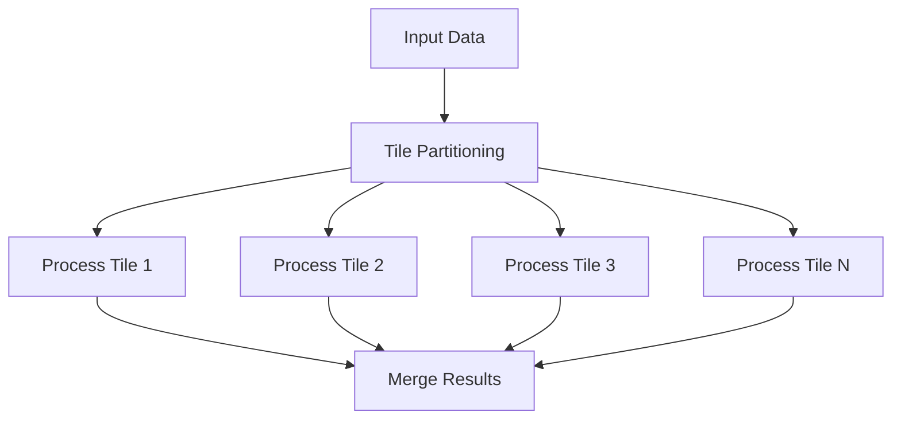
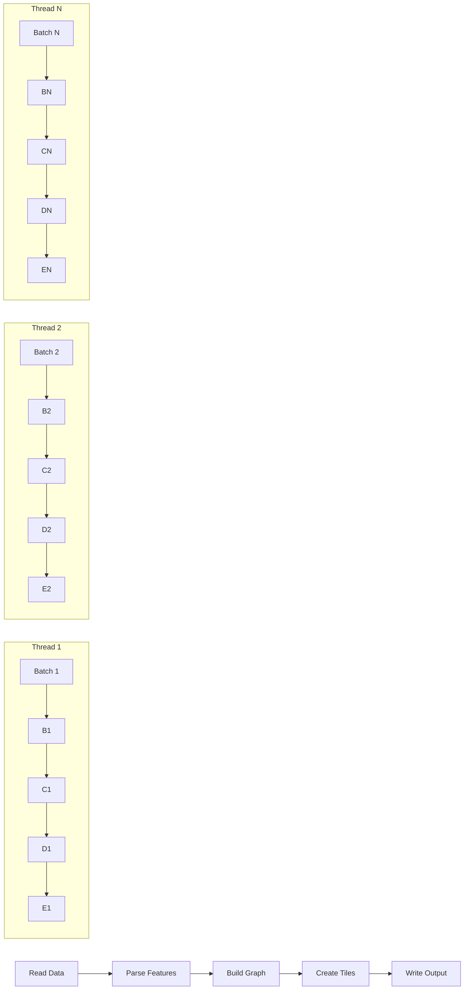
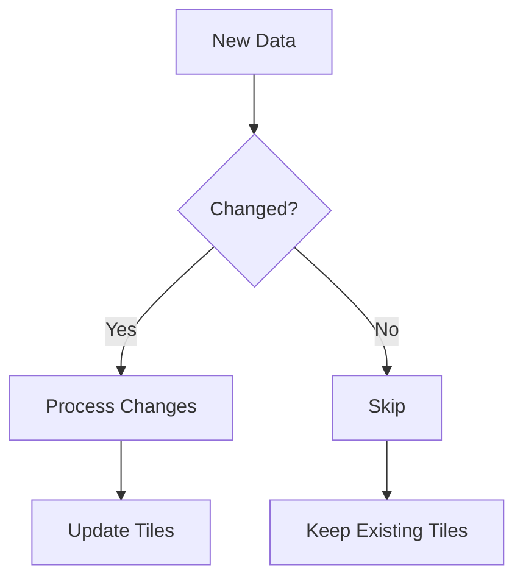

# Performance Optimization

## The Importance of Performance

When working with planet-scale transportation data, performance is not just a nice-to-have—it's essential. Processing billions of road segments and intersections requires careful attention to efficiency in both time and memory usage.

In this chapter, we'll explore strategies for optimizing the performance of our Overture graph tile building process, drawing on lessons from Valhalla's Mjolnir and adding Overture-specific optimizations.

## Understanding the Performance Challenges

Building graph tiles from Overture data presents several performance challenges:

### Data Volume

Overture's global transportation data can be massive, potentially including:

- Hundreds of millions of road segments
- Billions of shape points
- Complex relationships and attributes

Processing this volume of data requires efficient algorithms and data structures.

### Memory Constraints

Even on powerful servers, memory is finite. Loading the entire dataset into memory at once is often impractical, requiring streaming or chunked processing approaches.

### Processing Complexity

Many operations in graph tile building are computationally intensive:

- Geometric calculations for node placement
- Topological analysis for connectivity
- Hierarchical graph construction
- Spatial indexing and tile assignment

### Parallelization Potential

Many aspects of tile building can be parallelized, but this introduces complexity in coordination and data sharing.

## Memory-Efficient Data Processing

### Streaming Processing

Rather than loading the entire dataset into memory, process it in a streaming fashion:


This approach maintains a bounded memory footprint regardless of input size.

### Example: Streaming GeoParquet Reading

```rust
fn process_overture_data<R: Read>(reader: R) -> Result<(), Error> {
    let mut reader = GeoParquetReader::new(reader);
    
    while let Some(batch) = reader.next_batch(1000)? {
        for feature in batch {
            process_feature(feature)?;
        }
    }
    
    Ok(())
}
```

### Compact Data Structures

Use memory-efficient data structures to represent entities during processing:

- Use appropriate integer sizes (u32 vs u64)
- Avoid unnecessary string duplication
- Use bit fields for flags
- Consider custom memory layouts for hot paths

### Example: Compact Segment Representation

```rust
struct CompactSegment {
    id: u64,                // 8 bytes
    start_node: u32,        // 4 bytes
    end_node: u32,          // 4 bytes
    road_class: u8,         // 1 byte
    access: u16,            // 2 bytes
    speed: u8,              // 1 byte
    flags: u8,              // 1 byte (one-way, bridge, tunnel, etc.)
    shape_index: u32,       // 4 bytes (index into separate shape storage)
    name_index: u32,        // 4 bytes (index into separate name storage)
}
// Total: 29 bytes per segment
```

### String Deduplication

Transportation data often contains many duplicate strings (road names, references, etc.). Deduplicating these can save significant memory:

```rust
struct StringTable {
    strings: Vec<String>,
    index: HashMap<String, u32>,
}

impl StringTable {
    fn get_or_insert(&mut self, s: &str) -> u32 {
        if let Some(&idx) = self.index.get(s) {
            return idx;
        }
        
        let idx = self.strings.len() as u32;
        self.strings.push(s.to_string());
        self.index.insert(s.to_string(), idx);
        idx
    }
}
```

## Parallel Processing

### Tile-Based Parallelism

One of the advantages of a tiled approach is that many tiles can be processed independently:



### Example: Parallel Tile Processing

```rust
use rayon::prelude::*;

fn process_tiles_in_parallel(tiles: Vec<TileData>) -> Vec<ProcessedTile> {
    tiles.into_par_iter()
        .map(|tile| process_tile(tile))
        .collect()
}
```

### Handling Tile Boundaries

When processing tiles in parallel, special care is needed for entities that cross tile boundaries:

1. **Pre-processing**: Identify entities that span multiple tiles
2. **Duplication**: Include these entities in all relevant tiles
3. **Reconciliation**: Ensure consistent IDs and attributes across tiles
4. **Edge Connection**: Create proper connections between tiles

### Pipeline Parallelism

Different stages of the processing pipeline can also be parallelized:



## Algorithmic Optimizations

### Spatial Indexing

Efficient spatial queries are essential for many operations in graph tile building:

- Finding nearby nodes for connectivity
- Assigning entities to tiles
- Identifying administrative regions

Use appropriate spatial indexing structures:

- R-trees for complex spatial queries
- Grid-based indexes for simple proximity searches
- Quadtrees for hierarchical spatial decomposition

### Example: Grid-Based Spatial Index

```rust
struct SpatialGrid {
    cells: Vec<Vec<NodeId>>,
    cell_size: f64,
    min_x: f64,
    min_y: f64,
    width: usize,
    height: usize,
}

impl SpatialGrid {
    fn insert(&mut self, node_id: NodeId, x: f64, y: f64) {
        let cell_x = ((x - self.min_x) / self.cell_size) as usize;
        let cell_y = ((y - self.min_y) / self.cell_size) as usize;
        let cell_idx = cell_y * self.width + cell_x;
        self.cells[cell_idx].push(node_id);
    }
    
    fn find_nearby(&self, x: f64, y: f64, radius: f64) -> Vec<NodeId> {
        // Implementation omitted for brevity
    }
}
```

### Efficient Graph Algorithms

Many operations in graph tile building involve graph algorithms:

- Connectivity analysis
- Shortest path calculations for restrictions
- Hierarchical graph construction

Use efficient implementations of these algorithms:

- Breadth-first search for connectivity
- Dijkstra's algorithm for shortest paths
- A* for heuristic-guided searches

### Caching and Memoization

Many operations in graph tile building involve repeated calculations or lookups. Caching intermediate results can significantly improve performance:

```rust
use lru::LruCache;

struct NodeCache {
    cache: LruCache<NodeId, NodeData>,
}

impl NodeCache {
    fn get_or_load(&mut self, node_id: NodeId, loader: impl FnOnce() -> NodeData) -> &NodeData {
        if !self.cache.contains(&node_id) {
            let data = loader();
            self.cache.put(node_id, data);
        }
        self.cache.get(&node_id).unwrap()
    }
}
```

## I/O Optimizations

### Efficient File Formats

Choose appropriate file formats for different stages of processing:

- GeoParquet for input data (efficient columnar storage)
- Custom binary formats for intermediate data
- Memory-mapped files for large datasets
- Compressed formats for final output

### Batch Processing

Group I/O operations to reduce overhead:

```rust
fn write_nodes_batch(nodes: &[Node], writer: &mut impl Write) -> Result<(), Error> {
    // Write count
    writer.write_u32::<LittleEndian>(nodes.len() as u32)?;
    
    // Write nodes in a single batch
    for node in nodes {
        node.write(writer)?;
    }
    
    Ok(())
}
```

### Memory-Mapped Files

For large datasets, memory-mapped files can provide efficient random access without loading the entire file into memory:

```rust
use memmap2::Mmap;

fn process_with_mmap(path: &Path) -> Result<(), Error> {
    let file = File::open(path)?;
    let mmap = unsafe { Mmap::map(&file)? };
    
    // Process data using memory-mapped access
    // ...
    
    Ok(())
}
```

## Overture-Specific Optimizations

### Leveraging Explicit Topology

Overture's explicit representation of connectors provides opportunities for optimization:

- Direct connectivity information without node inference
- Simplified turn restriction processing
- More efficient hierarchical graph construction

### Example: Direct Connectivity Processing

```rust
fn build_connectivity_graph(segments: &[Segment]) -> ConnectivityGraph {
    let mut graph = ConnectivityGraph::new();
    
    for segment in segments {
        for connector in &segment.properties.connectors {
            graph.add_connection(
                connector.connector_id,
                segment.id,
                connector.at
            );
        }
    }
    
    graph
}
```

### Optimizing Linear Referencing

Overture's linear referencing system allows for precise attribute placement, but requires efficient processing:

- Convert linear references to discrete points for Valhalla
- Preserve attribute variations along segments
- Handle complex cases like lane changes mid-segment

## Benchmarking and Profiling

### Measuring Performance

Establish clear performance metrics:

- Processing time (total and per stage)
- Memory usage (peak and average)
- I/O operations and throughput
- Tile size and count

### Example: Simple Benchmarking

```rust
use std::time::Instant;

fn benchmark<F, T>(name: &str, f: F) -> T
where
    F: FnOnce() -> T,
{
    let start = Instant::now();
    let result = f();
    let duration = start.elapsed();
    
    println!("{} took {:?}", name, duration);
    
    result
}
```

### Profiling Tools

Use appropriate profiling tools to identify bottlenecks:

- CPU profilers (perf, flamegraph)
- Memory profilers (heaptrack, valgrind)
- I/O profilers (iotop, strace)

### Continuous Performance Testing

Integrate performance testing into your development workflow:

- Establish performance baselines
- Run benchmarks on representative datasets
- Track performance changes over time
- Set performance budgets and alerts

## Incremental Processing

### Handling Updates

For ongoing maintenance, process only changed data:



### Example: Change Detection

```rust
fn detect_changes(old_data: &Dataset, new_data: &Dataset) -> ChangeSet {
    let mut changes = ChangeSet::new();
    
    // Find added entities
    for entity in new_data.entities() {
        if !old_data.contains(entity.id) {
            changes.add_added(entity.clone());
        }
    }
    
    // Find modified entities
    for entity in new_data.entities() {
        if let Some(old_entity) = old_data.get(entity.id) {
            if entity != old_entity {
                changes.add_modified(old_entity.clone(), entity.clone());
            }
        }
    }
    
    // Find deleted entities
    for entity in old_data.entities() {
        if !new_data.contains(entity.id) {
            changes.add_deleted(entity.clone());
        }
    }
    
    changes
}
```

### Tile-Based Updates

Update only the tiles affected by changes:

1. Identify changed entities
2. Determine which tiles contain these entities
3. Rebuild only those tiles
4. Update tile references as needed

## Conclusion

Performance optimization is an ongoing process that requires careful measurement, analysis, and improvement. By applying these strategies to our Overture graph tile building process, we can handle planet-scale data efficiently and produce high-quality routing graphs.

Remember that premature optimization can lead to unnecessary complexity. Always measure first to identify actual bottlenecks, then apply targeted optimizations where they'll have the most impact.
