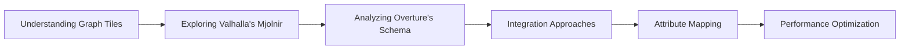
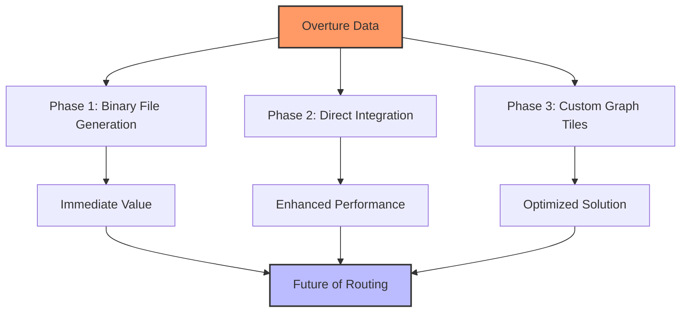

# Conclusion and Next Steps

## Our Journey So Far

Throughout this book, we've explored the fascinating world of graph tiles and routing, with a particular focus on understanding Valhalla's Mjolnir system and adapting it for use with Overture Maps Foundation data.

We began by understanding the fundamental concepts of graph tiles and their importance for efficient routing at scale. We then dove deep into Valhalla's Mjolnir component, examining how it transforms OpenStreetMap data into a sophisticated hierarchical graph structure.

With that foundation in place, we turned our attention to Overture's transportation schema and the challenges of integrating it with Valhalla. We explored different integration approaches, detailed attribute mapping strategies, and discussed performance optimizations for processing planet-scale data.

## Key Insights

Several important insights have emerged from our exploration:

### 1. The Power of Hierarchical Tiling

Dividing the world into a hierarchical system of tiles offers significant advantages for routing:

- Memory efficiency through selective loading
- Parallelization opportunities for processing
- Scalability to planet-sized datasets
- Support for incremental updates

This approach, pioneered by systems like Valhalla, remains valuable for any routing system, including one built specifically for Overture data.

### 2. The Value of Explicit Topology

Overture's explicit representation of network topology through connectors offers advantages over OSM's implicit topology:

- Clearer understanding of network connectivity
- More precise placement of attributes and restrictions
- Simplified processing of complex intersections
- Better support for multi-level structures like overpasses

These advantages can be leveraged to create more accurate and efficient routing graphs.

### 3. The Importance of Flexible Integration

No single integration approach fits all use cases. The phased strategy we've outlined—starting with binary file generation and progressing toward custom graph tiles—provides flexibility to balance immediate needs with long-term optimization.

### 4. The Challenge of Attribute Mapping

Translating between different attribute systems is complex but crucial for accurate routing. Our detailed mapping strategies for road classification, access restrictions, speed limits, and other attributes provide a foundation for this work.

### 5. The Necessity of Performance Optimization

At planet scale, performance isn't optional—it's essential. The optimization strategies we've discussed, from memory-efficient data structures to parallel processing to incremental updates, are critical for building a practical system.

## Next Steps

While we've covered a lot of ground, there's still much to explore and build. Here are some promising directions for future work:

### 1. Implementation of the Phase 1 Transcoder

The most immediate next step is to implement the Phase 1 approach we've outlined:

- Create a Rust-based transcoder that converts Overture data to Valhalla's binary formats
- Implement the attribute mapping strategies we've discussed
- Develop integration scripts for the complete pipeline
- Test with real-world Overture data

This will provide a working solution for routing with Overture data while we explore more advanced approaches.

### 2. Research on Direct Integration

In parallel with the Phase 1 implementation, research on more direct integration with Valhalla would be valuable:

- Explore modifications to Valhalla's `GraphBuilder` to work directly with Overture data
- Benchmark different integration approaches for performance
- Identify opportunities for optimization based on Overture's data model

This research will inform the development of Phase 2 and beyond.

### 3. Design of Overture Graph Tiles

Looking further ahead, designing a custom graph tile format specifically for Overture data is an exciting prospect:

- Define the tile structure and hierarchy
- Design efficient serialization formats
- Create tools for building and querying these tiles
- Develop converters for various routing engines

This work could eventually lead to a reference implementation of Overture Graph Tiles that becomes a standard for the community.

### 4. Exploration of Advanced Features

There are many advanced features that could enhance routing with Overture data:

- Time-dependent routing with traffic data
- Multimodal routing with transit integration
- Specialized routing for different vehicle types
- Support for 3D routing in multi-level structures

These features could be developed as extensions to the core system.

### 5. Community Engagement

Finally, engaging with the broader community is essential for the success of this work:

- Share findings and code with the Overture Maps Foundation community
- Collaborate with Valhalla developers on integration approaches
- Gather feedback from users and developers
- Contribute improvements back to upstream projects

Open collaboration will ensure that the benefits of this work are widely shared.

## Final Thoughts

Building routing systems with Overture data represents an exciting frontier in geospatial technology. The combination of Overture's rich, standardized data with sophisticated routing techniques offers the potential for more accurate, efficient, and flexible routing solutions.

By understanding both the existing tools like Valhalla's Mjolnir and the unique characteristics of Overture data, we can create systems that leverage the best of both worlds. The approaches and strategies outlined in this book provide a roadmap for this journey.

Whether you're implementing a simple integration with existing routing engines or designing a custom solution from the ground up, we hope this book has provided valuable insights and practical guidance. The future of routing with Overture data is bright, and we're excited to see what you'll build!

Thank you for joining us on this exploration of building Overture Graph Tiles. The journey continues, and we look forward to seeing the innovative solutions that emerge from this foundation.
