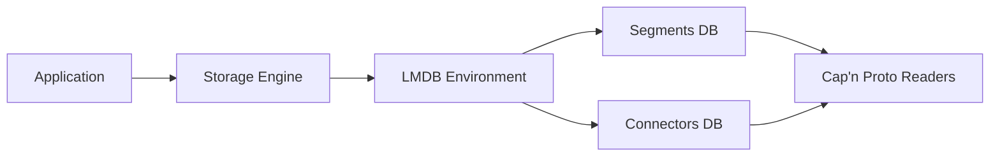
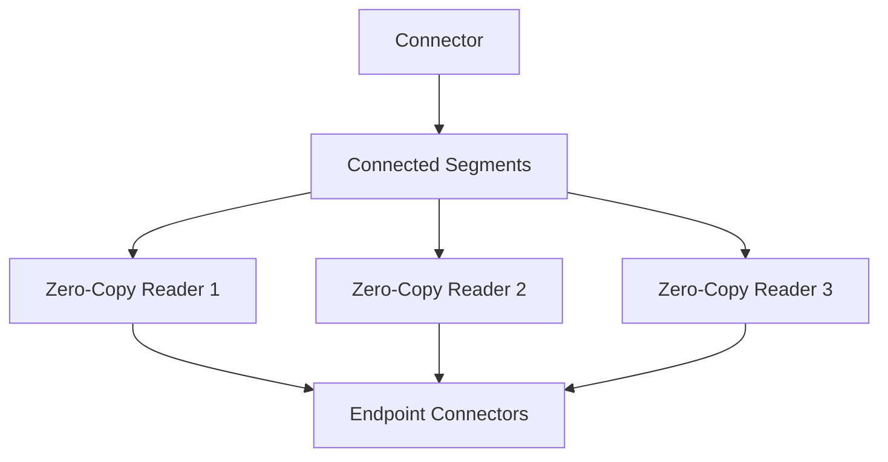

# OvertureExpress Implementation Roadmap

## Phase 1: Cap'n Proto Schema and Foundation (Week 1-2)

The foundation phase establishes the Cap'n Proto schema definitions and basic project structure following OSMExpress's proven architecture. This phase creates the Cap'n Proto schema files for Overture transportation elements, sets up the Rust crate structure within the existing workspace, and implements basic Cap'n Proto serialization and zero-copy reading patterns. The goal is to have working schema definitions and basic serialization that can be tested with sample data.

The first step involves defining the Cap'n Proto schema for segments, connectors, and supporting data structures that match Overture Maps transportation format. The schema design should optimize for common access patterns in routing applications while maintaining compatibility with Overture's data model. The implementation includes Rust code generation from Cap'n Proto schemas and basic unit tests for serialization operations.

Key deliverables for this phase include Cap'n Proto schema definitions for Overture transportation elements, Rust code generation and integration with capnp crate, basic serialization and zero-copy reading functions, and unit tests covering the core schema operations. The phase concludes with the ability to create, serialize, and read transportation elements using zero-copy access patterns.

## Phase 2: LMDB Storage Engine with Zero-Copy Access (Week 3-4)

The storage engine phase implements the LMDB integration with Cap'n Proto following OSMExpress's zero-copy access patterns. This phase creates the database environment management, implements zero-copy readers that access Cap'n Proto data directly from LMDB's memory-mapped storage, and establishes the transaction handling patterns that enable consistent performance at planet scale.

The implementation starts with LMDB environment creation and configuration, including appropriate map sizes for planet-scale datasets and database options optimized for transportation data workloads. The system implements separate databases for segments and connectors with string-based keys and Cap'n Proto serialized values. The key innovation is implementing zero-copy readers that create Cap'n Proto readers directly from LMDB's memory-mapped data without any copying or deserialization overhead.

Key deliverables include LMDB environment management with planet-scale configuration, zero-copy CRUD operations for segments and connectors using Cap'n Proto readers, transaction handling for consistency without performance overhead, and integration tests using sample Overture data. The phase concludes with the ability to store and retrieve transportation elements with zero-copy access patterns that eliminate serialization overhead.

## Phase 3: Spatial Indexing with S2 Geometry (Week 5-6)

The spatial indexing phase adds geographic query capabilities using S2 geometry following OSMExpress's spatial partitioning approach. This phase implements S2 cell calculation for segment geometries, creates the spatial index database structure, and provides bounding box query functionality that returns zero-copy readers for efficient data access. The spatial index enables efficient geographic queries that are essential for regional data processing at planet scale.

The implementation integrates the s2 crate for S2 geometry operations and implements cell calculation for LineString geometries from Cap'n Proto data. The system creates index entries mapping S2 cell IDs to lists of segment IDs that intersect those cells. Query operations use the spatial index to identify candidate segments and return Cap'n Proto readers for zero-copy access to the full segment data.

Key deliverables include S2 cell calculation for segment geometries from Cap'n Proto data, spatial index database with cell-to-segment mappings, bounding box query implementation returning zero-copy readers, and performance tests for spatial operations. The phase concludes with efficient geographic queries that can process regional datasets quickly while maintaining zero-copy access patterns.

## Phase 4: Topology Indexing for Graph Traversal (Week 7-8)

The topology indexing phase implements relationship tracking between segments and connectors using Overture's explicit topology model. This phase creates indexes that map connectors to their connected segments and segments to their endpoint connectors, enabling efficient graph traversal operations that are crucial for routing applications. The implementation leverages Overture's explicit connector elements to build more efficient topology indexes than OSM-based systems.

The implementation analyzes segment and connector relationships during data loading to build topology indexes using Cap'n Proto data access. The system maintains bidirectional mappings so that queries can efficiently traverse from connectors to segments or from segments to connectors using zero-copy readers. Update operations maintain index consistency when elements are modified while preserving zero-copy access patterns.

Key deliverables include connector-to-segment relationship indexing using Cap'n Proto data, segment-to-connector relationship indexing, graph traversal query operations returning zero-copy readers, and integration tests for topology operations. The phase concludes with efficient relationship queries that support routing graph construction while maintaining planet-scale performance characteristics.

## Phase 5: Bulk Loading from GeoParquet (Week 9-10)

The bulk loading phase implements efficient data loading from GeoParquet files using Cap'n Proto serialization and LMDB batch operations. This phase creates the integration with existing download functionality, implements batch processing for large datasets optimized for planet-scale data volumes, and builds all indexes during the loading process to avoid expensive post-processing steps. Bulk loading is essential for creating databases from Overture releases efficiently.

The implementation uses the existing GeoParquet reading capabilities from the overture-bifrost crate and processes data in batches to manage memory usage while building Cap'n Proto messages for storage. The system builds all indexes during the loading process using efficient batch operations that minimize LMDB transaction overhead. Progress reporting provides visibility into loading operations for planet-scale datasets.

Key deliverables include GeoParquet file processing integration with Cap'n Proto serialization, batch loading with memory management optimized for planet-scale datasets, index building during load operations using efficient batch transactions, and progress reporting for long-running operations. The phase concludes with the ability to create complete databases from Overture transportation data files efficiently.

## Phase 6: Query Engine with Zero-Copy API (Week 11-12)

The query engine phase implements the high-level query interface that coordinates between storage, spatial, and topology components while maintaining zero-copy access patterns throughout. This phase creates the unified query API that returns Cap'n Proto readers, implements query optimization strategies that leverage zero-copy access, and provides the clean interface that applications will use to access transportation data efficiently.

The implementation defines trait-based query interfaces that return Cap'n Proto readers instead of deserialized objects, following OSMExpress's proven approach for planet-scale performance. The query engine selects appropriate indexes and optimization strategies based on query characteristics while maintaining zero-copy access patterns. Error handling provides meaningful feedback for query failures without compromising zero-copy performance.

Key deliverables include unified query API design returning Cap'n Proto readers, query optimization and execution planning with zero-copy access, comprehensive error handling and reporting without performance overhead, and performance benchmarks for all query types. The phase concludes with a complete query system that provides fast access to transportation data at planet scale.

## Phase 7: Integration and Planet-Scale Testing (Week 13-14)

The integration and testing phase validates the complete system with planet-scale data and real-world use cases. This phase implements comprehensive testing with full Overture datasets, validates performance requirements against planet-scale workloads, and ensures integration with the broader OMF-Bifrost system works correctly under production conditions.

The implementation includes end-to-end testing with regional and planet-scale datasets, performance validation against the specified requirements using realistic query workloads, and integration testing with the existing conversion workflows. Documentation updates ensure that the system can be used effectively by other developers and deployed in production environments.

Key deliverables include comprehensive integration tests with planet-scale datasets, performance validation and benchmarking against realistic workloads, documentation updates and examples for production deployment, and integration with existing OMF-Bifrost workflows. The phase concludes with a production-ready system that meets all specified requirements for planet-scale transportation data access.

## Success Criteria

Each phase has specific success criteria that must be met before proceeding to the next phase. Phase 1 succeeds when Cap'n Proto schemas can serialize and provide zero-copy access to transportation data reliably. Phase 2 succeeds when data can be stored and retrieved using zero-copy patterns with LMDB. Phase 3 succeeds when spatial queries return correct results efficiently using zero-copy readers. Phase 4 succeeds when topology queries support graph traversal with zero-copy access. Phase 5 succeeds when complete datasets can be loaded from GeoParquet files efficiently. Phase 6 succeeds when the query API provides all required functionality with zero-copy access. Phase 7 succeeds when the system integrates with OMF-Bifrost and meets planet-scale performance requirements.

The overall project succeeds when OvertureExpress can load planet-scale datasets, provide microsecond ID lookups through zero-copy access, support millisecond spatial queries with zero-copy readers, enable efficient topology traversal for routing, and integrate cleanly with the existing conversion workflows. Performance requirements include microsecond ID lookups, millisecond spatial queries, and efficient bulk loading of hundreds of millions of elements using zero-copy access patterns throughout.
