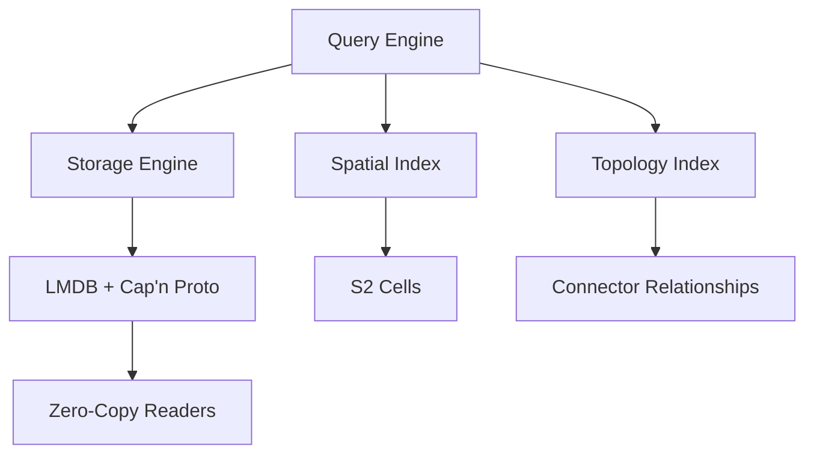
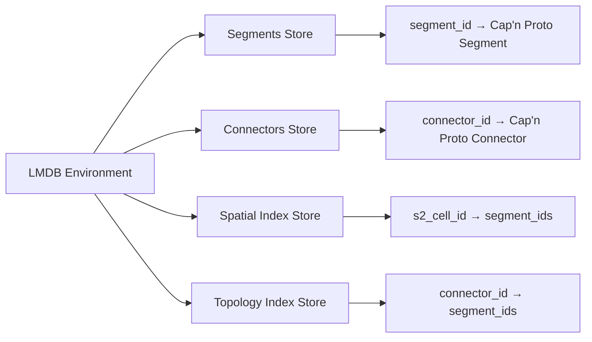

# OvertureExpress: Fast Database for Overture Transportation Data

## Overview

OvertureExpress is a specialized database system designed for fast storage and retrieval of Overture Maps transportation data at planet scale. The system follows the proven architecture of OSMExpress, using LMDB with Cap'n Proto serialization to achieve zero-copy data access for billions of queries.

The core problem OvertureExpress solves is performance at scale: when you have hundreds of millions of transportation segments and connectors from global Overture data, you need instant ID-based lookups and efficient spatial queries without the memory allocation overhead that traditional serialization approaches create. The system is designed to handle planet-scale datasets that exceed available RAM while maintaining microsecond query response times.

## Design Principles

OvertureExpress follows the proven architectural principles established by OSMExpress for planet-scale geospatial data access. The system prioritizes zero-copy data access over traditional serialization approaches because the performance difference becomes critical when handling billions of queries against hundreds of millions of transportation elements.

The system uses memory-mapped storage through LMDB to provide instant access to data without loading entire datasets into RAM. This approach allows the operating system to manage memory efficiently while providing consistent performance regardless of dataset size. The combination of LMDB's memory-mapping with Cap'n Proto's zero-copy serialization eliminates the CPU overhead and memory allocation pressure that would otherwise limit scalability.

The system is designed specifically for Overture Maps transportation schema, which provides explicit topology through segments and connectors. This explicit topology allows OvertureExpress to build efficient indexes for routing applications where you frequently need to traverse from one road segment to connected segments. Unlike OSM data where intersections must be inferred, Overture's explicit connectors enable more efficient graph traversal operations.

## Core Components

OvertureExpress consists of four main components that work together to provide zero-copy data access at planet scale. The Storage Engine handles database operations using LMDB for memory-mapped key-value storage with Cap'n Proto serialization for zero-copy data access. The Spatial Index provides geographic query capabilities using S2 geometry for efficient spatial partitioning. The Topology Index maintains relationships between segments and connectors for fast graph traversal. The Query Engine coordinates between these components to execute complex queries without unnecessary data copying.

The architecture directly follows OSMExpress's proven design but adapts it for Overture Maps transportation schema. The key insight from OSMExpress is that combining LMDB's memory-mapped storage with Cap'n Proto's zero-copy serialization eliminates the performance bottlenecks that traditional serialization approaches create at planet scale.

## Data Model

The OvertureExpress data model uses Cap'n Proto schema definitions that directly reflect the Overture Maps transportation schema while optimizing for zero-copy access. Segments represent road sections between intersections and contain geometry, classification, and property information serialized in Cap'n Proto format. Connectors represent intersections or junction points and maintain references to connected segments. The system stores these elements with their original Overture IDs while building additional indexes for efficient querying.

The Cap'n Proto schema enables zero-copy access to all element properties without deserialization overhead. Each segment contains its LineString geometry, road classification, access restrictions, speed limits, and references to connectors at its endpoints. Each connector contains its Point geometry and a list of segments that meet at that location. This structure enables both individual element lookups and efficient graph traversal for routing applications without the memory allocation overhead of traditional serialization approaches.

The schema design follows OSMExpress patterns but adapts to Overture's explicit topology model. Unlike OSM where intersections must be computed, Overture provides explicit connector elements that simplify topology indexing and graph traversal operations.

## Storage Architecture

The storage architecture uses LMDB with Cap'n Proto serialization following the proven OSMExpress design. LMDB provides memory-mapped access with excellent read performance and concurrent access capabilities, while Cap'n Proto enables zero-copy data access that eliminates serialization overhead at query time. This combination is essential for planet-scale performance where traditional serialization approaches create prohibitive CPU and memory allocation overhead.

The system organizes data into several key-value stores within the LMDB environment. The primary stores include segments and connectors serialized with Cap'n Proto and indexed by their Overture IDs, spatial cells mapping S2 cell IDs to lists of segment IDs, and topology maps connecting connector IDs to segment IDs. This organization enables both direct ID lookups through zero-copy Cap'n Proto readers and efficient spatial and topological queries.

The key insight from OSMExpress is that LMDB returns pointers to memory-mapped data, and Cap'n Proto can read directly from these pointers without any copying or deserialization. This eliminates the memory allocation and CPU overhead that traditional serialization approaches create when handling billions of queries.

## Spatial Indexing

The spatial indexing system uses S2 geometry to partition the Earth's surface into hierarchical cells. When segments are stored, the system calculates which S2 cells their geometry intersects and creates index entries mapping cell IDs to segment IDs. This approach enables efficient bounding box queries by identifying relevant cells and retrieving only the segments within those cells.

The S2 cell hierarchy allows the system to optimize queries at different scales. Large area queries use higher-level cells to reduce the number of index lookups, while small area queries use lower-level cells for precise results. The system automatically selects the appropriate cell level based on the query area size.

## Query Operations

OvertureExpress supports four primary query operations that leverage zero-copy data access for maximum performance. Direct ID lookups retrieve individual segments or connectors by their Overture ID using Cap'n Proto readers that access data directly from LMDB's memory-mapped storage without deserialization overhead. Spatial queries find all segments within a bounding box using the S2 spatial index and return zero-copy readers for efficient data access. Topology queries find all segments connected to a specific connector for graph traversal using precomputed indexes and zero-copy access patterns. Bulk operations handle loading data from GeoParquet files and updating multiple elements efficiently while maintaining index consistency.

The query engine follows OSMExpress patterns by returning Cap'n Proto readers instead of deserialized objects. This approach eliminates memory allocation overhead and provides consistent performance regardless of query volume. The zero-copy design means that query performance scales linearly with concurrent access rather than degrading due to memory allocation pressure.

## Implementation Strategy

The implementation strategy focuses on building a minimal viable system that demonstrates the core concepts before adding advanced features. The first phase implements basic storage and retrieval operations with LMDB integration. The second phase adds spatial indexing with S2 geometry integration. The third phase implements topology indexing for connector-to-segment relationships. The final phase adds bulk loading from GeoParquet files and update operations.

This phased approach allows for iterative testing and validation of each component before building the next layer. Each phase produces a working system that can be tested with real Overture transportation data to validate performance and correctness assumptions.

## Performance Characteristics

OvertureExpress is designed to provide planet-scale performance characteristics through zero-copy data access. ID-based lookups complete in microseconds using LMDB's memory-mapped access combined with Cap'n Proto's zero-copy readers that eliminate deserialization overhead. Spatial queries complete in milliseconds by using the S2 index to limit the search space and returning zero-copy readers for result data. Topology queries complete in microseconds by using precomputed relationship indexes with direct memory access. Bulk loading processes millions of segments per minute using efficient batch operations that build all indexes during the loading process.

The system achieves these performance characteristics by following OSMExpress's proven approach of eliminating serialization overhead through zero-copy access. The combination of LMDB's memory-mapping with Cap'n Proto's zero-copy design means that query performance remains consistent even under high concurrent load because there are no memory allocations or CPU-intensive deserialization operations per query. This approach is essential for planet-scale datasets where traditional serialization approaches would create prohibitive overhead.

## Integration Points

OvertureExpress integrates with the broader OMF-Bifrost system at several key points. The system loads initial data from GeoParquet files downloaded by the existing download functionality. The query results feed into the Valhalla conversion process for routing graph construction. The spatial query capabilities support the regional processing workflows that convert data for specific geographic areas.

The integration design maintains clean separation between OvertureExpress and other components. OvertureExpress focuses solely on fast data access while other components handle data conversion, routing graph construction, and output generation. This separation allows each component to be optimized for its specific responsibilities.
