# OvertureExpress Technical Specification

## Cap'n Proto Schema Design

The OvertureExpress schema uses Cap'n Proto to define Overture Maps transportation elements optimized for zero-copy access. The schema directly maps to Overture's transportation data model while enabling efficient serialization and instant deserialization through memory-mapped access. The design follows OSMExpress patterns but adapts to Overture's explicit topology model with dedicated connector elements.

The schema defines core transportation elements including segments, connectors, and their geometric and property data. Each element includes its original Overture ID, geometry information, classification data, and relationship references. The schema design prioritizes access patterns common in routing applications, such as traversing from connectors to connected segments and accessing geometric data for spatial calculations.

```capnp
# overture_transportation.capnp
@0xf1e2d3c4b5a69788;

struct Segment {
  id @0 :Text;
  geometry @1 :LineString;
  class @2 :RoadClass;
  subtype @3 :Text;
  connectors @4 :List(Text);
  properties @5 :SegmentProperties;
}

struct Connector {
  id @0 :Text;
  geometry @1 :Point;
  connectedSegments @2 :List(Text);
}

struct LineString {
  coordinates @0 :List(Coordinate);
}

struct Point {
  coordinate @0 :Coordinate;
}

struct Coordinate {
  lon @0 :Float64;
  lat @1 :Float64;
}

enum RoadClass {
  motorway @0;
  trunk @1;
  primary @2;
  secondary @3;
  tertiary @4;
  residential @5;
  service @6;
}

struct SegmentProperties {
  maxSpeed @0 :UInt32;
  accessRestrictions @1 :List(Text);
  surface @2 :Text;
  lanes @3 :UInt32;
}
```

## LMDB Integration with Cap'n Proto

The LMDB integration follows OSMExpress's proven pattern of combining memory-mapped storage with zero-copy serialization. The system uses the lmdb crate for Rust bindings to LMDB and the capnp crate for Cap'n Proto integration. The key insight is that LMDB returns pointers to memory-mapped data, and Cap'n Proto can create readers directly from these pointers without any copying or deserialization.

The system creates a single LMDB environment with multiple named databases for different data types and indexes. The segments database stores Cap'n Proto serialized segment data with string keys for segment IDs. The connectors database follows the same pattern for connector data. Index databases use appropriate key types for efficient lookups while storing lists of element IDs as values.

The zero-copy access pattern works by serializing data with Cap'n Proto during writes, storing the serialized bytes in LMDB, then creating Cap'n Proto readers directly from LMDB's memory-mapped pointers during reads. This eliminates the CPU overhead and memory allocation pressure that traditional serialization approaches create at planet scale.

```rust
// Writing data (serialization)
let mut message = capnp::message::Builder::new_default();
let mut segment = message.init_root::<segment_capnp::Builder>();
segment.set_id(&segment_data.id);
// ... populate other fields

let mut buffer = Vec::new();
capnp::serialize::write_message(&mut buffer, &message)?;
lmdb_put(segment_id, &buffer)?;

// Reading data (zero-copy)
let bytes = lmdb_get(segment_id)?;
let message = capnp::serialize::read_message_from_flat_slice(
    &mut bytes.as_slice(), 
    capnp::message::ReaderOptions::new()
)?;
let segment = message.get_root::<segment_capnp::Reader>()?;
// Access data directly without copying
let id = segment.get_id()?;
```

## Spatial Index Implementation

The spatial index implementation uses the s2 crate to provide S2 geometry functionality in Rust. When storing a segment, the system calculates the S2 cells that the segment's geometry intersects using an appropriate cell level for the desired query resolution. The system then creates index entries mapping each intersecting cell ID to the segment ID.

The cell level selection balances index size with query precision. Higher cell levels provide more precise spatial resolution but create larger indexes. Lower cell levels reduce index size but may include more false positives in query results. The system uses a fixed cell level initially but can be extended to use adaptive cell levels based on geometry complexity.

```mermaid
graph TD
    A[Segment Geometry] --> B[Calculate Intersecting S2 Cells]
    B --> C[Cell Level 13]
    C --> D[Store Cell → Segment Mappings]
    D --> E[LMDB Spatial Index]
```



## Query Engine Architecture

The query engine coordinates between the storage engine, spatial index, and topology index to execute queries using zero-copy data access patterns. The engine follows OSMExpress's design by returning Cap'n Proto readers instead of deserialized Rust structures, eliminating memory allocation overhead and providing consistent performance under high concurrent load.

Direct ID queries access the storage engine directly using the element ID as the key and return Cap'n Proto readers that provide zero-copy access to the stored data. Spatial queries use the S2 index to identify candidate cells, retrieve segment IDs from those cells, and then return Cap'n Proto readers for the full segment data. Topology queries use the connector-to-segment index to find connected segments and return readers for efficient graph traversal.

The query engine implements a trait-based design that allows different query types to be implemented consistently while maintaining zero-copy access patterns throughout the system. Error handling preserves the zero-copy design by avoiding unnecessary data copying in error paths.

```rust
pub trait QueryEngine {
    fn get_segment_reader(&self, id: &str) -> Result<SegmentReader>;
    fn get_connector_reader(&self, id: &str) -> Result<ConnectorReader>;
    fn query_segments_in_bbox(&self, bbox: BoundingBox) -> Result<Vec<SegmentReader>>;
    fn get_connected_segments(&self, connector_id: &str) -> Result<Vec<SegmentReader>>;
}

// Readers provide zero-copy access to Cap'n Proto data
pub struct SegmentReader<'a> {
    reader: segment_capnp::Reader<'a>,
}

impl<'a> SegmentReader<'a> {
    pub fn id(&self) -> Result<&str> {
        self.reader.get_id()
    }
    
    pub fn geometry(&self) -> Result<LineStringReader> {
        self.reader.get_geometry()
    }
}
```

## Serialization Strategy

The serialization strategy uses Cap'n Proto for zero-copy data access following OSMExpress's proven approach. Cap'n Proto provides efficient binary serialization with the unique capability of reading data directly from serialized form without deserialization overhead. This approach is essential for planet-scale performance where traditional serialization methods create prohibitive CPU and memory allocation overhead.

The system uses Cap'n Proto's Rust bindings through the capnp crate to generate type-safe readers and builders from schema definitions. Writers use Cap'n Proto builders to construct messages that are serialized to bytes and stored in LMDB. Readers create Cap'n Proto readers directly from LMDB's memory-mapped data without any copying or conversion overhead.

String keys use UTF-8 encoding directly since LMDB handles arbitrary byte sequences efficiently. Numeric keys like S2 cell IDs use big-endian encoding to maintain proper lexicographic ordering in LMDB's B-tree structure. The Cap'n Proto serialization handles all complex data structures including geometry coordinates, property lists, and relationship references.

## Error Handling

The error handling strategy uses the anyhow crate for flexible error management throughout the system. Database operations return Results that can be chained efficiently while providing meaningful error messages for debugging and monitoring. The system defines specific error types for common failure modes like missing elements, corrupted data, and database access errors.

LMDB errors are wrapped in custom error types that provide context about the specific operation that failed. Serialization errors include information about the data type and operation being performed. Spatial index errors include details about the geometry and cell calculations that failed.

## Concurrency Model

The concurrency model leverages LMDB's built-in support for multiple concurrent readers with a single writer. Read operations can be performed concurrently from multiple threads without coordination, which is ideal for query-heavy workloads typical in routing applications. Write operations are serialized through LMDB's transaction system.

The system provides both synchronous and asynchronous APIs to support different application architectures. The synchronous API uses LMDB directly for maximum performance in single-threaded scenarios. The asynchronous API uses tokio integration to support concurrent operations in async applications.

## Memory Management

The memory management strategy relies on LMDB's memory-mapped architecture to provide efficient data access without explicit memory management. LMDB maps database files directly into the process address space, allowing the operating system to manage caching and memory pressure automatically.

The system configures LMDB with appropriate map sizes based on expected data volumes. For regional datasets, a 1GB map size provides sufficient space with minimal virtual memory overhead. For planet-scale datasets, larger map sizes up to the available address space can be configured. The memory-mapped approach means that actual memory usage depends on access patterns rather than database size.

## Testing Strategy

The testing strategy includes unit tests for individual components, integration tests for complete workflows, and performance tests for query operations. Unit tests verify correct behavior of serialization, spatial calculations, and query logic using small synthetic datasets. Integration tests validate end-to-end functionality using real Overture transportation data samples.

Performance tests measure query latency and throughput under various load conditions. The tests include scenarios with different dataset sizes, query patterns, and concurrent access levels. Benchmark results guide optimization efforts and validate that performance requirements are met.

## Build and Deployment

The build system integrates with the existing Cargo workspace structure to provide consistent dependency management and build configuration. The system uses feature flags to enable optional functionality like async support or advanced spatial operations. This approach allows applications to include only the functionality they need.

The deployment strategy supports both embedded use within applications and standalone database servers. For embedded use, applications link directly with the OvertureExpress library and manage the database lifecycle. For server deployments, a separate binary provides network access to database operations through a REST or gRPC API.
